# Graph Population Control Protocol

## Quick Use For Human Operator

Start here only when a generated graph-population bundle already exists and you
want Codex to execute or continue that bundle.

For a bundle created by `MAKE-GRAPH`, tell Codex:

```text
EXECUTE-BUNDLE

Use assets/protocol_assets/system/graph_population/v001/graph_population_control_protocol.md
as the control protocol.

protocol_root: assets/protocol_assets/bundles/<domain_slug>/<protocol_id>
run_id: run_001
candidate_graph_root: assets/protocol_assets/bundles/<domain_slug>/<protocol_id>/candidate_graphs
continue_until: graph_build_targets_met
validation_mode: bootstrap
```

For a manual debugging pass on an existing bundle, you may explicitly ask for
`continue_until: first_completed_action`. That setting means step once, update
cursor/log, and stop. It is not the default for `MAKE-GRAPH` and must not be
used for ordinary target-seeking graph construction.

If you are starting from a sentence like "Make graph on domain...", point Codex
at the schema first:

```text
assets/protocol_assets/system/graph_population/v001/graph_population_protocol_schema.md
```


## Post-Run Correction Execution Gates

These gates are normative for contextless execution. They prevent the executor
from pushing through in the wrong place: Codex must push through recoverable
source and semantic difficulty by expanding explicit Markdown loops, not by
skipping gates, inventing hidden scripts, or counting weak records as complete.

### GraphIntentContract.MaterializationGate

For ordinary MAKE-GRAPH bundles, verify before any source, type, edge, instance,
or graph-writing action:

```text
manifest.graph_intent exists
runs/<run_id>/reports/graph_intent_contract.md exists
graph_intent_status is confirmed or explicitly_authorized_inference
created_before_source_probe: true
downstream_gate exists
next_legal_action_after_contract is source reconnaissance planning
```

If a source probe or source result exists before the contract is materialized,
stop with `graph_intent_materialization_order_violation`. If confirmation is
missing, stop with `graph_intent_confirmation_required`. Passing this gate
advances only to source reconnaissance planning, not directly to source probing.

### SourceReconnaissance Markdown Loop

Source reconnaissance is a Markdown-controlled loop with this order:

```text
SourceReconnaissance.PlanWrite
SourceReconnaissance.BatchPacketWrite
SourceReconnaissance.BatchExecute
SourceReconnaissance.ResultReview
```

The executor must not execute a source batch until the batch packet exists and
contains the candidate rows or selection rule, acceptance criteria, rejection
criteria, source batch cache path, write targets, cursor update rule, and resume
point. If source results exist without a declared batch packet, stop with
`source_result_without_declared_batch`.

### GeneratedCode.RuntimeAuditGate

If generated helper code, temporary code, inline Python, shell, notebooks, or
SQL-like helpers are used during a run, verify
`runs/<run_id>/reports/generated_code_runtime_audit.md` before accepting any
result the code produced.

The audit must show that code had a mechanical purpose and that a prior
Markdown artifact owned the decision. Missing audit means
`hidden_runtime_audit_missing`. Code that selected semantic graph content,
filled targets, chose accepted/candidate status, or owned traversal means
`hidden_semantic_runtime_detected`.

### FiberGraph.Node.DomainMembershipReview

Before fiber nodes become accepted, run a domain-membership review. Each
reviewed record must become accepted, candidate, rejected, or deferred. A record
with only source-query-shape evidence remains candidate. Candidate, rejected,
and deferred records do not count toward MAKE-GRAPH targets.

Write or update:

```text
runs/<run_id>/reports/domain_membership_audit.md
```

### FiberGraph.Edge.PairEvidenceReview

Before fiber edges become accepted, verify accepted endpoints, accepted edge
type, pair-specific evidence for the exact source-predicate-target assertion,
primitive relation status, and graph-intent fit. Endpoint co-presence, shared
bucket membership, deterministic pairing, and SQL-query-like derivation are not
pair evidence. Candidate edge records may remain in a frontier, but they do not
count toward targets.

### SemanticAcceptance.SampleAudit

Before final semantic acceptance, run the semantic sample audit over accepted
node and edge records. If accepted samples expose wrong domain membership, wrong
type assignment, non-primitive relation shape, or missing pair evidence, the
run must stop for repair. Do not downgrade target-counting semantic errors to
warnings.

### Completion.SemanticAcceptanceGate

Completion requires `semantic_acceptance_status: passed`, accepted target
reconciliation, domain membership audit passed, semantic sample audit passed,
no candidate records counted toward targets, no synthetic/completion records
counted toward targets, and no contradictory counters.

If semantic acceptance is not passed, final narration must begin by saying the
graph is not complete. Raw counts, structural validation success, or generated
file paths may follow only as supporting detail.

## Corrected Soft Control Flow Diagram

This diagram is the whole-system control flow. It is normative for both the
schema/compiler phase and the control/executor phase.

```mermaid
flowchart TD
  A["User invocation"] --> B{"Dispatch"}

  B -->|"GENERATE-BUNDLE"| C["Schema/compiler phase"]
  B -->|"MAKE-GRAPH or clear plain-language graph request"| D["Compile graph_build_target"]
  B -->|"EXECUTE-BUNDLE"| E["Control/executor phase"]

  D --> D0["Run MAKE-GRAPH front-door intent triage"]
  D0 -->|"unresolved broad or multi-model intent"| Q["Ask/propose graph intent and stop before source probing or bundle generation"]
  D0 -->|"intent supplied, confirmed, or explicitly authorized"| D1["Compile graph_intent contract values"]
  D1 --> C

  C --> C1["Create or repair protocol_root under assets/protocol_assets/bundles/"]
  C1 --> C2["Write manifest.json"]
  C2 --> C3["Write graph_population_protocol.md"]
  C3 --> C3A["MAKE-GRAPH: record graph_intent metadata and contract path"]
  C3A --> C4["Write mandatory control_loop_plan.md for MAKE-GRAPH"]
  C4 --> C5["Write loop_specs/*.md"]
  C5 --> C6["Initialize candidate graph JSON files"]
  C6 --> C7["Initialize run artifacts: structured cursor, initialized execution_log, source_batch_plan, reports, source_batches, batch_packets, tool_outputs"]
  C7 --> C7I["MAKE-GRAPH: write graph_intent_contract.md as the first run report artifact"]
  C7I --> C7A["MAKE-GRAPH: initialize source reconnaissance plan, landscape map, source family registry, adapter frontier, recovery plan, and source strategy log"]
  C7A --> C7B["MAKE-GRAPH: initialize joint population feasibility and endpoint reservation plans"]
  C7B --> C8["Run generated-bundle acceptance checks"]
  C8 --> C9["Write runs/<run_id>/reports/generated_bundle_acceptance_report.md"]

  C9 -->|"generated_bundle_acceptance: failed or validation_unavailable_stop"| S["Stop with structured failure"]
  C9 -->|"GENERATE-BUNDLE only"| R["Report validation command and stop"]
  C9 -->|"MAKE-GRAPH and generated_bundle_acceptance: passed"| E

  E --> E1["Verify required bundle files"]
  E1 --> E2["Read manifest, domain protocol, control_loop_plan, loop specs, cursor, execution log"]
  E2 --> E3["Verify run_contract_completeness"]
  E3 -->|"incomplete"| S
  E3 --> E4["Reconcile graph paths and inspect current graph JSON state"]
  E4 --> E4I{"MAKE-GRAPH graph intent contract valid?"}
  E4I -->|"no"| S
  E4I -->|"yes"| E4A{"MAKE-GRAPH source reconnaissance, runtime audit, and joint population control surfaces valid?"}
  E4A -->|"no"| S
  E4A -->|"yes"| E5["Derive next legal bounded action from manifest order, loop spec, cursor, log, and repo reality"]
  E5 --> E6["Execute one Markdown-authorized action"]
  E6 --> E7["Persist source batches, Markdown reports, graph JSON changes, or tool output logs"]
  E7 --> E8["Validate affected state"]
  E8 --> E8A{"Recoverable semantic leaf failure?"}
  E8A -->|"no"| E9["Append execution_log entry"]
  E8A -->|"yes, recovery budget remains"| E8B["Expand explicit Markdown child loop, recovery frontier, and recovery cursor state; do not write proxy records"]
  E8B --> E9
  E8A -->|"terminal or recovery exhausted"| S
  E9 --> E10["Update cursor"]

  E10 -->|"continue allowed and target not met"| E2
  E10 -->|"raw targets appear met"| E11["Run Markdown semantic acceptance gate loop"]
  E11 -->|"semantic_acceptance_status: passed"| Z["Complete run"]
  E11 -->|"recoverable semantic gap remains"| E2
  E11 -->|"terminal limitation, invalid status, or recovery exhausted"| S
  E10 -->|"terminal stop or recovery exhausted"| S
```



## 0. Cold-Start Operational Bootloader

This document must be sufficient for a Codex instance with no prior
conversation context.

Read this section first. Later sections are normative, but they are subordinate
to this bootloader for initial routing, artifact authority, and first action
selection.

### 0.0.1 Document Identity

This file is the domain-agnostic graph-population control protocol.

Its job is to execute an already generated graph-population protocol bundle by
interpreting repo-local Markdown, JSON, cursor, log, report, source-batch, and
graph files.

It is not:

- the bundle generator;
- the graph-build request compiler;
- a domain-specific crawl plan;
- a source of domain facts by itself;
- permission to improvise hidden loops, generated helper scripts, or in-memory
  traversal state.

The companion compiler/schema is:

```text
assets/protocol_assets/system/graph_population/v001/graph_population_protocol_schema.md
```

### 0.0.2 System Pair Roles

The two hand-authored system documents have separate jobs:

```text
graph_population_protocol_schema.md
  -> compiler / bundle generator

graph_population_control_protocol.md
  -> interpreter / run executor

generated protocol bundle
  -> workflow program

manifest + control_loop_plan + loop_specs + cursor + log + reports
  -> externalized program counter and run state
```

This control protocol executes the generated workflow program. It does not
replace the generated workflow program.

### 0.0.2.0 Hard MAKE-GRAPH Continuation Rule

For any invocation or manifest with `front_door_mode: MAKE-GRAPH` and
`graph_build_target.completion_target: graph_build_targets_met`, Codex must not
stop after bundle generation, generated-bundle acceptance, domain suitability,
graph JSON initialization, source-scope setup, source-batch planning, validation
of empty graph files, or any other administrative/setup action. Those actions
are prerequisites only.

The effective control setting for ordinary `MAKE-GRAPH` execution is:

```text
continue_until: graph_build_targets_met
```

`continue_until: first_completed_action` is valid for an ordinary `MAKE-GRAPH`
bundle only when the human explicitly asks for manual step-through, debugging,
or a single bounded diagnostic action. It is not a valid default and it must not
be inferred from the quick-use examples. If a schema handoff for ordinary
`MAKE-GRAPH` supplies `first_completed_action`, stop with
`make_graph_continue_until_invalid` before executing, because that handoff would
collapse target-seeking graph construction into scaffold/admin stepping.

After every successful setup prerequisite, Codex must immediately advance to
the next ordered loop. After setup is complete, the next required semantic
action is source-grounded type discovery. Execution continues through the
generated semantic loops until one of these happens:

```text
1. semantic graph targets are met and semantic acceptance passes;
2. the human explicitly stops the run;
3. an explicit execution budget is exhausted and logged as a pause, not success;
4. validation fails in a way the current action cannot repair;
5. a real semantic/source blocker is logged after the generated recovery ladder
   has been attempted or ruled inapplicable.
```

A run with zero accepted semantic graph records and no logged blocker has not
made graph-population progress. Report it as
`make_graph_stopped_before_semantic_action`, not as success or near-success.

### 0.0.2.1 Recoverable Semantic Leaf Failure Directive

A graph-population run is designed to push through recoverable semantic
difficulty by entering explicit Markdown child loops. It must not treat the
first shallow source result, sparse field search, rate limit, weak relation
evidence, or target shortfall as terminal unless the generated recovery policy
says the recovery ladder is exhausted.

When a semantic leaf action gets hard, the next legal action is not to throw up
hands and not to fill the target with proxy records. The next legal action is:

```text
1. classify the trouble as terminal, recoverable, or recovery-exhausted;
2. if recoverable, create or update the explicit Markdown child-loop surface;
3. persist source/frontier/report state under the run directory;
4. update cursor/log recovery state;
5. execute the next bounded child-loop action;
6. resume the parent loop only when the child loop's resume condition is met.
```

Synthetic, deterministic, serial-numbered, placeholder, source-adapter-only,
endpoint-pairing, scaffold, or completion-policy records are not recovery.
They must not be used to satisfy raw or accepted targets in ordinary
`MAKE-GRAPH` mode.

### 0.0.2.2 Zero-Context Markdown Semantic Acceptance Gate Directive

A fresh Codex instance executing this control protocol must treat semantic
acceptance as a required Markdown loop, not as hidden judgment and not as a
Python traversal loop. Do not assume any prior conversation, unstated project
intent, or model memory about what counts as a real graph. Codex must not
create generated scripts that select types, select relation inventory, run
source-recovery loops, retry source strategies, populate graph records, or
write graph JSON. If Codex thinks such a script is needed, the generated bundle
is missing an explicit Markdown batch packet or child loop, and Codex must
create that Markdown loop surface instead.

For every ordinary `MAKE-GRAPH` bundle, the executor must require and execute:

```text
loop_specs/18_semantic_acceptance_gate.md
runs/<run_id>/reports/semantic_acceptance_report.md
```

This loop is the semantic acceptance validator for the run. It must inspect the
repo-local graph files, source batches, and decision reports through bounded
Markdown checklist loops:

```text
TypeNodeSemanticReview:
  for each accepted type node

TypeEdgeSemanticReview:
  for each accepted type edge

FiberNodeBatchSemanticReview:
  for each accepted fiber-node batch or type bucket

FiberEdgeBatchSemanticReview:
  for each accepted fiber-edge batch or edge type

CounterReconciliation:
  compare accepted semantic counters against graph_build_target

FinalSemanticDecision:
  write the exact semantic_acceptance_status
```

The semantic acceptance report must contain these explicit audit tables, not
only summary counters:

```text
Graph Intent Alignment Review Table
Type Node Semantic Review Table
Type Edge Semantic Review Table
Primitive Relation Family Summary
Endpoint Variant / Inverse Group Table
Fiber Node Batch Review Table
Fiber Edge Batch Review Table
Field Richness Review Table
Source Landscape Review Table
Domain Membership Review Table
Joint Population Feasibility Table
Endpoint Reservation Review Table
Generated Code Runtime Audit Table
Counter Reconciliation Table
Final Decision
```

The report is invalid if any required table is absent, empty, or replaced by a
sentence claiming that counts passed. Summary counters can summarize the tables;
they cannot replace them.

Only this Markdown gate may promote raw written records to accepted semantic
records. Structural graph validation, NetworkX/PyG/DGL materialization, source
query row counts, and raw record counts are evidence inputs. They are not
completion.

For every accepted type edge, the gate must classify:

```text
relation_kind:
  domain_relation
  source_claim
  provenance_relation
  evidence_relation
  adapter_metadata_relation
  type_membership_relation
  query_derived_relation
  materialized_view_relation
  helper_or_scaffold_relation
  unknown
```

Only `relation_kind: domain_relation` may count toward
`accepted_base_relation_type_records` or requested edge-type targets.

The executor must then normalize every accepted `domain_relation` edge into a
primitive relation family before it can count toward requested edge-type
targets. The normalized family is the semantic relation meaning, not the edge
ID, endpoint type labels, source-property label, source-query shape, or graph
direction chosen for storage.

Every type edge review row in the semantic acceptance report must include:

```text
edge_type_id:
edge_label:
source_type_id:
target_type_id:
relation_kind:
primitive_relation_family:
source_property_family:
directionality_role: canonical | inverse | endpoint_variant | alternate_duplicate
inverse_pair_id:
is_inverse_of_edge_type_id:
is_endpoint_variant_of_family:
is_alternate_duplicate:
counts_toward_requested_edge_type_target:
acceptance_or_rejection_reason:
```

By default, endpoint specialization does not create a new requested edge type.
These examples are endpoint variants of one primitive relation family unless
the manifest explicitly says endpoint variants are in scope:

```text
person born in place
artist born in place
painter born in place
sculptor born in place
place birthplace of painter
place birthplace of sculptor
```

By default, inverse direction does not create a new primitive relation family.
These examples count as one primitive family unless the manifest explicitly
says inverse variants are in scope:

```text
painter created painting
painting created by painter
```

Any relation introduced as an alternate, backup, replacement, fallback,
`_alt`, `_2`, or count-preserving substitute must be presumed not to count. It
may count only if the semantic acceptance gate proves a distinct primitive
relation family and records why it is not an endpoint variant, inverse, or
alternate duplicate.

The gate must compute target progress with:

```text
accepted_distinct_primitive_relation_families
```

It must not use raw edge IDs, endpoint variants, inverse variants, source
properties, source-query paths, or alternate labels as substitutes for distinct
primitive relation families.

Source-backed source claims, source-system properties, source taxonomy classes,
source categories, source IDs, source URLs, claim targets, evidence records, and
provenance facts are metadata. They belong in sources, provenance, evidence
notes, source batches, or reports, not in accepted base graph edges, unless the
human explicitly requested a graph whose domain is source claims themselves.

Self-edges must not count toward requested edge targets unless the gate records
all of these fields as true:

```text
self_edge_allowed: true
reflexive_domain_relation: true
human_or_manifest_explicitly_requested_reflexive_edges: true
relation_kind: domain_relation
pair_specific_evidence_for_reflexive_relation: present
not_source_claim_or_provenance_or_evidence: true
```

A self-edge that exists only to record a source claim, source property,
classification, evidence event, provenance fact, adapter row, or membership in
a type bucket must be rejected for graph-build target counting.

The executor must reject every semantic acceptance status except these exact
values:

```text
passed
semantic_acceptance_incomplete
source_depth_limited
field_richness_limited
edge_evidence_limited
semantic_edge_family_diversity_unmet
relation_recovery_collapsed_to_low_diversity
```

Only the exact value `passed` is a completion state. Statuses such as
`passed_with_note`, `passed_with_relation_policy_note`,
`passed_with_claim_evidence_scope`, `passed_structural_only`, or any other
qualified pass are invalid. A caveated pass is not a pass.

If exact requested counts can be reached only by weakening relation semantics,
writing source-claim edges, writing provenance/evidence/helper edges, writing
self-edge padding, counting generic fields, or treating source-adapter rows as
semantic completion, stop with `semantic_acceptance_incomplete` or the more
precise limitation status. Count preservation is subordinate to semantic
admission.

The field richness review must also run in the final semantic acceptance gate.
A type or relation does not pass field richness merely because it has source
adapter fields such as `wikidata_qid`, `source_url`, `source_batch_id`,
`wikidata_property`, `pair_evidence`, `type_membership_evidence`, display
labels, coordinates, or source category values. The report must count these
separately:

```text
identity_field_count
source_adapter_field_count
domain_descriptive_field_count
relation_affordance_field_count
review_or_provenance_field_count
```

For ordinary `MAKE-GRAPH`, every accepted ordinary type must have type-specific
domain-descriptive fields or a non-passing field limitation after recovery. A
single identical generic field set reused across every type is not field
richness. If this happens, the final gate must set
`semantic_acceptance_status: field_richness_limited` or continue into the
field-enrichment Markdown child loop when recovery remains.


### 0.0.2.3 Graph Intent Contract Gate

For ordinary `MAKE-GRAPH`, the executor must verify graph intent before source
landscape discovery, type discovery, field discovery, edge discovery, instance
population, or semantic acceptance completion.

The executor must read:

```text
manifest.graph_intent
runs/<run_id>/reports/graph_intent_contract.md
```

The graph-intent contract is the run's modeling-lens authority. The domain
label says where the graph lives; the graph-intent contract says what kind of
graph is being built. The executor must not replace the contract with model
memory, source salience, or a convenient source adapter's taxonomy.

Passing graph-intent states are only:

```text
graph_intent_status: confirmed
graph_intent_status: explicitly_authorized_inference
confirmation_status: confirmed
confirmation_status: explicitly_authorized_inference
```

If the manifest lacks `graph_intent`, stop with `graph_intent_contract_missing`.
If the contract file is missing, stop with `graph_intent_contract_missing`. If
the contract exists but has a non-passing status, stop with
`graph_intent_unconfirmed`. If the contract lacks a downstream gate, stop with
`graph_intent_downstream_gate_missing`.

When source, type, field, edge, instance, or edge candidates do not fit the
contract, the next legal action is to write them to a frontier or rejection
report. Do not accept out-of-intent candidates into target-counting graph JSON.

### 0.0.2.4 Source Landscape, Domain Membership, And Joint Planning Directive

For ordinary `MAKE-GRAPH`, Codex must not move directly from a queryable source
adapter to graph population. The generated workflow must first separate three
phases:

```text
source_landscape_discovery
source_adapter_selection
source_exploitation
```

Source landscape discovery is semantic research over the available source
ecology. It asks which source families exist for the domain, what evidence
shapes they can provide, which graph loops they can support, and where they are
shallow or biased. Source adapter selection chooses concrete access paths for
those families. Source exploitation pulls records or evidence only after the
source landscape has shaped the type, field, edge, and population plans.

The generated bundle must distinguish:

```text
source_family: the information family or institution class, such as a public
  authority file, institution collection API, standards vocabulary, official
  directory, catalog, archive, registry, or broad public knowledge base
source_adapter: the concrete access method for a source family, such as a
  SPARQL endpoint, mirror, public API, search page, catalog page, downloaded
  file, or human-supplied source list
source_endpoint: the exact URL, API endpoint, query surface, local source file,
  or navigation target
source_record: the retrieved item, row, page, claim, catalog record, source
  excerpt, or evidence object used by a bounded action
```

Multiple adapters or endpoints for one source family do not create source
landscape diversity. For example, an official Wikidata endpoint, a Wikidata
mirror, and a Wikidata entity page are different adapters/endpoints for the
same source family. Switching between them is adapter recovery, not source
landscape recovery.

Before target-scale type, field, instance, edge, or edge-instance population,
every ordinary `MAKE-GRAPH` bundle must create and maintain these run artifacts:

```text
runs/<run_id>/reports/source_landscape_map.md
runs/<run_id>/reports/source_family_registry.md
runs/<run_id>/source_adapter_candidate_frontier.md
runs/<run_id>/reports/source_strategy_decision_log.md
runs/<run_id>/reports/joint_population_feasibility_plan.md
runs/<run_id>/reports/endpoint_reservation_plan.md
```

The source landscape artifacts are not optional decorations. They are the
control surface that keeps Codex in exploratory source-discovery mode before it
operationalizes record extraction. If they are missing, empty, or replaced by
one source adapter family, the run must stop with
`source_landscape_missing`, `source_family_monoculture`, or
`source_strategy_decision_log_missing` before target-scale population.

The generated workflow must also separate type membership from domain
membership. A source row may prove that an entity belongs to a broad source
class without proving that it belongs in the requested domain graph. Every
ordinary population-eligible type must define:

```text
type_membership_predicate:
domain_membership_predicate:
domain_exclusion_predicate:
domain_membership_evidence_required:
```

A fiber node counts toward accepted graph targets only when both the type
membership predicate and the domain membership predicate are satisfied by
persisted source evidence. A source query result, source category, occupation,
classification class, or adapter row is not sufficient by itself.

For edge-heavy graph targets, node and edge population must be planned jointly.
The bundle must not freeze all node buckets first and then discover that the
frozen endpoints cannot support requested edge counts. Before target-scale
fiber-node writes, the generated workflow must run a joint feasibility plan:

```text
1. discover candidate edge pairs and relation evidence;
2. reserve endpoints needed for requested edge targets;
3. populate node buckets around reserved endpoints;
4. backfill remaining node slots only after edge feasibility is preserved;
5. write graph JSON only from Markdown-authorized batch rows.
```

Endpoint-cap conflict is recoverable, not automatically terminal. If exact node
bucket caps conflict with pair-evidenced edge targets, the next legal action is
an explicit Markdown repair child loop such as:

```text
JointPopulation.Repair.EndpointReservation
```

That loop may reselect endpoint nodes from edge evidence, change the sampling
strategy, replace weak edge families, replace weak node types, add admissible
source families, split an overbroad type, narrow domain predicates, or write a
precise blocker only after those repairs are exhausted.


### 0.0.2.5 Markdown-Controlled Runtime Boundary

For ordinary `MAKE-GRAPH`, the generated Markdown/JSON artifacts are the
workflow runtime. Generated Python, shell scripts, notebooks, SQL files, or
other helper programs must not perform graph-building traversal, source-landscape
selection, type selection, relation selection, population selection, semantic
acceptance, cursor advancement, or graph JSON writes.

Allowed code use is limited to read-only or mechanical repository tools:

```text
validate graph JSON
inspect graph counts
materialize NetworkX/PyG/DGL graphs
run tests or linters
perform read-only consistency checks that report back into Markdown
```

If Codex is tempted to write a generator script to loop over sources, records,
edge candidates, or graph writes, the generated bundle is missing a Markdown
loop, batch packet, frontier, or report. The next legal action is to create or
repair that Markdown control surface, not to hide the loop in code.

### 0.0.3 Invocation Dispatch

At first contact, classify the invocation before doing any other work.

Use this dispatch table:

```text
EXECUTE-BUNDLE
  Use this control protocol to execute an existing generated bundle.
  Verify required files before any graph action.
  If the manifest contains graph_build_target.completion_target:
  graph_build_targets_met, use continue_until: graph_build_targets_met unless
  the human explicitly requested manual step-through or debugging.
  Otherwise execute exactly the next legal bounded action unless continue_until
  says otherwise.

MAKE-GRAPH, after bundle generation and acceptance
  Use this control protocol only for the execution phase.
  Read manifest.graph_build_target and manifest.control_loop_plan.
  Execute with continue_until: graph_build_targets_met until semantic targets
  are met or a true stop condition fires.

MAKE-GRAPH, raw short request with no generated bundle
  Wrong document for the first phase.
  Route to graph_population_protocol_schema.md.

GENERATE-BUNDLE
  Wrong document.
  Route to graph_population_protocol_schema.md.

Plain-language request to run/populate/continue an existing bundle
  Treat as EXECUTE-BUNDLE only if protocol_root and run_id can be identified.
  Otherwise ask only the blocking clarification.
```

Do not inspect sources, select records, write graph JSON, or advance the cursor
until the dispatch decision and bundle existence check are explicit.

### 0.0.3.1 Raw MAKE-GRAPH Front-Door Rule

This control protocol executes generated bundles. If Codex is invoked with a
raw `MAKE-GRAPH` prompt and no existing manifest/cursor surface, the next legal
action is not source probing, source lookup, bundle generation, or population
framing. Route the request to the schema's `MAKE-GRAPH Front-Door Intent
Triage`.

For a raw `MAKE-GRAPH` request that supplies only domain + target counts and no
confirmed graph intent, modeling lens, sufficient examples, or competency
questions, Codex must treat the prompt as valid but graph-intent unresolved.
For broad or multi-model domains, the only legal first action is:

```text
GraphIntentAlignment.Domain.ResolveIntent
```

That action may only ask bounded graph-intent questions or propose two to four
candidate graph lenses and stop. It must not inspect external sources, probe
source adapters, create a bundle, write graph JSON, or count any graph-building
progress.

### 0.0.4 First Actions For This Control Protocol

After dispatch, perform this sequence before any graph-population action:

```text
1. identify mode, protocol_root, and run_id;
2. if this is a raw MAKE-GRAPH request without an existing manifest, route to
   schema front-door intent triage and stop unless graph intent is confirmed or
   explicitly authorized for infer-and-proceed;
3. verify required bundle files exist;
4. read manifest.json;
5. read graph_population_protocol.md;
6. read control_loop_plan.md when present; for `MAKE-GRAPH`, this file is
   mandatory and must be read;
7. for `MAKE-GRAPH`, read manifest.graph_intent and graph_intent_contract.md;
8. read ordered loop specs;
9. read cursor.json and execution_log.md;
10. reconcile candidate graph paths;
11. derive the next legal bounded action from the cursor and loop surface;
12. if the manifest is an ordinary `MAKE-GRAPH` graph-build run, set the
    effective continuation target to `graph_build_targets_met` unless explicit
    manual step-through/debugging was requested;
13. state the bounded action and stop condition before mutating files.
```

If any required artifact is missing or contradictory, stop with a structured
failure report naming the smallest failing surface. Do not fill gaps from
model memory.

### 0.0.5 Minimal Vocabulary At First Contact

Use these definitions before relying on later detailed sections:

```text
schema:
  hand-authored generator document

control protocol:
  this hand-authored executor document

protocol bundle:
  generated repo-local files for one domain/protocol_id

domain protocol:
  generated graph_population_protocol.md inside a bundle

control loop plan:
  generated dotted nested loop plan that binds targets to traversal

loop spec:
  generated Markdown file defining one explicit loop/action surface

cursor:
  JSON run pointer recording the current externalized program counter

execution log:
  append-only Markdown record of actions, validation, failures, and handoffs

type graph / downstairs graph:
  graph of admissible domain types and relation types

fiber graph / upstairs graph:
  graph of concrete instances projected onto the type graph
```

If a later section uses a term that is not yet clear, resolve it against this
vocabulary and actual bundle files. Do not improvise.

### 0.0.6 Hand-Authored Versus Generated Files

This file is hand-authored system guidance.

The run authority lives in generated bundle files such as:

```text
manifest.json
graph_population_protocol.md
control_loop_plan.md
loop_specs/*.md
candidate_graphs/<type_graph_id>/nodes.json
candidate_graphs/<type_graph_id>/edges.json
candidate_graphs/<fiber_graph_id>/nodes.json
candidate_graphs/<fiber_graph_id>/edges.json
runs/<run_id>/cursor.json
runs/<run_id>/execution_log.md
runs/<run_id>/source_batch_plan.md
runs/<run_id>/reports/generated_bundle_acceptance_report.md
runs/<run_id>/reports/*.md
runs/<run_id>/source_batches/*
runs/<run_id>/batch_packets/*.md
runs/<run_id>/tool_outputs/*
```

This control protocol tells Codex how to interpret those files. It must not
silently create a different control system.

### 0.0.7 Wrong-Mode Stops

If the prompt asks this control protocol to create a new bundle, stop with:

```text
wrong_mode: use graph_population_protocol_schema.md
```

If the prompt is a raw short graph-build request and no generated bundle
exists, stop and route to the schema. Do not compile the bundle from inside
this control protocol.

If a mode or required input is missing, ask at most three blocking questions.

### 0.0.8 Cold-Start Output Discipline

Before mutating files, report:

```text
mode:
document_role:
protocol_root:
run_id:
cursor_status:
files_that_may_change:
first_bounded_action:
stop_condition:
```

Do not expose manifest/cursor/log internals beyond what the human needs unless
`diagnostic_verbosity` is `full`, the user asks, or the detail is needed to
explain a stop condition.

### 0.0.9 Operational Read Order For The Rest Of This Document

After this bootloader, read and apply the remaining sections in this order:

```text
1. Agentic Loop Ownership Directive
2. Mode Boundary
3. Human Interaction Contract
4. Purpose and Graph Build Target Execution Contract
5. Required Inputs, Required Bundle Files, and Run Contract Completeness
6. Graph Tool Compatibility Gates
7. Externalized Program Counter
8. Dispatcher Cycle, Next Legal Action Rule, and Loop Traversal Semantics
9. Type-Graph Execution Order
10. Fiber-Graph Execution Order
11. JSON Write Discipline and Repo-Local Run Artifact Discipline
12. Evidence, Source-Crawl, and Markdown Batch Execution Discipline
13. Completion Rules, Stop Conditions, Failure Reports, Logs, and Cursor Updates
14. Candidate Invocation Prompts and Smoke-Test Shape
```

If a later section seems to conflict with the bootloader, obey the bootloader
and repair or report the conflict rather than improvising.

## 0.1 Agentic Loop Ownership Directive

The generated Markdown control surface is the workflow program.

Codex is the interpreter of that program. The externalized program counter is
the combination of:

```text
manifest.ordered_loop_specs
control_loop_plan.md
loop_specs/
runs/<run_id>/cursor.json
runs/<run_id>/execution_log.md
runs/<run_id>/reports/
```

All semantic iteration must be represented in that Markdown/JSON/log surface
before it is executed.

Generated Python, shell scripts, notebooks, or other helper code must not own,
traverse, or complete graph-building loops. They must not decide, select,
iterate over, or write:

```text
type nodes
type fields
type edges
type-edge fields
fiber nodes
fiber-node field values
fiber edges
fiber-edge field values
```

If execution discovers that a step requires a nested loop that has not yet been
made explicit, Codex must pause graph writes, expand the Markdown loop surface,
update the cursor/log, and then resume from the explicit loop. If only one
level is known, Codex must create a bounded child-loop-generation action rather
than hiding traversal inside code.

This is especially important at semantic leaf actions. Sparse sources,
rate-limits, shallow fields, insufficient relation families, instance-count
shortfalls, and weak pair-specific evidence are usually recoverable semantic
failures, not automatic stop conditions. A recoverable leaf failure must become
an explicit Markdown child loop before Codex stops, broadens the crawl, or
writes any graph JSON.

Existing repository Python tools may be used as validators, inspectors, or
materializers after Codex has written graph JSON according to an authorized
Markdown action. They are not the workflow engine.

If a generated script or ad hoc code loop appears necessary to perform graph
population, stop with:

```text
generated_code_loop_forbidden
```

and report the Markdown loop surface that needs to be expanded instead.

## 0.2 Mode Boundary

This document is used in `EXECUTE-BUNDLE` mode and in the execution phase of a
`MAKE-GRAPH` run after bundle generation and acceptance.

`EXECUTE-BUNDLE` mode runs an already generated graph-population protocol
bundle. It must not generate or redesign that bundle unless the invocation
explicitly says `REPAIR-BUNDLE`.

`MAKE-GRAPH` is not a third execution mode that erases this boundary. It is a
front-door macro whose execution phase reaches this document only after:

```text
1. the short request has been compiled by graph_population_protocol_schema.md;
2. a generated protocol bundle exists;
3. manifest.graph_build_target exists;
4. manifest.control_loop_plan exists;
5. manifest.make_graph_orchestration records the phase sequence and handoff rule;
6. generated-bundle acceptance checks have passed;
7. `runs/<run_id>/reports/generated_bundle_acceptance_report.md` exists and
   records `generated_bundle_acceptance: passed`;
8. the handoff is represented in repo-local files, not memory.
```

If the raw short request reaches this control protocol without a generated
bundle, stop with `wrong_mode`. Do not compile the bundle from inside
`EXECUTE-BUNDLE`.

For a short front-door request such as:

```text
Make graph on domain: <domain label>, with 10 node types and 10 instances
of each type, and then 5 edge types and 10 instances of each.
```

execution begins only after the request has been compiled into a generated
bundle whose manifest contains `graph_build_target` and `control_loop_plan`.
The control protocol then executes the generated loop plan until those targets
are met or a real stop condition fires.

For `MAKE-GRAPH` runs, this document must still execute only the explicit
Markdown loop surface. It must not treat the macro as permission to skip loop
specs, batch packets, Markdown decision reports, source caches, validation, or
cursor/log updates.

For ordinary `MAKE-GRAPH`, the schema handoff must be target-seeking. The
effective execution contract is `continue_until: graph_build_targets_met`.
Stopping after a setup/admin action is allowed only if that action fails and
logs the blocker.

If an invocation asks Codex to create a new domain-specific protocol bundle,
Codex must stop and report:

```text
wrong_mode: use GENERATE-BUNDLE with graph_population_protocol_schema.md
```

The accepted execution trigger for this document is:

```text
EXECUTE-BUNDLE
```

This document may also be used for the execution phase of `MAKE-GRAPH`, but
only after a generated bundle exists and the schema's acceptance gate has
passed. A raw `MAKE-GRAPH` request belongs to the schema first.

## 0.3 Human Interaction Contract

This document controls conversation with the human prompter as well as bundle
execution.

Use progressive disclosure: show the human only the amount of system machinery
needed for the current decision, unless the human asks for more detail or
`diagnostic_verbosity` is `full`.

The closest standard terms for this behavior are:

- human-in-the-loop workflow;
- interaction contract;
- diagnostic UX;
- structured error reporting;
- adaptive expertise-aware prompting.

### Interaction Mode

Every invocation must support:

```text
interaction_level: expert | guided | onboarding
diagnostic_verbosity: terse | normal | full
```

Defaults:

```text
interaction_level: guided
diagnostic_verbosity: normal
```

Interaction meanings:

- `expert`: assume the human knows `GENERATE-BUNDLE`, `EXECUTE-BUNDLE`, graph
  IDs, manifests, loop specs, cursors, and graph roots. Do not overexplain.
- `guided`: briefly explain current state, identify the next bounded action,
  and ask only blocking questions.
- `onboarding`: teach enough of the system for the human to make the next
  decision, while still keeping questions bounded.

### Expert Fast Path

If the human supplies complete protocol language, respond tersely:

```text
Mode: EXECUTE-BUNDLE
Protocol root: <protocol_root>
Run ID: <run_id>
Next action: identify and execute the next legal action
Missing inputs: none
Proceeding.
```

### New User Ramp Path

If the human request is vague or uses ordinary language, do not dump internals.
Start with this kind of orientation:

```text
This system builds a typed graph in two layers:
1. a type graph defining what kinds of things and relations exist;
2. a fiber graph containing concrete instances over those types.

Right now we are executing an existing protocol bundle. I will inspect the
bundle state, identify the next legal bounded action, and stop if required
state is missing.
```

### Question Discipline

Ask at most three blocking questions at once.

For each question:

- say why it matters;
- give the recommended default when one exists;
- avoid implementation-internal questions unless the answer changes
  user-visible behavior or run safety.

### Situation Briefing Before Action

Before mutating graph JSON, advancing cursor state, or crawling sources, state:

- where the run is;
- what mode is active;
- what files may change;
- what the next bounded action is;
- what would cause a stop.

In `expert` mode, this may be a compact status block. In `guided` or
`onboarding` mode, use plain language first and technical labels second.

### Behind-The-Scenes Filtering

Do not expose cursor, log, manifest, or loop-spec details unless:

- they are relevant to the human's decision;
- they explain a failure or stop;
- the human asks for them;
- `diagnostic_verbosity` is `full`.

### Plain-Language Glossary On Demand

When the human appears unfamiliar with the system, translate terms:

```text
type graph = the graph of categories and allowed relation kinds
fiber graph = the graph of actual things mapped onto those categories
loop spec = the checklist that keeps Codex from wandering
cursor = the saved place in the run
```

### Dual-Layer Error Messages

Every error or stop should have:

1. a user-facing diagnosis;
2. a technical failure report when technical detail is relevant.

Example:

```text
I cannot start population yet because the generated protocol bundle is missing
its ordered loop list. That list tells me which crawl pass comes first.

Technical:
failure_kind: incomplete_run_contract
missing_field: manifest.ordered_loop_specs
safe_to_resume: yes
recommended_next_action: repair the generated bundle manifest
```

### User Alignment Checkpoints

In `guided` and `onboarding` mode, before moving from type-graph population to
fiber-graph population, summarize what was created and ask for confirmation
unless the human explicitly requested automatic continuation.

## 1. Purpose

This control protocol tells Codex how to populate a type graph and a graph
fibered over it by traversing generated loop specs.

The control target is not "do research until the graph looks good." The target
is:

```text
read generated protocol bundle
read cursor and log
identify the next legal loop action
perform that bounded action
write or update graph JSON
validate the relevant graph state
log evidence
advance cursor or stop
```

This document is the operational counterpart to the protocol schema.

The schema designs the loops. This control protocol executes the loops.

## 1.1 Graph Build Target Execution Contract

If `manifest.graph_build_target` exists, Codex must treat it as the run's
completion contract.

The graph-build target must be read before deriving the next legal action. It
must define, directly or by derivation:

```text
type_node_target_count
type_edge_target_count
fiber_node_target_count
fiber_edge_target_count
instances_per_node_type
instances_per_edge_type
```

For example:

```text
10 node types
10 instances of each node type
5 edge types
10 instances of each edge type
```

derives:

```text
type_node_target_count: 10
type_edge_target_count: 5
fiber_node_target_count: 100
fiber_edge_target_count: 50
```

The run is not complete until those counts are met, graph validation passes,
and the execution log records the target comparison. If the targets are not met
on the current pass, classify the shortfall. When the shortfall is recoverable,
enter the generated recovery child loop. Stop with a failure report only after
the relevant recovery ladder is exhausted or the source policy makes recovery
inapplicable. The report must name the unmet target, recovery attempted,
sources checked, safe resume point, and recommended next action.

For graph-build targets, counts are semantic counts:

```text
type_node_target_count = base entity types, not query-derived cohorts/views
type_edge_target_count = base relation types, not query-derived edges/views
```

Base node types are not views. Base edges are not queries. If a proposed type
or edge can be obtained only by filtering, joining, projecting, path traversal,
co-membership testing, transitive closure, or materializing a query result, it
does not count toward the base graph target.

## 1.2 Dotted Loop Path Semantics

The generated control loop plan may use notation such as `Phase.Stage.Action`,
`Type.Instance.Action`, or another dotted path. The literal words are not
special.

The required semantic form is:

```text
LoopClass.LoopClass...LoopClass.Action
```

Each nonterminal segment is a loop level with:

- iterator;
- target count;
- current cursor field;
- allowed writes;
- evidence rule;
- validation rule;
- handoff rule.

The terminal segment is the bounded action executed at the current cursor
position.

Examples:

```text
TypeSetDiscovery.SourceBatch.ResearchCandidateTypes
TypeFieldDiscovery.Type.SourceBatch.SearchFieldCandidates
TypeEdgeDiscovery.EnrichedTypePair.SourceBatch.SearchRelationCandidates
TypeEdgeFieldDiscovery.EdgeType.SourceBatch.SearchRelationFieldCandidates
InstancePopulation.Type.SourceBatch.WriteInstanceNodes
EdgePopulation.EdgeType.SourceBatch.WriteEdgeInstances
```

When `manifest.control_loop_plan` exists, Codex must use it to derive the next
legal action before relying on prose in the domain protocol. The control loop
plan is the explicit serialized form of the implicit nested loop.

## 2. Required Inputs

An invocation of this control protocol must provide the execution-phase inputs.
For the execution phase of `MAKE-GRAPH`, the effective mode is still
`EXECUTE-BUNDLE`; the macro identity is read from the generated manifest.

```text
mode: EXECUTE-BUNDLE
interaction_level
diagnostic_verbosity
protocol_root
run_id
```

Optional but recommended inputs:

```text
candidate_graph_root
source_policy
continue_until
validation_mode
```

For bundles generated from ordinary `MAKE-GRAPH`, source lookup for population
is authorized by the macro unless the manifest explicitly says no_live_lookup,
bundle_only, scaffold_only, smoke_only, or no_population. The executor must not
require a second natural-language authorization phrase before beginning
source-backed population loops.

For ordinary `MAKE-GRAPH`, `continue_until` is effectively required and its
default is target-seeking:

```text
continue_until: graph_build_targets_met
```

Example for a `MAKE-GRAPH` execution phase:

```text
mode: EXECUTE-BUNDLE
interaction_level: guided
diagnostic_verbosity: normal
protocol_root: assets/protocol_assets/bundles/example_domain/protocol_001
run_id: run_001
candidate_graph_root: assets/protocol_assets/bundles/example_domain/protocol_001/candidate_graphs
validation_mode: bootstrap
continue_until: graph_build_targets_met
```

If `continue_until` is omitted for a bundle whose manifest contains
`graph_build_target.completion_target: graph_build_targets_met`, Codex must set
the effective value to `graph_build_targets_met`. If a schema handoff for
ordinary `MAKE-GRAPH` specifies `first_completed_action`, stop with
`make_graph_continue_until_invalid` unless the human explicitly requested
manual step-through or debugging.

For non-target-seeking `EXECUTE-BUNDLE` runs, or explicit manual debugging,
`continue_until: first_completed_action` means execute one bounded action and
stop after updating cursor and log.

For graph-build runs, one completed action is not success. Bundle creation,
empty graph initialization, source-scope setup, and first-action completion are
prerequisites. Success requires the requested graph target counts to be met and
validated, or a precise stop condition to be logged.

## 3. Required Bundle Files

Before any population action, verify that the protocol bundle contains:

```text
manifest.json
graph_population_protocol.md
control_loop_plan.md, required for `MAKE-GRAPH` and whenever referenced by manifest.control_loop_plan.location
loop_specs/
candidate_graphs/
runs/<run_id>/cursor.json
runs/<run_id>/execution_log.md
runs/<run_id>/reports/generated_bundle_acceptance_report.md, when the bundle came from `MAKE-GRAPH`
runs/<run_id>/reports/graph_intent_contract.md, when the bundle came from ordinary `MAKE-GRAPH`
runs/<run_id>/source_batch_plan.md, when source lookup is used
runs/<run_id>/source_batches/, when source batches influence graph contents
runs/<run_id>/batch_packets/, when batch execution occurs
runs/<run_id>/reports/, when staged selections influence graph contents
runs/<run_id>/tool_outputs/, when existing graph tools are run
```

The manifest must identify:

- protocol ID;
- domain;
- type graph ID;
- fiber graph ID;
- projection;
- candidate graph root;
- canonical `ordered_loop_specs`;
- graph build target, when the bundle came from a `MAKE-GRAPH` request;
- graph intent metadata and graph-intent contract path, when the bundle came from a `MAKE-GRAPH` request;
- control loop plan, when the bundle came from a `MAKE-GRAPH` request;
- `make_graph_orchestration`, when the bundle came from a `MAKE-GRAPH` request;
- generated-bundle acceptance report path, when the bundle came from a
  `MAKE-GRAPH` request;
- run state paths;
- run artifact paths for source batches, batch packets, Markdown reports, and
  graph-tool output logs;
- path reconciliation fields;
- run contract completeness fields.

If any required file is absent, stop and report the missing file. Do not infer
the missing control surface from memory.

If the manifest does not contain `ordered_loop_specs`, stop before execution.
Do not reconstruct the run order from filenames or prose.

If `run_contract_completeness.status` is absent or not `complete`, stop before
execution and produce a failure report naming the missing contract field.

The generated-bundle acceptance report is a handoff proof from the schema
phase. It must exist for `MAKE-GRAPH`, but it is not a substitute for this
control protocol's run-contract completeness check and it is not evidence that
the graph has been built. For `MAKE-GRAPH`, the report should state
`bundle_status: accepted_for_execution`, `graph_build_status: not_built_yet`,
and `next_required_control_continuation: graph_build_targets_met`.

For `MAKE-GRAPH`, the acceptance report must show one of:

```text
generated_bundle_acceptance: passed
generated_bundle_acceptance: validation_unavailable_stop
```

Only `generated_bundle_acceptance: passed` authorizes execution. If the report
is missing, unreadable, records failure, or records
`validation_unavailable_stop`, stop before execution with
`incomplete_run_contract` or `validation_unavailable`, whichever names the
smallest failing surface.

## 4. Run Contract Completeness

Before deriving the next legal action, verify that the generated bundle has a
complete run contract.

The contract is complete only if:

- `mode` is `EXECUTE-BUNDLE` for the invocation;
- `manifest.ordered_loop_specs` exists and all listed files exist;
- for ordinary `MAKE-GRAPH`, `manifest.ordered_loop_specs` includes a final
  Markdown semantic acceptance loop, normally
  `loop_specs/18_semantic_acceptance_gate.md`;
- every loop spec contains the required headings;
- every loop spec defines source boundaries;
- every loop spec defines validation as a command, named checklist, or
  unavailable-stop rule;
- the manifest records declared graph paths and path reconciliation policy;
- graph-intent alignment and graph-intent contract generation are defined before type-set discovery;
- graph-intent contract has a passing status or an explicit blocker before semantic loops proceed;
- source/type/field/edge/population loops reference the graph-intent downstream gate;
- type-set discovery and type-set freeze gates are defined;
- type-set discovery defines a candidate-pool size rule and a type diversity
  gate;
- type-set discovery defines base entity type admission and query-derived type
  rejection rules;
- type-field discovery iterates over the frozen type set, one type at a time;
- type-field review records complete, deferred, or blocked field discovery for
  every frozen type;
- type-field review includes a field richness gate that does not count
  source-adapter fields as sufficient by themselves;
- type-edge discovery begins only after the enriched type set exists;
- type-edge discovery searches meaningful relations from enriched type
  knowledge and rejects filler/source-convenience relations;
- type-edge discovery defines predicate-family identity and a relation-family
  diversity gate;
- type-edge discovery defines base relation admission and query-derived
  relation rejection rules;
- type-edge review/freeze is defined;
- type-edge-field discovery iterates over frozen edge types, one edge type at
  a time;
- edge-field review records complete, deferred, or blocked field discovery for
  every frozen edge type;
- edge-field review includes a relation-field richness gate that does not
  count endpoint/source/provenance fields as sufficient by themselves;
- the type graph ready gate is defined after those staged projects and before
  any fiber-graph loop;
- edge-instance discovery loops define budgets and a frontier output;
- edge-field completion loops define missing-value policy and a frontier
  output;
- source-crawling loops define source adapters, timeout/retry behavior,
  fallback behavior, rate-limit behavior, partial-success policy, and recovery policy;
- source-crawling and large graph-processing loops define batch execution,
  batch logging, checkpointing, and resume behavior;
- batch-capable loops define `batch_execution_meaning`,
  `batch_plan_path`, and `batch_markdown_packet_path`;
- source-crawling loops define repo-local source batch cache paths before
  source results may influence graph contents;
- graph-shaping loops define Markdown decision report paths before graph JSON
  may be written;
- semantic iteration is owned by Markdown loop specs, cursor state, execution
  logs, and decision reports;
- generated code is forbidden from owning graph-building traversal, selection,
  or graph JSON writes;
- existing graph-tool outputs, if any, are logs only and cannot choose graph
  contents or advance graph-building loops;
- no required run state lives only in `/tmp`, `/private/tmp`, terminal output,
  model memory, or generated code;
- instance-discovery loops define deduplication and entity-resolution rules;
- field-discovery loops define field tiers and missing-value policies;
- field-completion loops define when missing field values block, defer, allow
  continuation, or trigger a recovery child loop;
- semantic leaf loops define recoverable and terminal failure kinds;
- semantic leaf loops define recovery ladders, child-loop generation rules,
  recovery budgets, resume-parent conditions, exhaustion conditions, and proxy-substitution bans;
- every target-contributing loop spec defines a `Semantic Acceptance Gate`
  that distinguishes candidate writes from accepted target progress;
- no loop spec treats source-adapter seed contracts, generic field sets,
  structural validation, query-result counts, or count probes as passing
  semantic acceptance gates;
- if `manifest.graph_build_target` exists, the target counts are derivable;
- if `manifest.graph_build_target` exists, `manifest.control_loop_plan` binds
  those counts to loop completion rules;
- if `manifest.graph_build_target` exists, `control_loop_plan.md` exists as a
  dedicated file and is referenced by `manifest.control_loop_plan.location`;
- if `manifest.graph_build_target.front_door_mode` is `MAKE-GRAPH`,
  `manifest.make_graph_orchestration` records
  `GENERATE-BUNDLE -> ACCEPT-GENERATED-BUNDLE -> EXECUTE-BUNDLE` and
  `repo_local_artifacts_only`;
- if `manifest.graph_build_target.front_door_mode` is ordinary `MAKE-GRAPH`,
  `manifest.source_execution.live_population_lookup_authorization` must be
  `authorized_by_make_graph` unless the invocation explicitly requested
  `no_live_lookup`, `bundle_only`, `scaffold_only`, `smoke_only`, or
  `no_population`;
- if `manifest.graph_build_target.front_door_mode` is ordinary `MAKE-GRAPH`,
  `manifest.source_execution.live_population_lookup_authorization` must not be
  `not_supplied_in_invocation` unless the invocation explicitly requested
  `no_live_lookup`, `bundle_only`, `scaffold_only`, `smoke_only`, or
  `no_population`;
- if `manifest.graph_build_target.front_door_mode` is `MAKE-GRAPH`,
  `runs/<run_id>/reports/generated_bundle_acceptance_report.md` exists and
  records `generated_bundle_acceptance: passed`;
- if `manifest.graph_build_target.front_door_mode` is `MAKE-GRAPH`, the
  effective continuation target is `graph_build_targets_met` unless the human
  explicitly requested manual step-through or debugging;
- if `manifest.graph_build_target.front_door_mode` is ordinary `MAKE-GRAPH`,
  `continue_until: first_completed_action` in a schema handoff is rejected as
  `make_graph_continue_until_invalid`;
- cursor and execution log paths exist;
- for a newly generated bundle or empty execution log, the initial cursor
  scaffold matches the schema-defined `not_started` state;
- for a newly generated bundle or empty execution log, the initial execution
  log scaffold declares `initialized_no_execution_actions` and `entries_status:
  none`;
- if the execution log has no entries, `cursor.last_log_entry_id` is `null`;
- the first legal action can be identified without guessing.

If the contract is incomplete, stop with `incomplete_run_contract` and write a
failure report. If the only failing surface is an ordinary `MAKE-GRAPH` manifest
that records `live_population_lookup_authorization: not_supplied_in_invocation`,
use `make_graph_source_authorization_invalid` so the report names the stale or
miscompiled source-authorization contract directly.

## 5. Graph Tool Compatibility Gates

Before accepting generated graph JSON as usable, verify that it is compatible
with the repository's Python graph tools.

The control protocol must treat graph IDs as protocol data:

```text
type_graph_id
fiber_graph_id
candidate_graph_root
```

It must not assume any domain-specific graph names.

The graph root is compatible only if it can be loaded as:

```python
load_graph_bundle(
    graph_root="<candidate_graph_root>",
    type_graph_id="<type_graph_id>",
    fiber_graph_id="<fiber_graph_id>",
)
```

When a loop writes or updates graph JSON, the next validation gate should use
the declared graph IDs:

```bash
uv run ortelius validate --graph-root <candidate_graph_root> --type-graph-id <type_graph_id> --fiber-graph-id <fiber_graph_id> --mode bootstrap
```

Before a run claims that generated graph JSON is materially usable, it should
also run or explicitly defer:

```bash
uv run ortelius inspect --graph-root <candidate_graph_root> --type-graph-id <type_graph_id> --fiber-graph-id <fiber_graph_id>
uv run ortelius materialize networkx --graph-root <candidate_graph_root> --type-graph-id <type_graph_id> --fiber-graph-id <fiber_graph_id>
uv run ortelius materialize pyg --graph-root <candidate_graph_root> --type-graph-id <type_graph_id> --fiber-graph-id <fiber_graph_id>
uv run ortelius materialize dgl --graph-root <candidate_graph_root> --type-graph-id <type_graph_id> --fiber-graph-id <fiber_graph_id>
```

If graph-tool validation fails, stop with `validation_failed` and include the
tool output in the technical failure report.

If a materializer is unavailable because an optional dependency is missing,
report that as an optional dependency condition rather than as graph-data
failure.

### 5.1 Materializer Status Policy

Protocol-generated graph records normally enter as `candidate` records. Some
materializers or CLI commands may default to accepted records only.

Before reporting a materializer smoke result, identify:

```text
included_statuses
record_status_counts
expected_nonempty_statuses
materializer_default_status_policy
```

If an accepted-only materialization is empty but the candidate graph contains
candidate records, do not report that the graph is empty. Report:

```text
accepted_only_materialization_empty
candidate_inclusive_materialization_required
```

and run a candidate-inclusive materializer smoke when available.

If no candidate-inclusive materializer path exists, log the limitation and keep
the graph validation result separate from the materializer smoke result.

## 6. Externalized Program Counter

The cursor file is the externalized program counter.

Candidate cursor shape:

```json
{
  "schema_version": "ortelius.protocol_cursor.v0",
  "run_id": "run_001",
  "protocol_id": "protocol_001",
  "status": "not_started",
  "active_loop_id": null,
  "active_action_id": null,
  "active_iteration": {
    "current_project": null,
    "current_type_id": null,
    "current_type_pair": null,
    "current_edge_type_id": null,
    "current_batch_id": null
  },
  "active_recovery": null,
  "completed_loop_ids": [],
  "completed_action_ids": [],
  "blocked_on": null,
  "last_log_entry_id": null,
  "updated_at": null
}
```

The execution log is the write-ahead trace. It must explain why the cursor
moved.

For a newly generated bundle, or for any run whose execution log declares no
entries, the execution log must start with this scaffold:

```text
# Execution Log

schema_version: ortelius.protocol_execution_log.v0
run_id: <run_id>
protocol_id: <protocol_id>
log_status: initialized_no_execution_actions
entries_status: none
```

When `entries_status: none`, the cursor must remain in the initial state:

- `status` is `not_started`;
- `active_loop_id` and `active_action_id` are `null`;
- every field in `active_iteration` is `null`;
- `active_recovery` is `null`;
- `completed_loop_ids` and `completed_action_ids` are empty arrays;
- `blocked_on` is `null`;
- `last_log_entry_id` is `null`.

If the execution log contains no entries but the cursor claims completed
actions, an active loop, or a non-null `last_log_entry_id`, stop with
`cursor_log_conflict`.

If the execution log contains real entries, treat the run as a resume and
verify cursor/log consistency against those entries instead of resetting to the
initial scaffold.

The cursor is not trusted blindly. Repository reality outranks cursor state.
If the cursor claims an action completed but the expected file change or log
entry is missing, stop and reconcile before continuing.

### 6.1 Cursor Status Vocabulary

Allowed cursor statuses:

```text
not_started
running
completed
blocked
failed
paused
needs_repair
superseded
```

Status meanings:

- `not_started`: no action has been executed for this run.
- `running`: an action or loop is currently active.
- `completed`: the requested run scope is complete.
- `blocked`: progress requires Project Owner input, missing files, missing
  sources, or another external resolution.
- `failed`: an action produced an unrepaired invalid state.
- `paused`: execution stopped because the invocation scope ended, not because
  the run is blocked.
- `needs_repair`: repo reality, cursor, log, or generated bundle structure
  disagree and must be reconciled before ordinary execution continues.
- `superseded`: this run state has been replaced by another run.

Legal status transitions:

```text
not_started -> running
not_started -> blocked
running -> paused
running -> completed
running -> blocked
running -> failed
running -> needs_repair
paused -> running
blocked -> running
blocked -> superseded
failed -> needs_repair
needs_repair -> running
needs_repair -> blocked
needs_repair -> superseded
```

Any transition not listed above requires an explicit log entry explaining the
exception.

## 7. Dispatcher Cycle

Every control pass follows this cycle:

```text
1. Read this control protocol.
2. Read manifest.json.
3. Read graph_population_protocol.md.
4. Read the ordered loop specs.
5. Read cursor.json.
6. Read execution_log.md.
7. Verify run contract completeness.
8. Reconcile declared graph paths with observed repository paths.
9. Inspect graph JSON state relevant to the next loop.
10. Derive the next legal action.
11. Execute exactly that bounded action.
12. Validate the affected graph state.
13. Classify any trouble as none, terminal, recoverable, or recovery-exhausted.
14. If trouble is recoverable, create or update the explicit Markdown child loop
    and recovery cursor/log state before any further graph write.
15. Append an execution-log entry.
16. Update cursor.json.
17. Continue only if the invocation explicitly allows continuation and no
    terminal or recovery-exhausted stop condition has fired.
```

For ordinary `MAKE-GRAPH`, if the cursor is not started and graph-intent
alignment is incomplete, the next legal action is graph-intent alignment, not
domain suitability, graph JSON initialization, source landscape discovery, or
type discovery.

The core rule is:

```text
Make the next legal move obvious before making it.
```

## 8. Next Legal Action Rule

Codex must derive the next legal action from this precedence order:

```text
newest user instruction
Prime Directive and safety rules
this control protocol
manifest ordered_loop_specs
current loop spec
generated domain protocol
cursor.json
execution_log.md
repository reality
```

Repository reality can invalidate cursor or log state. A newer user
instruction can redirect the run.

`manifest.ordered_loop_specs` is the canonical execution spine. If manifest
order conflicts with generated domain protocol prose, loop-spec filenames, or
document section order, the manifest order wins unless the newest user
instruction overrides it.

Codex must not skip ahead because a later loop looks easier or more
interesting.

If the current action encounters a recoverable semantic failure, the next legal
action is the generated recovery action for that parent loop. Codex must not
skip to validation, final reporting, scaffold generation, or another easier
loop while accepted semantic targets remain unmet and recovery budget remains.

## 9. Loop Traversal Semantics

Each loop spec defines:

- loop ID;
- graph level;
- iterator;
- current item;
- action template;
- evidence requirement;
- write rule;
- validation rule;
- completion rule;
- stop conditions.

Each loop spec must also contain the required headings defined by
`graph_population_protocol_schema.md`:

```text
Loop Identity
Inputs
Iterator
Current Item Shape
Action Template
Recovery Policy
Allowed Writes
Source Boundaries
Batch Execution
Evidence Required
Validation Required
Completion Rule
Semantic Acceptance Gate
Stop Conditions
Handoff
```

If any required heading is missing, stop before execution and report
`incomplete_loop_spec`.

The control protocol interprets the loop spec as cursor-bound Markdown
traversal, not as a hidden runtime loop:

```text
read iterator definition
read cursor current item
bind current_project and the loop's current item fields
bind current_type_id, current_type_pair, current_edge_type_id, or current_batch_id when applicable
execute exactly one bounded Markdown action for the current item
write only Markdown-authorized output
validate allowed output
log evidence
advance cursor to the next explicit item or stop
```

The loop is not mechanically executed by a hidden runtime. It is stabilized by
reading explicit loop state, acting, recording evidence, and resuming from
externalized state.

### 9.1 Recoverable Leaf Failure Semantics

Semantic leaf actions are allowed to be difficult. Difficulty is not by itself
a stop condition.

A semantic leaf action includes any bounded action that searches, selects,
deduplicates, writes, or fills:

```text
type candidates
type fields
relation candidates
relation fields
fiber nodes
fiber-node fields
fiber edges
fiber-edge fields
```

When such an action cannot meet its target on the first attempt, classify the
result:

```text
terminal_control_failure:
  missing required files, invalid JSON, forbidden write target, source lookup
  not allowed, projection invariant violation, or instruction conflict

recoverable_semantic_failure:
  sparse results, shallow fields, rate limiting, source timeout with retry or
  fallback available, insufficient source depth, insufficient relation family
  diversity, instance-count shortfall, field-completion shortfall, weak
  pair-specific edge evidence, or ambiguous entity resolution with review
  policy available

recovery_exhausted_failure:
  the generated recovery ladder exists and every declared retry, query rewrite,
  source fallback, source-class expansion, frontier expansion, batch split, or
  review child loop has been tried or explicitly ruled out
```

For `recoverable_semantic_failure`, do not stop the run and do not write proxy
records. Perform the generated recovery action:

```text
1. pause parent graph writes;
2. write or update the child loop spec / batch packet / Markdown report rows;
3. set cursor.active_recovery;
4. append a recovery_started or recovery_attempted log entry;
5. execute the next bounded child-loop action;
6. persist source batches and frontier state;
7. resume the parent loop only when resume_parent_condition is satisfied.
```

A recovery action may broaden or narrow queries, switch source adapters, switch
source classes, paginate, retry with backoff, extract seed lists, split a batch,
run an entity-resolution review loop, or create a field/relation/evidence
enrichment child loop only when those moves are declared in the loop spec's
`Recovery Policy`.

The following are never valid recovery actions in ordinary `MAKE-GRAPH` mode:

```text
write serial-numbered placeholder records
write deterministic completion records
write source-adapter-only identity rows as accepted population
write endpoint pairings without pair-specific evidence
fill raw counts with scaffold records
call structural validation success a graph-build success
```

If the loop spec lacks a recovery policy for a semantic leaf action, stop with
`missing_recovery_policy` before executing that leaf action. If the recovery
policy exists but is exhausted, stop with the smallest recovery-exhausted
failure kind and report the next human or source-scope decision needed.

## 10. Type-Graph Execution Order

The type graph must be populated before the fiber graph.

Required order:

```text
graph intent alignment
domain suitability
graph JSON initialization
type set discovery
type set review and freeze
type field discovery for each frozen type
type field review
type edge discovery from enriched types
type edge review and freeze
type edge field discovery for each frozen edge type
type graph ready gate
```

### 10.0 Graph Intent Alignment

Confirm or read the graph-intent contract before source or graph-population
work. The contract must define the domain lens, supplied or inferred examples,
negative scope, competency questions, confirmation status, confirmation policy,
and downstream gate.

Type, field, relation, instance, and edge candidates discovered outside the
contract must be rejected or written to a frontier. They must not count toward
accepted graph targets merely because they fit the broad domain label.

If the graph intent is missing, ambiguous, contradicted by examples, or awaiting
human confirmation, stop with the smallest graph-intent failure code instead of
continuing into source/type discovery.

### 10.1 Domain Suitability

Confirm that the domain has plausible typed entities, typed relations,
instances, and sources.

If suitability fails, write a log entry and set cursor status to `blocked` or
`failed`. Do not continue to graph population.

### 10.2 Graph JSON Initialization

Confirm or create candidate JSON files for both graph levels.

Do not write accepted canonical graph facts unless the invocation explicitly
authorizes canonical writes.

### 10.3 Type Set Discovery

This is a broad research project. The executor may inspect allowed sources to
understand the domain and propose a candidate set of ordinary domain entity
types.

This loop may write only type-node candidates and type-discovery frontier
records. It must not perform deep field discovery, write type edges, populate
fiber nodes, or populate fiber edges.

Before freezing the type set, verify that the generated type candidate report
contains:

```text
candidate_type_pool_min_count
candidate_type_pool_observed_count
base_entity_type_admission_gate_result
query_derived_type_rejection_gate_result
type_diversity_scores
rejected_type_candidates
deferred_type_candidates
type_diversity_gate_result
```

For graph-build runs, the observed candidate pool should be at least twice the
requested node-type count unless a source-depth or domain-scope limitation is
logged. If the report only lists the selected types and no rejected/deferred
alternatives, stop with `type_diversity_report_missing`.

For each requested type candidate:

- inspect allowed sources or supplied evidence;
- record `graph_intent_fit` or `supported_competency_questions`;
- record `positive_example_similarity`, `negative_scope_check`, and `accept_or_frontier_reason`;
- propose one type node;
- verify that the candidate is an ordinary domain entity type, not a source
  taxonomy class, schema category, provenance/evidence class, source-system
  label, classification bucket, helper type, metadata type, or relation
  placeholder;
- verify that membership in the candidate type is not defined only by a query,
  filter, join, graph path, role intersection, source taxonomy filter,
  computed cohort, or analytical view;
- verify that instances of this type could exist independently of the source
  system;
- verify that the type is not being introduced merely to satisfy a count target
  or make edge construction easier;
- log field and relation hints to the generated frontiers instead of treating
  them as completed field or edge work;
- write the candidate to type-graph nodes JSON;
- include source/provenance/review scaffolds;
- log why the candidate belongs in the type graph.

If the candidate fails this admission rule, reject it or stop with
`inadmissible_type_node`. Do not write it to satisfy the requested node-type
count.

Primitive Type Admission Rule:

```text
If a candidate type is equivalent to:
  base_type WHERE field = value
  base_type JOIN relation
  graph path query
  role intersection
  source taxonomy filter
  computed cohort
  analytical/materialized view
then reject it as a derived type unless the human explicitly requested an
analytical/view layer.
```

If the current pass cannot find enough admissible ordinary domain entity types
under the source policy, classify the shortfall as recoverable when source
classes, query rewrites, seed indexes, or candidate-frontier expansion remain.
Enter the generated type-discovery recovery child loop before stopping. Stop
with `graph_build_target_unmet` only after that recovery ladder is exhausted.
Do not fill the count with metadata, source taxonomy, provenance, helper,
relation, classification, query-derived cohort, role-intersection,
path-derived, or analytical-view types.

### 10.4 Type Set Review And Freeze

Evaluate the generated `type_set_frozen_gate`.

The gate must confirm:

- the requested type count has been met or a precise unmet-target blocker has
  been logged;
- base entity type admission gate passed;
- query-derived type rejection gate passed;
- type diversity gate passed or logged a precise limitation;
- selected types are nonredundant ordinary domain roles, not just variants of
  one source category;
- every type node is an ordinary domain entity type;
- rejected and deferred type candidates are outside the frozen set;
- source taxonomy, schema, provenance, evidence, helper, classification, and
  relation-placeholder types are not counted;
- query-derived cohorts, role intersections, path-derived classes, and
  analytical views are not counted;
- the next loop iterates over exactly the frozen type nodes.

After this gate passes, do not silently add new type nodes. New type ideas
found later go to a frontier or to an explicit repair/revision action.

### 10.5 Type Field Discovery For Each Frozen Type

For each frozen type node:

- set `active_iteration.current_type_id`;
- run the current loop's deep type-specific field search;
- identify fields needed to recognize, dedupe, source, compute, and describe
  records of that specific type;
- add field metadata to `type_fields`;
- include cardinality, value kind, description, source policy, field tier,
  missing-value policy, enrichment priority, and allowed source adapters;
- log sources checked, rejected fields, deferred fields, and relation-shaped
  field discoveries.

If this loop reveals that the current frozen type is actually a query-derived
cohort, role intersection, source taxonomy class, path-derived class, or
analytical view, stop with `derived_type_discovered_after_freeze` or write the
generated type-set repair frontier item required by the loop spec. Do not
continue treating it as a valid base type.

The executor must verify that the per-type field report distinguishes:

```text
identity fields
source-adapter fields
domain-descriptive fields
relation-affordance fields
rejected/deferred field candidates
```

For graph-build runs meant to produce semantically rich output, source-adapter
fields such as source ID, URL, coordinates, source category, or display label
do not satisfy field richness by themselves. If the current source pass cannot
support richer fields, classify that as a recoverable semantic failure when the
loop spec has remaining recovery budget. Expand the field-recovery child loop
before stopping. Only after the declared recovery ladder is exhausted may the
run log `type_field_richness_limited` with sources checked and a revisit
frontier.

While this loop is active, do not invent new type nodes, write type edges, or
populate upstairs records. Out-of-phase discoveries go to the appropriate
frontier.

Field tiers are:

```text
identity_field
source_adapter_field
domain_descriptive_field
computed_field
review_or_provenance_field
```

Do not treat source-adapter fields alone as deep domain field discovery. If no
domain-descriptive fields can be supported yet, log
`domain_descriptive_field_status: unavailable_at_current_source_depth` and
write a field-enrichment frontier entry.

### 10.6 Type Field Review

Evaluate the generated `type_fields_complete_gate`.

For every frozen type, the gate must record one of:

```text
fields_complete
fields_partially_complete_with_frontier
fields_blocked
```

The run may proceed to edge discovery only after this review is logged. If an
identity field is missing, or if no domain-descriptive field can be supported,
the log must say whether that blocks the graph-build target or is a documented
deferment.

The review must also record `type_field_richness_gate_result`. If that result
is absent, stop with `type_field_richness_gate_missing`.

For ordinary `MAKE-GRAPH`, the executor must reject these as passing values:

```text
passed_seed_contract
passed_source_adapter_only
passed_with_generic_fields
passed_structural_only
```

If every type has the same generic field set, or if the only
domain-descriptive fields are reusable adapter/display fields such as
`description` and `domain_note`, stop with
`generic_type_field_schema_reused` or enter the generated type-field recovery
child loop. Do not proceed to edge discovery as if deep type-specific field
discovery has succeeded.

### 10.7 Type Edge Discovery From Enriched Types

This project begins only after type-field review. It must use the enriched
type records, relation-shaped field frontier entries, and allowed sources to
discover meaningful directed relation types.

For graph-build runs, the executor must treat `edge_type_count` as a requested
count of distinct predicate families unless the manifest explicitly says the
human requested endpoint variants of one predicate family.

Before freezing the edge set, verify that the relation candidate report
contains:

```text
candidate_relation_family_pool_min_count
candidate_relation_family_observed_count
base_relation_admission_gate_result
query_derived_relation_rejection_gate_result
predicate_family for each candidate
why_each_selected_family_is_distinct
rejected_relation_candidates
deferred_relation_candidates
relation_family_diversity_gate_result
source_diversity_or_limitation_result
```

For `MAKE-GRAPH` runs with an edge-instance target, the relation candidate
report must also contain target-scale feasibility fields for every selected
edge type:

```text
target_edges_for_this_type
pair_evidence_feasibility_status
pair_evidence_probe_count
source_node_selection_strategy
target_node_selection_strategy
recovery_or_revision_action_if_below_target
```

If those fields are absent, stop with `edge_target_feasibility_missing`. If a
selected edge type is valid but cannot plausibly support the requested number
of pair-evidenced concrete edges, it must remain candidate/deferred and must
not count toward the accepted edge-type target unless the manifest explicitly
allows under-populated accepted edge types.

If the report only lists selected edges and no rejected/deferred relation
families, stop with `relation_diversity_report_missing`.

Endpoint variants of the same predicate do not count as separate relation
families. For example, these count as one family unless the manifest declares
an endpoint-variant target:

```text
restaurant -> street : located_on
cafe -> street : located_on
school -> street : located_on
```

If one source adapter only exposes one cheap predicate family, classify that
as a recoverable semantic failure when other source classes, query rewrites, or
relation-frontier expansions remain. Use the generated relation-recovery child
loop before stopping. Stop with `relation_family_diversity_unmet` only after
that recovery ladder is exhausted.

For each generated relation-search work item, such as an enriched type pair,
type neighborhood, or relation frontier item:

- set `active_iteration.current_type_pair` when the iterator is a pair;
- choose source type and target type;
- assign a `predicate_family`;
- verify that the predicate family is distinct from already counted relation
  families;
- define the directed arrow from source type to target type;
- verify that the relation is an ordinary domain relation between concrete
  upstairs instances;
- verify that the relation is a primitive, source-attested base relation, not
  a query-derived relation, one-mode projection, path-derived edge,
  co-membership shortcut, transitive closure, or materialized query result;
- verify that the relation is not `classified_as`, `has_type`, `instance_of`,
  `source_classified_as`, `derived_from_source_class`, `has_source`,
  `mentioned_in`, `evidence_for`, or another provenance/evidence/source-system
  relation;
- verify that the relation does not merely restate `fiber_node.type_id`,
  `fiber_edge.type_id`, a record field, source metadata, or source taxonomy;
- verify that the relation is not being introduced merely to satisfy an
  edge-type count target;
- reject proximity-only, source-convenience, and computed helper relations
  unless the requested domain explicitly treats that relation as a real
  relation of interest;
- reject co-membership or co-affiliation projections such as
  `shares_school_with`, `shares_award_with`, or
  `has_same_source_category_as`;
- reject path-derived relations such as `student_of_student_of` or
  `connected_to_through`;
- reject transitive-closure and materialized-view relations;
- write relation-field hints to the edge-field frontier instead of treating
  them as completed relation-field discovery;
- write the type edge only if both endpoint type nodes exist;
- log the domain rationale and evidence.

If the candidate fails this admission rule, reject it or stop with
`inadmissible_type_edge`. Do not write it to satisfy the requested edge-type
count.

Primitive Edge Admission Rule:

```text
Deep relation does not mean compound relation.

A base type edge may be written only when the relation is a primitive,
domain-native, source-attested relation. If the relation can be produced by
SQL query, graph traversal, path composition, one-mode projection,
co-membership test, transitive closure, rule inference, or materialized view,
reject it as a derived relation.
```

If the candidate is admissible but duplicates an already counted predicate
family, it may be logged as an endpoint variant, but it must not increment the
graph-build edge-type target unless endpoint variants are explicitly in scope.

The type edge is the relation type. Do not create a separate relation-type
object outside the type graph edges JSON file.

All graph edges are directed. If a relation should be treated symmetrically,
write or request two directed type edges, one in each direction. Do not encode
symmetry as one undirected edge, and do not assume that an inverse edge exists
unless the type graph explicitly contains it.

### 10.8 Type Edge Review And Freeze

Evaluate the generated `edge_set_frozen_gate`.

The gate must confirm:

- the requested edge-type count has been met or a precise unmet-target blocker
  has been logged;
- base relation admission gate passed;
- query-derived relation rejection gate passed;
- relation family diversity gate passed;
- distinct predicate-family count meets the requested edge-type count unless
  endpoint variants are explicitly in scope;
- every type edge is an ordinary domain relation between eligible ordinary
  domain entity types;
- no source taxonomy, schema, provenance, evidence, helper, proximity-only,
  type-membership, or classification relation is counted;
- no query-derived, projected, path-derived, co-membership, transitive-closure,
  or materialized-view relation is counted;
- every accepted edge type has passed the pair-evidence feasibility gate when
  the run has a nonzero `instances_per_edge_type` target, or else the edge is
  deferred and excluded from accepted target counts;
- every type edge has directed source and target type IDs;
- rejected and deferred relation candidates are outside the frozen set;
- the next loop iterates over exactly the frozen type edges.

After this gate passes, do not silently add new type edges. New relation ideas
found later go to a frontier or to an explicit repair/revision action.

### 10.9 Type Edge Field Discovery For Each Frozen Edge Type

For each frozen type edge:

- set `active_iteration.current_edge_type_id`;
- run the current loop's deep relation-specific field search;
- identify fields needed to recognize, source, compute, and describe instances
  of that specific relation;
- add field metadata to the type edge's `type_fields`;
- include cardinality, value kind, description, source policy, field tier,
  missing-value policy, enrichment priority, and allowed source adapters;
- log sources checked, rejected edge fields, deferred edge fields, and
  edge-instance hints.

The executor must verify that relation fields describe the predicate family,
not merely the endpoints or source adapter. Source ID, source URL, source node,
target node, address, coordinate, and provenance fields are useful, but they do
not satisfy relation-field richness by themselves.

If edge-field discovery reveals that the current frozen edge is actually a
query-derived relation, one-mode projection, path-derived edge, co-membership
shortcut, transitive closure, or materialized query result, stop with
`derived_relation_discovered_after_freeze` or write the generated edge-set
repair frontier item required by the loop spec. Do not continue treating it as
a valid base edge.

If the current source pass cannot support a relation-descriptive field for the
current edge type, classify that as a recoverable semantic failure when the
loop spec has remaining recovery budget. Expand the edge-field-recovery child
loop before stopping. Only after the declared recovery ladder is exhausted may
the run log `relation_field_richness_limited` with sources checked, reason,
and a revisit frontier.

While this loop is active, do not invent new type nodes, silently add new type
edges, or populate upstairs edge instances. Out-of-phase discoveries go to the
appropriate frontier.

Evaluate the generated `edge_fields_complete_gate` before the type graph ready
gate. For every frozen type edge, the gate must record one of:

```text
edge_fields_complete
edge_fields_partially_complete_with_frontier
edge_fields_blocked
```

The edge-field review must also record
`relation_field_richness_gate_result`. If that result is absent, stop with
`relation_field_richness_gate_missing`.

### 10.10 Type Graph Ready Gate

Run the relevant validation gate.

Validation must be one of:

1. an actual command recorded in the loop spec;
2. a named manual checklist recorded in the loop spec;
3. unavailable, in which case the run must stop with
   `validation_unavailable`.

The validation gate must check:

- type node IDs unique;
- type edge IDs unique;
- type edge endpoints exist;
- type node fields are well formed;
- type edge fields are well formed;
- source/provenance/review scaffolds exist.

The loop must also evaluate the generated `type_graph_ready_gate`:

```text
min_type_nodes
min_type_edges
type_set_frozen
type_fields_complete_or_deferred
edge_set_frozen
edge_fields_complete_or_deferred
required_type_fields_complete
required_edge_fields_complete
type_diversity_gate_result
base_entity_type_admission_gate_result
query_derived_type_rejection_gate_result
type_field_richness_gate_result
base_relation_admission_gate_result
query_derived_relation_rejection_gate_result
relation_family_diversity_gate_result
relation_field_richness_gate_result
source_diversity_or_limitation_result
fiber_population_eligibility_review_complete
eligible_type_node_count
eligible_type_edge_count
allow_instance_population_with_zero_edges
validation_required
```

Before fiber graph passes begin, every type node and type edge must have an
explicit `fiber_population_eligible: true | false` decision or equivalent
review metadata in the generated protocol/log. Missing eligibility is a stop
condition: `missing_fiber_population_eligibility`.

A type node is eligible only if it represents an ordinary domain entity type
whose concrete instances should appear upstairs. Query-derived cohorts, source
taxonomy classes, role intersections, path-derived classes, and analytical
views are not eligible base types.

A type edge is eligible only if it represents an ordinary domain relation
between concrete upstairs instances. Query-derived relations, one-mode
projections, co-membership shortcuts, path-derived edges, transitive closures,
and materialized query results are not eligible base relations.

Ineligible records include source taxonomy classes, schema categories,
provenance/evidence objects, type labels, classification buckets, helper
metadata nodes, source-classification relations, type-membership relations, and
provenance/evidence/source relations. They also include query-derived cohorts,
role intersections, analytical views, projected relations, path-derived
relations, co-membership relations, and materialized query relations.

The fiber graph passes may not begin until the `type_graph_ready_gate` is
passed and logged.

If validation fails, repair within the current bounded action if obvious.
Otherwise stop and log the failure.

## 11. Fiber-Graph Execution Order

The fiber graph may start only after the staged type-set, type-field,
type-edge, edge-field, and `type_graph_ready_gate` checks all pass or log
permitted deferrals.

Required order:

```text
instance target selection
instance discovery
instance field completion
edge instance discovery
edge instance field completion
fiber graph review
```

### 11.1 Instance Target Selection

For each fiber-population-eligible type node, determine or read the target
number of instances to find.

Do not iterate over every type node blindly. If a requested count says
"instances of each type," "each type" means each eligible ordinary domain
entity type, not metadata, source taxonomy, schema, classification, evidence,
provenance, query-derived cohort, role-intersection, path-derived, or
analytical-view types.

If a target count is missing and cannot be derived from the generated protocol,
stop and ask for the missing decision.

For any `MAKE-GRAPH` run with a nonzero edge-instance target, instance target
selection must be edge-aware. Before selecting accepted nodes for a type, read
the accepted type edges that use that type as source or target and identify
which source queries expose relation-bearing candidates. Do not fill the node
target with isolated source rows when those rows cannot plausibly support the
requested edge layer.

The target-selection report must state, for each eligible type node:

```text
required_source_edge_types
required_target_edge_types
relation_bearing_source_strategy
allowed_isolated_node_count
edge_support_frontier
```

### 11.2 Instance Discovery

For each fiber-population-eligible type node and target count:

- search allowed sources for concrete instances;
- deduplicate against existing candidate nodes;
- write each candidate node with a valid `type_id`;
- include identity evidence;
- include type-membership evidence for the current `type_id`, not merely proof
  that a broad query returned the row;
- include relation-participation evidence or a frontier status when edge
  targets depend on this type;
- stop when the target count is reached or no defensible candidate remains.

Do not write a fiber node whose label is merely a downstairs type label, source
taxonomy label, schema class, provenance/evidence class, or classification
bucket. The fiber node's `type_id` is already the projection to the type graph;
do not create an ordinary fiber edge to restate that projection.

Do not write a fiber node under a type whose membership is a query-derived
cohort, source taxonomy filter, role intersection, path-derived class, or
analytical view. Those belong in fields, relations, saved queries, or future
analytical layers, not in the base fiber graph.

If the same source entity appears under more than one accepted type, apply the
bundle's multi-typing policy before counting it. A duplicate source entity may
count under multiple type IDs only when the report records distinct
type-membership evidence for each role/type projection and says whether the
fiber graph intentionally represents one real-world entity as multiple
role-specific fiber nodes. Otherwise deduplicate it or leave the duplicate
candidate, and do not count it toward accepted target totals.

### 11.3 Instance Field Completion

For each discovered node:

- read the node's type fields from the type graph;
- attempt to fill each declared field;
- write field values with status, confidence, sources, and notes;
- record blocked or unknown fields explicitly rather than inventing values.

The executor must distinguish record lifecycle status from field-value
evidence status. A graph record can remain `candidate` while a field value
inside it has `status: accepted` because that value is source-supported.

For a missing field value, follow the field's `missing_value_policy`:

```text
identity_blocking -> stop or reject the candidate record
required_blocks_record_acceptance -> keep candidate, mark field blocked, do not promote
candidate_allowed_with_missing_value -> continue and log missing field
optional_omit_when_missing -> omit the field and log only if useful
computed_after_dependencies -> defer until dependency fields exist
human_review_required -> stop or set review.state to needs_human_review
```

If the type field lacks a `missing_value_policy`, stop with
`missing_field_completion_policy` before continuing. Do not silently treat the
field as optional.

### 11.4 Edge Instance Discovery

Use the type graph to avoid an unconstrained all-pairs edge search.

Before edge instance discovery, read these budgets from the current loop spec:

```text
max_source_nodes_per_pass
max_edge_types_per_source_node
max_target_nodes_per_edge_type
max_sources_checked_per_relation_question
max_edges_written_per_pass
candidate_frontier_output
batch_execution_meaning
batch_plan_path
batch_markdown_packet_path
batch_item_ids_or_selection_rule
resume_from_batch_cursor
source_batch_cache_path
markdown_report_path
```

If any budget is missing, stop with `missing_edge_instance_budget`.

Traversal:

```text
for each source node:
  read source_node.type_id
  find fiber-population-eligible type edges whose source_type_id matches source_node.type_id
  for each matching type edge:
    find candidate target nodes whose type_id matches target_type_id
    for each candidate target node:
      ask whether the relation is supported by allowed sources
      write edge candidate only when evidence supports it
```

Every written fiber edge must satisfy:

```text
source_node.type_id == type_edge.source_type_id
target_node.type_id == type_edge.target_type_id
```

Every written fiber edge is directed and maps to exactly one directed type
edge. If a symmetric concrete relation is supported in both directions, write
the two directed concrete edges required by the two directed type edges. Do not
write an undirected edge and do not infer the reverse edge from the forward
edge.

Do not write fiber edges that restate type membership, source classification,
provenance, evidence, or schema metadata. Such information belongs in `type_id`,
fields, source evidence, or review metadata, not in ordinary fiber graph
relations.

Do not write fiber edges whose support is only that the endpoints share a third
node, share a field value, share a source category, or are connected by a graph
path. That is a projection or query-derived relation. A fiber edge requires
direct evidence for the primitive relation named by the type edge.

If any edge-instance discovery budget is reached, write the remaining unprocessed
source nodes, edge types, or target nodes to `candidate_frontier_output`, then
pause or hand off according to the current loop spec.

Do not invent a new type edge to make a concrete relation fit. New relation
ideas discovered during edge instance discovery go to a relation frontier or
an explicit repair/revision action.

### 11.5 Edge Instance Field Completion

For each discovered edge:

- read the edge's type fields from the type graph;
- attempt to fill each declared relation field;
- write edge-field values with status, confidence, sources, and notes;
- record blocked or unknown edge fields explicitly rather than inventing
  values.

If the type-edge field lacks a `missing_value_policy`, stop with
`missing_edge_field_completion_policy` before continuing. Do not silently treat
the field as optional.

For a missing edge-field value, follow the field's `missing_value_policy`:

```text
identity_blocking -> stop or reject the candidate edge
required_blocks_record_acceptance -> keep candidate, mark field blocked, do not promote
candidate_allowed_with_missing_value -> continue and log missing field
optional_omit_when_missing -> omit the field and log only if useful
computed_after_dependencies -> defer until dependency fields exist
human_review_required -> stop or set review.state to needs_human_review
```

### 11.6 Fiber Graph Review

Validate the upstairs graph against the downstairs graph:

- every node has a valid type;
- every edge has a valid type;
- every edge endpoint exists;
- every edge endpoint type matches the type edge;
- no edge relies on an implicit inverse relation;
- every field belongs to that record's type fields;
- no unsupported relationship was written as accepted.
- no accepted fiber node is an instance of a query-derived cohort,
  role-intersection, source-taxonomy, path-derived, or analytical-view type;
- no accepted fiber edge is supported only by projection, co-membership, path
  composition, transitive closure, or materialized query evidence.

## 12. JSON Write Discipline

Default writes go to the candidate graph root inside the protocol bundle.

Allowed write targets are controlled by the current loop spec.

Type-graph loops may write:

```text
<candidate_graph_root>/<type_graph_id>/nodes.json
<candidate_graph_root>/<type_graph_id>/edges.json
```

Fiber-graph loops may write:

```text
<candidate_graph_root>/<fiber_graph_id>/nodes.json
<candidate_graph_root>/<fiber_graph_id>/edges.json
```

Do not write outside the allowed target for the current loop.

Do not change generated protocol structure while executing population unless
the current action is explicitly a protocol-revision action.

### 12.1 Path Reconciliation

Before writing graph JSON, compare:

```text
manifest.graphs.declared_graph_paths
manifest.graphs.existing_graph_paths_checked
observed repository paths
```

If declared paths differ from observed paths, stop with:

```text
path_reconciliation_required
```

Do not guess that a nearby graph directory is equivalent to the declared graph
ID. Do not write to a different graph path because it "looks like" the intended
target.

## 13. Repo-Local Run Artifact Discipline

Any artifact that affects graph decisions must live in the repository under
the active run directory:

```text
<protocol_root>/runs/<run_id>/
```

Decision-bearing artifacts include:

- source query plans;
- raw or filtered source batch caches;
- type-set candidate comparisons;
- per-type field discovery notes;
- relation candidate comparisons;
- per-edge-type field discovery notes;
- instance selection reports;
- edge-instance selection reports;
- graph-tool validation, inspection, or materialization logs.

Do not use `/tmp`, `/private/tmp`, another external scratch directory, shell
history, or model memory as the only location for decision-bearing run state.
External temporary files are allowed only as transport buffers. Before their
contents influence a selection, graph write, validation claim, or final report,
the relevant content must be copied into the repo-local run artifact tree and
logged.

Required run artifact paths when the corresponding activity occurs:

```text
runs/<run_id>/source_batch_plan.md
runs/<run_id>/source_batches/<batch_id>.json
runs/<run_id>/reports/<stage_report>.md
runs/<run_id>/tool_outputs/<tool_run_id>.md
```

### 13.1 Markdown Loop Ownership Rule

Markdown reports, loop specs, cursor state, and execution logs are the control
surface for graph-shaping decisions and traversal.

Before writing graph JSON, verify that the relevant Markdown report exists and
contains a nested-list account of:

- active dotted loop path;
- loop variable;
- target count;
- source batches read;
- candidates considered;
- candidates selected;
- candidates rejected or deferred;
- selection rule;
- exact graph records or record templates authorized for writing;
- validation or gate result.

The executor must not treat generated code as the explanation or mechanism for
why types, fields, edges, instances, or edge instances were chosen.

If the Markdown report is missing or does not authorize the graph write, stop
with:

```text
missing_markdown_decision_report
```

If the next action requires iteration that is not already explicit in the loop
spec, control loop plan, cursor, and Markdown report, stop graph writes and
expand the Markdown loop surface first. If only the next loop level is known,
create a bounded child-loop-generation action and log that expansion.

### 13.2 Generated Code Loop Prohibition

Generated helper scripts, ad hoc Python, shell scripts, notebooks, and similar
code artifacts must not perform graph-building loops.

Forbidden generated-code actions:

- traverse `manifest.ordered_loop_specs`;
- decide or iterate the type set;
- decide or iterate type fields;
- decide or iterate type edges;
- decide or iterate edge fields;
- select, deduplicate, or count domain instances for graph-population purposes;
- select or count edge instances for graph-population purposes;
- transform source batches into graph records;
- write graph JSON;
- repair or advance cursor/log state;
- contain the only executable representation of a graph-building loop.

Allowed tool use is limited to existing repository commands that validate,
inspect, or materialize graph JSON after Codex has written records from an
authorized Markdown action. These tools do not own traversal and must not
choose graph contents.

Tool outputs must be logged under `runs/<run_id>/tool_outputs/` when they
affect validation, inspection, materialization, or final reporting. A tool
output is evidence about graph-tool behavior only; it is not a source of graph
selection, cursor advancement, or graph JSON write instructions.

Before running an existing repository tool, verify that the active loop spec or
validation gate names:

```text
tool_id
command
purpose
allowed_inputs
allowed_outputs
allowed_writes
owning_loop_id
validation_after_run
tool_output_log
```

If a generated code loop is requested or appears necessary for graph
population, stop with:

```text
generated_code_loop_forbidden
```

The failure report must name the missing Markdown loop surface, cursor field,
or report row that would let Codex continue agentically.

If an existing repository tool is needed but the loop spec or validation gate
does not declare it, stop with:

```text
tool_not_declared
```

### 13.3 Source Cache Discipline

Before source results influence a graph-shaping decision, the source batch
must be persisted under:

```text
runs/<run_id>/source_batches/<batch_id>.json
```

Each source batch cache must record:

```text
batch_id
loop_id
source_adapter_id
query_or_operation
retrieved_at
source_endpoint
source_boundary
raw_or_filtered_records
filter_rule_applied
markdown_report_path
selection_authority
returned_count
selected_count
rejected_count
next_batch_cursor
```

`selected_count` and `rejected_count` are valid only when they summarize the
named Markdown report. If the cache has no Markdown report path or its
selection authority is not the Markdown report, do not use it for graph writes.
Stop with `missing_markdown_decision_report` or repeat the batch with a valid
Markdown packet/report surface.

If a source query succeeds but its result is only visible in terminal output or
an external temporary file, the next legal action is to import that result into
the run artifact tree or discard and repeat the batch. Do not write graph JSON
from unpersisted source results.

## 14. Evidence Discipline

Every candidate graph record must have evidence appropriate to its status.

Minimum evidence fields:

```text
sources
provenance
review
```

Field values should include:

```text
value
status
confidence
sources
notes
```

If evidence is absent, the control protocol should prefer:

```text
status: candidate
review.state: needs_review
```

over unsupported `accepted` records.

## 14.5 Source Landscape And Joint Population Gates

Before target-scale population in ordinary `MAKE-GRAPH`, verify the generated
graph-intent, source landscape, and joint population artifacts:

```text
runs/<run_id>/reports/graph_intent_contract.md
runs/<run_id>/reports/source_landscape_map.md
runs/<run_id>/reports/source_family_registry.md
runs/<run_id>/source_adapter_candidate_frontier.md
runs/<run_id>/reports/source_strategy_decision_log.md
runs/<run_id>/reports/joint_population_feasibility_plan.md
runs/<run_id>/reports/endpoint_reservation_plan.md
```

The source landscape map must distinguish source families from adapters,
endpoints, and records. It must also record `intent_relevance`,
`supported_competency_questions`, `supported_type_or_relation_classes`, and
`out_of_scope_reason` where those fields affect source selection. Multiple endpoints or mirrors of one public knowledge
base count as one source family. If all semantic work depends on one source
family and no `single_authoritative_source_family_exception` is logged, stop
with `source_family_monoculture` before accepting target-scale semantic
completion.

Every population-eligible type must have explicit type-membership,
domain-membership, and domain-exclusion predicates. If a node record is backed
only by broad source-class membership, source query membership, or source
adapter identity, it remains candidate or identity-scaffold state. It must not
count as an accepted domain fiber node.

The joint population feasibility plan must exist before target-scale fiber-node
writes. When edge targets are nonzero, endpoint reservation must guide node
selection before backfill. If frozen node caps prevent pair-evidenced edge
targets, enter the generated `JointPopulation.Repair.EndpointReservation`
child loop instead of stopping immediately. Stop only after repair attempts are
exhausted and logged.

## 15. Source-Crawl Discipline

Source crawling is always bounded by the current loop spec.

For ordinary `MAKE-GRAPH`, live source lookup is part of the graph-building
contract. If the environment requires a separate browser/network/tool approval,
ask for that approval and continue after approval. Do not convert absent tool
approval into a graph-population blocker. If approval is denied, stop with a
source-approval failure that names the denied capability.

For ordinary `MAKE-GRAPH`, source-backed means backed by admissible persisted
source evidence, not by a single privileged adapter. A generated bundle must
not treat one public source family outage, throttle, timeout, malformed
response, or shallow result as global source exhaustion while admissible source
adapter candidates remain. Unless the human explicitly restricted sources,
source adapter expansion is a normal Markdown recovery loop and does not
require human approval merely because the next adapter is different.

If the manifest explicitly says `no_live_lookup`, `bundle_only`,
`scaffold_only`, `smoke_only`, or `no_population`, and no source batches are
provided, source-backed population cannot proceed and the executor must stop
before graph fact writes.

Design reconnaissance from `GENERATE-BUNDLE` is not population evidence by
itself. If execution uses reconnaissance material to affect graph contents, it
must import or revalidate that material as an `EXECUTE-BUNDLE` source batch and
interpret it through the current Markdown packet/report surface.

Before source lookup, identify:

- current loop ID;
- current item;
- allowed source kinds;
- allowed source locations;
- disallowed sources;
- source adapter ID;
- fallback source adapter order;
- source adapter expansion policy;
- source adapter registry path;
- source adapter candidate frontier path;
- same-source-family exhaustion rule;
- timeout, retry, and backoff policy;
- batch size and batch runtime budget;
- repo-local source batch cache path;
- repo-local Markdown report path that will interpret the batch;
- target record or field;
- maximum number of candidates or source checks;
- evidence standard.

If any source boundary is missing, do not crawl. Stop with
`missing_source_boundary`.

If any source adapter, timeout, retry, fallback, adapter-expansion, or batch
policy required by the loop is missing, do not crawl. Stop with
`missing_source_execution_policy`.

If an ordinary `MAKE-GRAPH` loop's fallback order contains only variants of one
source family and lacks a source-adapter expansion policy/frontier, stop with
`incomplete_source_adapter_expansion_policy` before treating that source family
as exhaustive.

If the loop has no repo-local source batch cache path, do not crawl. Stop with
`missing_source_cache_path`.

If a generated code loop appears necessary to perform source crawling,
selection, or graph writing, do not crawl. Stop with
`generated_code_loop_forbidden` and expand the Markdown loop surface instead.

Do not broaden the crawl because new interesting entities appear. New entities
belong in a later loop iteration or a logged candidate frontier.

### 15.1 Source Failure State Machine

Every source lookup must follow this state machine:

```text
prepare_batch
query_source_adapter
receive_response
validate_response_shape
update_markdown_candidate_selection
record_markdown_dedupe_or_resolution
write_markdown_authorized_records
validate_batch
checkpoint_batch
advance_or_stop
```

These are Markdown packet states. They do not authorize generated code to
select candidates, deduplicate records, or write graph JSON.

When trouble occurs:

```text
timeout -> retry_if_budget_remains -> fallback_if_declared -> recovery_child_loop_if_declared -> recovery_exhausted_stop
rate_limited -> backoff_if_declared -> fallback_if_declared -> source_adapter_expansion_child_loop_if_same_family_exhausted -> recovery_exhausted_stop
malformed_response -> retry_if_budget_remains -> fallback_if_declared -> source_adapter_expansion_child_loop_if_same_family_exhausted -> recovery_exhausted_stop
source_adapter_unavailable -> checkpoint -> source_adapter_expansion_child_loop_if_candidates_remain -> recovery_exhausted_stop
insufficient_results -> persist_partial_success -> update_frontier -> source_strategy_or_adapter_expansion_child_loop_if_budget_remains -> recovery_exhausted_stop
insufficient_depth_for_declared_fields -> persist_partial_success -> field_recovery_child_loop_if_budget_remains -> field_recovery_exhausted_stop
insufficient_relation_family_diversity -> relation_recovery_child_loop_if_budget_remains -> relation_discovery_recovery_exhausted_stop
insufficient_pair_evidence_for_edges -> edge_evidence_recovery_child_loop_if_budget_remains -> edge_evidence_recovery_exhausted_stop
```

The executor may continue after source trouble only if the loop spec declares
the relevant recovery policy and repository state has been checkpointed. If the
policy is missing for a semantic leaf action, stop with `missing_recovery_policy`
before pretending the leaf action is complete.

Partial success may write frontier entries, source caches, Markdown decision
reports, and genuinely source-backed candidate records authorized by those
reports. It must not promote records to accepted target counts unless the
semantic acceptance rules for source backing, field completion, and
pair-specific evidence are satisfied.

If source lookup cannot yet support declared type fields, declared relation
fields, source-backed instances, or pair-specific edge evidence, the executor
must run the declared recovery ladder before stopping. For ordinary
`MAKE-GRAPH`, that ladder includes source-adapter expansion unless the human
explicitly restricted sources or the adapter frontier is exhausted. Only after
recovery is exhausted may it stop with the precise limitation. Do not fill
target counts with deterministic local completion, placeholder values,
source-adapter-only identity rows, endpoint pairings, or scaffold records unless
the human explicitly requested scaffold or smoke mode.

Failure and event codes:

```text
source_batch_timeout
source_rate_limited
source_adapter_unavailable
source_adapter_expansion_required
source_adapter_expansion_started
source_adapter_candidate_accepted
source_adapter_candidate_rejected
source_adapter_expansion_exhausted
source_scope_user_restricted
source_malformed_response
source_fallback_used
source_partial_success
source_exhausted
source_depth_limited
field_richness_limited
edge_evidence_limited
missing_source_execution_policy
incomplete_source_adapter_expansion_policy
```

### 15.2 Source Adapter Expansion Recovery

For ordinary `MAKE-GRAPH`, a source adapter is a recoverable execution choice,
not the definition of the domain. If one adapter family fails, the executor
must ask whether admissible adapter candidates remain before marking the run
blocked.

The next legal action after same-family source failure is:

```text
1. checkpoint the failing batch;
2. persist any partial source cache and Markdown report;
3. update cursor.active_recovery with source_adapter_expansion_required;
4. create or update runs/<run_id>/source_adapter_candidate_frontier.md;
5. create or update a Markdown batch packet for adapter evaluation;
6. evaluate the next admissible adapter candidate;
7. persist its probe result under runs/<run_id>/source_batches/;
8. resume the parent source loop if the adapter satisfies the evidence shape.
```

A new adapter candidate may be accepted without Project Owner approval when it
is public, legal to access under ordinary live lookup, inside the user-provided
or generated source scope, and can be persisted/reported through the run
artifact tree. Human approval is required only for credentialed, paid,
private/personal, terms-of-service-sensitive, or explicitly out-of-scope
sources.

The executor may stop with `source_strategy_recovery_exhausted` or
`source_depth_limited` only when the adapter frontier has been exhausted,
source scope was explicitly restricted by the human, or every remaining adapter
candidate requires approval that has been denied or cannot be requested in the
current run.

### 15.2 Markdown Batch Execution Discipline

Any loop that crawls sources or may process many graph records must execute in
batches.

Batches are explicit Markdown work packets. They bound the agentic loop; they
do not authorize generated Python, shell scripts, notebooks, or helper code to
own traversal.

Before a batch starts, read:

```text
batch_execution_meaning
batch_plan_path
batch_markdown_packet_path
batch_kind
batch_scope
batch_item_source
batch_item_ids_or_selection_rule
batch_size
max_runtime_seconds_per_batch
max_records_written_per_batch
max_source_queries_per_batch
max_retries_per_batch
backoff_seconds
checkpoint_after_each_batch
partial_success_policy
resume_from_batch_cursor
candidate_frontier_output
source_batch_cache_path
markdown_report_path
```

If any required batch control is missing, stop with
`missing_batch_execution_policy`.

If `batch_execution_meaning` is not
`markdown_batch_partition_not_generated_code_loop`, stop with
`missing_batch_execution_policy`.

Before executing the batch, verify that `batch_markdown_packet_path` exists or
create it as the next legal Markdown expansion action. If the path is declared
but the packet is absent and cannot be created without guessing, stop with
`missing_batch_packet`. The packet must be a real nested Markdown work program, not a pointer to some other report. It must name:

```text
parent_loop_id
batch_goal
ordered_item_list
acceptance_criteria
rejection_criteria
per_item_status_table
write_targets
cursor_update_rule
resume_point
active_loop_path
batch_id
current_loop_item
batch_scope
source_queries_or_graph_items_to_check
candidate_items_to_consider
maximum_writes_allowed
markdown_report_rows_to_update
source_batch_cache_path
cursor_before
cursor_after_success
frontier_output_path
stop_conditions
```

Codex must execute the batch by walking that Markdown packet, not by generating
or running code to traverse the batch. Source lookup may use available
source-access tools or human-provided source material, but candidate selection,
dedupe decisions, graph-write authorization, cursor advancement, and frontier
updates must remain in Markdown/log/cursor state.

A packet is invalid if its meaningful content is only a status pointer such as
`status: see execution log and reports`, `see report`, `see generated output`,
or an equivalent placeholder. If a placeholder packet is encountered, stop with
`placeholder_batch_packet` and repair the packet before executing or accepting
that loop.

After each batch:

- persist the batch result under `runs/<run_id>/source_batches/` before using
  it for candidate selection;
- update the relevant nested-list Markdown report before any graph JSON write;
- write only records explicitly authorized by the Markdown report row for the
  current batch;
- record rejected and deduped candidates in the Markdown report;
- run the declared batch validation or note why only final validation is
  available;
- append a batch log entry;
- update the cursor or batch cursor;
- write any unprocessed work to the candidate frontier.

Do not discard partial success because a later source query timed out. Do not
restart a batch from memory when a cursor or frontier exists.

### 15.3 Batch Log Fields

Every source or graph-processing batch log entry must include:

```text
batch_id
loop_id
action_id
batch_markdown_packet_path
source_adapter_id
query_or_operation
requested_count
returned_count
selected_count
rejected_count
deduped_count
written_count
timeout_status
retry_count
fallback_used
partial_success
frontier_output
next_batch_cursor
validation_result
```

For loops without external source lookup, `source_adapter_id` may be
`not_applicable`, but counts, validation, cursor, and frontier fields still
apply when graph JSON is written.

### 15.4 Entity Resolution During Source Crawls

Before writing a fiber node from a source record, apply the loop's
entity-resolution rule.

The executor must distinguish:

```text
source_record
candidate_entity
resolved_entity
```

If the loop spec lacks canonical identity fields, source-native ID fields,
label normalization, duplicate handling, and conflict policy, stop with
`missing_entity_resolution_policy`.

If two records may refer to the same entity and the policy does not decide
whether to merge or keep separate, stop with `entity_resolution_ambiguous` or
write both as candidates with explicit review notes only if the loop spec
allows that behavior.

### 15.5 Incremental Validation

For large or source-backed runs, validation must be staged:

```text
validate_current_batch
validate_touched_file
periodic_full_validation
final_full_validation
```

The loop spec must say which level is required after the current action.

If full graph validation is too expensive after every small batch, the executor
may run batch or touched-file validation only when the loop spec allows it, but
the run cannot be marked complete until final full validation passes.

## 16. Completion Rules

An action is complete only when:

- allowed file changes are made or a defensible no-change result is logged;
- any decision-bearing source batch has been persisted under the run source
  batch root;
- any graph-shaping decision has been recorded in the relevant nested-list
  Markdown report;
- any generated code loop needed by the action has been rejected and replaced
  with explicit Markdown loop traversal;
- relevant validation is run or explicitly deferred with reason;
- evidence is recorded;
- execution log is appended;
- cursor is advanced or stopped.

A loop is complete only when its iterator is exhausted, target count is reached,
or a loop-specific stop condition fires.

A protocol run is complete only when the fiber graph review passes or the
generated protocol defines an earlier completion target.

For a graph-build run with `manifest.graph_build_target`, the earlier
completion target is valid only when semantic acceptance, not merely structural
JSON validation, satisfies the compiled target contract.

The executor must read:

```text
runs/<run_id>/reports/semantic_acceptance_report.md
```

If the report is missing, stop with `semantic_acceptance_report_missing`.

The report must show:

```text
actual_eligible_ordinary_type_node_count == graph_build_target.type_graph_targets.node_type_count
actual_base_entity_type_count == graph_build_target.type_graph_targets.node_type_count
actual_query_derived_type_count == 0
actual_distinct_predicate_family_count == graph_build_target.type_graph_targets.edge_type_count
accepted_distinct_primitive_relation_families == graph_build_target.type_graph_targets.edge_type_count
actual_base_relation_type_count == graph_build_target.type_graph_targets.edge_type_count
actual_query_derived_relation_type_count == 0
actual_fiber_node_count == graph_build_target.fiber_graph_targets.expected_node_instances
actual_fiber_edge_count == graph_build_target.fiber_graph_targets.expected_edge_instances
accepted_base_entity_type_records == graph_build_target.type_graph_targets.node_type_count
accepted_base_relation_type_records == graph_build_target.type_graph_targets.edge_type_count
accepted_source_backed_fiber_nodes == graph_build_target.fiber_graph_targets.expected_node_instances
accepted_field_complete_fiber_nodes == graph_build_target.fiber_graph_targets.expected_node_instances
accepted_pair_evidenced_fiber_edges == graph_build_target.fiber_graph_targets.expected_edge_instances
accepted_edge_field_complete_fiber_edges == graph_build_target.fiber_graph_targets.expected_edge_instances
synthetic_records_counted_toward_target == false
scaffold_records_counted_toward_target == false
```

Ineligible metadata, source, taxonomy, schema, provenance, evidence, helper, or
classification records must not count toward graph-build targets. Endpoint
variants of one predicate family must not count as multiple edge-type targets
unless the manifest explicitly declares an endpoint-variant target.
Query-derived cohorts, role intersections, analytical views, query-derived
relations, projections, path-derived relations, co-membership edges,
transitive closures, and materialized query results must not count toward
base graph-build targets.

For graph-build runs, raw counts are not sufficient. The completion log must
also show:

```text
graph_intent_status == confirmed OR graph_intent_status == explicitly_authorized_inference
accepted_type_nodes_match_graph_intent == true
accepted_type_edges_match_graph_intent == true
accepted_fiber_nodes_match_graph_intent == true
accepted_fiber_edges_match_graph_intent == true
type_diversity_gate_result == passed
base_entity_type_admission_gate_result == passed
query_derived_type_rejection_gate_result == passed
type_field_richness_gate_result == passed
base_relation_admission_gate_result == passed
query_derived_relation_rejection_gate_result == passed
relation_family_diversity_gate_result == passed
primitive_relation_family_normalization_gate_result == passed
relation_field_richness_gate_result == passed
instance_field_completion_gate_result == passed
edge_instance_evidence_gate_result == passed
edge_instance_field_completion_gate_result == passed
semantic_acceptance_status == passed
accepted_distinct_primitive_relation_families == graph_build_target.type_graph_targets.edge_type_count
endpoint_variant_edges_counted_toward_target == 0 unless endpoint variants are explicitly in manifest scope
inverse_edges_counted_toward_target == 0 unless inverse variants are explicitly in manifest scope
alternate_duplicate_edges_counted_toward_target == 0
query_derived_type_count == 0
query_derived_relation_type_count == 0
```

`semantic_acceptance_status` is an exact closed value. Only `passed` passes.
Do not accept `passed_with_note`, `passed_with_relation_policy_note`,
`passed_with_claim_evidence_scope`, `passed_structural_only`, or any other
qualified pass. Treat an unknown or qualified pass status as
`semantic_acceptance_status_invalid` and stop before claiming completion.

For every accepted type edge, the semantic acceptance report must show
`relation_kind: domain_relation`. Source claims, source-system properties,
source taxonomy classes, source categories, source IDs, source URLs, claim
targets, evidence records, provenance facts, adapter metadata, type-membership
relations, query-derived relations, materialized views, and helper/scaffold
relations must not count as base edge types.

For every accepted fiber edge, the report must show that the edge is an
instance of an accepted `domain_relation` type edge and has pair-specific
evidence for the exact source node, primitive domain relation, and target node.
A source claim about one entity is not pair-specific edge evidence. A source
record showing that entity X has source-system property P with claim target Z
may support type membership, a field value, source evidence, or provenance, but
it must not be converted into an accepted base edge unless the human explicitly
requested a graph whose domain is source claims themselves.

Self-edges must not count toward edge targets unless the semantic acceptance
report records all of these as true for the edge type and affected edge batch:

```text
self_edge_allowed: true
reflexive_domain_relation: true
human_or_manifest_explicitly_requested_reflexive_edges: true
relation_kind: domain_relation
pair_specific_evidence_for_reflexive_relation: present
not_source_claim_or_provenance_or_evidence: true
```

If raw edge counts pass by using source-claim edges, provenance/evidence edges,
helper/scaffold edges, adapter metadata edges, type-membership edges, or
self-edge padding, stop with `base_graph_target_semantically_invalid` or
`semantic_edge_target_unmet`.

For `MAKE-GRAPH`, a precise limitation is a valid stop explanation, not a
completion state. But a limitation is precise only after the relevant generated
recovery ladder has been run or explicitly found inapplicable. If type fields,
relation fields, source-backed instances, or pair-specific edge evidence are
not supported by the first source pass, classify the result as recoverable when
recovery remains, expand the Markdown child loop, and continue from that child
loop. Stop with the appropriate limitation status only after recovery is
exhausted. Do not satisfy counts with deterministic local completion,
placeholder records, source-adapter identity records, endpoint pairing, or
scaffold records unless the human explicitly requested scaffold or smoke mode.

Structural validation alone never satisfies `MAKE-GRAPH`. A graph may be
structurally valid and still be incomplete.

If an ordinary `MAKE-GRAPH` run stops after setup/admin actions with zero
accepted semantic records and no logged validation, semantic, source, budget, or
user-stop blocker, stop with `make_graph_stopped_before_semantic_action`. Do
not describe bundle creation, graph initialization, domain suitability, or an
empty semantic report as a successful graph-building run.

If raw edge counts pass but `accepted_distinct_primitive_relation_families` is
below the requested edge-type count, stop with
`semantic_edge_family_diversity_unmet`. Report the graph as structurally valid
but semantically incomplete. The failure report must list written edge count,
accepted primitive family count, endpoint variants excluded from target,
inverses excluded from target, alternate duplicates excluded from target, and
the next legal relation-discovery recovery child loop.

If relation recovery repeatedly swaps hard/deep relation candidates for faster,
cached, broader, inverse, endpoint-variant, or alternate relations from the
same few primitive families, stop with
`relation_recovery_collapsed_to_low_diversity` unless a generated Markdown
child loop still exists that can search genuinely new primitive relation
families. Recovery is allowed to change relation candidates; it is not allowed
to preserve counts by collapsing semantic diversity.

If raw node or edge counts pass only because query-derived types or
query-derived relations were counted as base records, stop with
`base_graph_target_semantically_invalid`. Report the graph as structurally
present but semantically invalid for the requested base graph target.

If raw fiber-node counts pass but accepted source-backed or field-complete node
counts do not pass, stop with `semantic_acceptance_incomplete`. Report which
type targets lack accepted records and which fields or source classes blocked
acceptance.

If raw fiber-edge counts pass but accepted pair-evidenced or edge-field-complete
edge counts do not pass, stop with `edge_evidence_limited` or
`semantic_acceptance_incomplete`. Report which edge types lack pair-specific
evidence for concrete source-predicate-target assertions.

If synthetic, deterministic, placeholder, scaffold, or completion-policy
records were counted toward graph-build targets without explicit scaffold mode,
stop with `synthetic_records_counted_toward_target`.

If the bundle declares an overflow policy other than exact counts, the manifest
must state that policy explicitly. Otherwise, do not exceed the requested
counts and do not report success below the requested counts.

The execution log entry that marks completion or stop must include:

```text
target_eligible_type_nodes
actual_eligible_ordinary_type_nodes
actual_base_entity_type_count
actual_query_derived_type_count
target_distinct_predicate_families
actual_distinct_predicate_families
actual_base_relation_type_count
actual_query_derived_relation_type_count
target_fiber_nodes
actual_fiber_nodes
target_fiber_edges
actual_fiber_edges
type_diversity_gate_result
base_entity_type_admission_gate_result
query_derived_type_rejection_gate_result
type_field_richness_gate_result
base_relation_admission_gate_result
query_derived_relation_rejection_gate_result
relation_family_diversity_gate_result
relation_field_richness_gate_result
distinct_predicate_family_count
semantic_acceptance_report
semantic_acceptance_status
accepted_base_entity_type_records
accepted_base_relation_type_records
accepted_source_backed_fiber_nodes
accepted_field_complete_fiber_nodes
accepted_pair_evidenced_fiber_edges
accepted_edge_field_complete_fiber_edges
synthetic_records_counted_toward_target
scaffold_records_counted_toward_target
validation_result
unmet_target, if any
```

## 17. Stop Conditions

Before stopping, classify the condition as terminal control failure,
recoverable semantic failure, or recovery-exhausted failure.

Recoverable semantic failures must enter the generated recovery child loop when
recovery budget remains. They are not immediate stops. Stop immediately only
for terminal control failures, unsafe writes, explicit Project Owner decisions,
or semantic failures whose declared recovery ladder is exhausted.

Stop immediately if:

- required bundle files are missing;
- graph-intent contract is missing for ordinary `MAKE-GRAPH`;
- graph-intent contract has a non-passing status;
- graph-intent downstream gate is missing;
- a source, type, edge, instance, or fiber edge is accepted despite failing the graph-intent gate;
- run contract completeness is absent or not `complete`;
- `manifest.ordered_loop_specs` is missing;
- required loop-spec headings are missing;
- a required Markdown batch packet is missing and cannot be created as the next
  legal expansion action;
- path reconciliation is required;
- cursor/log state conflicts with repository reality;
- graph JSON cannot be parsed;
- validation is unavailable;
- validation fails and repair is not obvious within the current action;
- a type/fiber projection invariant would be violated;
- a proposed type node is not an ordinary domain entity type;
- a proposed type node is a query-derived cohort, role intersection, source
  taxonomy filter, path-derived class, or analytical view;
- a proposed type edge is not an ordinary domain relation type;
- a proposed type edge is query-derived, projected, path-derived,
  co-membership based, a transitive closure, or a materialized query result;
- the graph-build target cannot be met under the source policy and semantic
  gates;
- type diversity report is missing before type-set freeze;
- base entity type admission gate is missing before type-set freeze;
- query-derived type rejection gate is missing before type-set freeze;
- type diversity gate fails and no precise limitation is logged;
- type field richness gate is missing before type-field review completes;
- relation diversity report is missing before edge-set freeze;
- base relation admission gate is missing before edge-set freeze;
- query-derived relation rejection gate is missing before edge-set freeze;
- relation family diversity gate fails and no precise limitation is logged;
- multiple endpoint variants of one predicate family are counted as multiple
  graph-build edge types without explicit endpoint-variant scope;
- relation field richness gate is missing before edge-field review completes;
- raw graph counts are met but semantic richness gates fail;
- semantic acceptance report is missing before graph-build completion;
- semantic acceptance report exists but does not pass;
- accepted source-backed fiber-node counts are below the graph-build target;
- accepted field-complete fiber-node counts are below the graph-build target;
- accepted pair-evidenced fiber-edge counts are below the graph-build target;
- accepted edge-field-complete fiber-edge counts are below the graph-build
  target;
- synthetic, deterministic, placeholder, scaffold, or completion-policy
  records were counted toward graph-build targets without explicit scaffold
  mode;
- type field discovery begins before the type set is frozen;
- type edge discovery begins before type-field review is complete or
  explicitly deferred;
- type edge field discovery begins before the edge set is frozen;
- fiber population begins before type-edge-field review and the type graph
  ready gate;
- an action tries to write out-of-phase records instead of logging them to the
  frontier;
- type-node or type-edge fiber-population eligibility is missing before a
  fiber graph pass;
- a fiber graph pass would iterate over an ineligible type node or type edge;
- a fiber node would duplicate a downstairs type label, source taxonomy label,
  schema class, provenance/evidence class, or classification bucket;
- a fiber node would instantiate a query-derived cohort, role intersection,
  source taxonomy filter, path-derived class, or analytical view;
- a fiber edge would restate type membership, source classification,
  provenance, evidence, or schema metadata;
- a fiber edge would encode projection, co-membership, path composition,
  transitive closure, or a materialized query result as a base relation;
- source boundaries are missing;
- source lookup is explicitly forbidden by manifest source policy and no source
  batches are provided;
- source tool approval is required by the environment and the human denies it;
- source execution policy is missing;
- source batch times out and no retry, fallback, partial-success, or stop rule
  is declared;
- source rate limiting occurs and no backoff, fallback, partial-success, or
  stop rule is declared;
- batch execution policy is missing;
- source batch cache path is missing before source lookup or graph-shaping
  selection;
- source results exist only in an external temporary path, terminal output, or
  model memory;
- a graph-shaping Markdown decision report is missing before graph JSON write;
- generated code would be needed to perform graph-building traversal,
  selection, or graph JSON writes;
- an existing repository validation/materialization tool is needed but not
  declared by the loop spec or validation gate;
- entity-resolution policy is missing before instance discovery;
- entity resolution is ambiguous and no merge/keep-separate/review rule is
  declared;
- field completion policy is missing before instance field completion;
- edge-instance discovery budgets are missing;
- edge-field completion policy is missing before edge field completion;
- an action requires a Project Owner decision;
- instructions conflict;
- the next legal action cannot be identified;
- continuing would require writing outside the allowed target;
- continuing would require inventing unsupported graph facts.

When stopping, update the execution log and cursor if it is safe to do so.

## 18. Failure Report Schema

Every stop must produce a structured failure report before the final response
or log entry is considered complete.

Required failure report fields:

```text
mode:
protocol_root:
run_id:
protocol_id:
loop_id:
action_id:
active_iteration:
cursor_status_before:
expected_state:
observed_state:
failed_rule:
failure_kind:
files_read:
files_written:
sources_checked:
batch_id:
source_adapter_id:
fallback_used:
partial_success:
frontier_output:
recovery_classification:
parent_loop_id:
parent_action_id:
child_loop_path:
recovery_attempt_index:
recovery_budget_remaining:
resume_parent_condition:
recovery_exhausted:
proxy_substitution_rejected:
validation_attempted:
validation_result:
safe_to_resume:
resume_cursor:
next_required_input:
recommended_next_action:
```

`failure_kind` must be one of:

```text
wrong_mode
missing_bundle_file
incomplete_run_contract
make_graph_source_authorization_invalid
missing_loop_spec_heading
missing_batch_packet
path_reconciliation_required
cursor_log_conflict
invalid_graph_json
validation_unavailable
validation_failed
projection_invariant_violation
graph_build_target_unmet
inadmissible_type_node
inadmissible_type_edge
missing_fiber_population_eligibility
missing_source_boundary
source_lookup_explicitly_forbidden
source_tool_approval_denied
missing_source_execution_policy
missing_source_cache_path
missing_recovery_policy
external_tmp_decision_state
missing_markdown_decision_report
generated_code_loop_forbidden
tool_not_declared
source_batch_timeout
source_rate_limited
source_malformed_response
source_fallback_used
source_partial_success
source_exhausted
source_depth_limited
source_strategy_recovery_exhausted
field_recovery_exhausted
relation_discovery_recovery_exhausted
instance_population_recovery_exhausted
edge_evidence_recovery_exhausted
proxy_substitution_forbidden
missing_batch_execution_policy
missing_entity_resolution_policy
entity_resolution_ambiguous
missing_field_completion_policy
type_diversity_report_missing
type_diversity_gate_failed
type_field_richness_gate_missing
type_field_richness_limited
field_richness_limited
type_set_not_frozen
type_fields_not_reviewed
edge_set_not_frozen
edge_fields_not_reviewed
relation_diversity_report_missing
relation_family_diversity_unmet
relation_field_richness_gate_missing
relation_field_richness_limited
semantic_edge_target_unmet
semantic_graph_target_incomplete
semantic_acceptance_report_missing
semantic_acceptance_incomplete
instance_field_completion_incomplete
edge_instance_evidence_limited
edge_field_completion_incomplete
synthetic_records_counted_toward_target
out_of_phase_write
missing_edge_instance_budget
missing_edge_field_completion_policy
project_owner_decision_required
instruction_conflict
next_action_unknown
write_target_forbidden
unsupported_fact_risk
```

The failure report must name the smallest failing control surface: manifest,
domain protocol, loop spec, cursor, log, graph JSON, source policy, validation
gate, or prompt.

## 19. Execution Log Entry Contract

Every action must append a log entry.

The initial execution-log scaffold is not an action entry. Do not create a fake
bootstrap entry unless a real initialization action was executed and the cursor
points to that entry with `last_log_entry_id`.

Candidate log entry shape:

```text
## Entry <entry_id>

timestamp:
event_type:
cursor_before:
loop_id:
action_id:
active_iteration:
files_read:
files_written:
sources_checked:
batch_id:
source_batch_cache:
markdown_report:
tool_output_log:
source_adapter_id:
requested_count:
returned_count:
selected_count:
rejected_count:
deduped_count:
written_count:
timeout_status:
retry_count:
fallback_used:
partial_success:
frontier_output:
recovery_classification:
parent_loop_id:
child_loop_path:
recovery_attempt_index:
recovery_budget_remaining:
resume_parent_condition:
proxy_substitution_rejected:
validation:
result:
cursor_after:
stop_condition:
notes:
failure_report:
```

The log entry should be enough for a later Codex run to reconstruct why the
cursor moved.

Allowed recovery-related `event_type` values include:

```text
recovery_started
child_loop_created
recovery_attempted
recovery_partial_success
recovery_succeeded
parent_loop_resumed
recovery_exhausted
proxy_substitution_rejected
```

A recovery log entry must name the parent loop, the generated child-loop path,
the recoverable failure kind, the remaining target, the recovery budget, and
the condition that allows the parent loop to resume.

## 20. Cursor Update Contract

After each action, update:

```text
status
active_loop_id
active_action_id
active_iteration
active_recovery
current_project
current_type_id
current_type_pair
current_edge_type_id
current_batch_id
completed_loop_ids
completed_action_ids
blocked_on
last_log_entry_id
updated_at
```

Do not advance the cursor before the log entry exists.

If a file edit succeeds but validation fails, the cursor should show that the
run is blocked or needs repair at the current action, not that the action is
complete.

When a recoverable semantic failure creates a child loop, set `active_recovery`
to an object with this minimum shape:

```text
parent_loop_id:
parent_action_id:
failure_kind:
recovery_loop_id:
recovery_attempt_index:
recovery_budget_remaining:
frontier_path:
resume_parent_condition:
recovery_exhaustion_condition:
```

Clear `active_recovery` only after logging `parent_loop_resumed` or
`recovery_exhausted`.

## 21. Candidate Invocation Prompts

### 21.1 Expert Prompt

```text
EXECUTE-BUNDLE

Using assets/protocol_assets/system/graph_population/v001/graph_population_control_protocol.md
as the control protocol, execute the generated protocol bundle at:

interaction_level: expert
diagnostic_verbosity: terse
protocol_root: <protocol root>
run_id: <run id>

Read the manifest, domain protocol, loop specs, cursor, execution log, and
candidate graph JSON. Identify the next legal action, execute only that bounded
action unless I explicitly say to continue farther, validate the affected graph
state, append the execution log, and update the cursor. Stop if any stop
condition fires.
```

To run longer:

```text
Continue under the same control protocol until the current loop completes or a
stop condition fires.
```

### 21.2 Guided Prompt

```text
I have a generated graph-population protocol bundle and want to run it. Use
guided mode with
assets/protocol_assets/system/graph_population/v001/graph_population_control_protocol.md.

Help me confirm the protocol root, run ID, candidate graph root, and next safe
bounded action before changing files or crawling sources.
```

In `guided` or `onboarding` mode, Codex must explain the current run state in
plain language before exposing manifest, cursor, log, or loop-spec details.

## 22. Smoke-Test Shape

A minimal smoke test for this control protocol should use a tiny generated
bundle that explicitly sets no_live_lookup or scaffold/smoke mode. Ordinary
`MAKE-GRAPH` is expected to authorize live source lookup by default and to use
`continue_until: graph_build_targets_met` unless the human explicitly requests
manual step-through or debugging.

The fixture should prove:

- missing bundle files are detected;
- missing graph-intent contract is detected for ordinary `MAKE-GRAPH`;
- unresolved graph-intent status stops before source/type discovery;
- incomplete run contracts are detected;
- missing loop-spec headings are detected;
- path reconciliation mismatches are detected;
- missing validation definitions stop execution;
- missing source boundaries stop source crawling;
- generated code loops are rejected before graph-building traversal, selection,
  or graph JSON writes;
- missing or invalid `batch_execution_meaning` stops batched execution;
- missing `batch_markdown_packet_path` causes a Markdown expansion action or a
  stop before batch traversal;
- source-cache selected/rejected counts without a Markdown report do not
  authorize graph writes;
- graph-tool outputs are logged under `tool_outputs/` and do not choose graph
  contents;
- missing type-set freeze stops type-field discovery;
- query-derived/cohort type candidates are rejected before type-set freeze;
- missing type-field review stops type-edge discovery;
- query-derived/projection relation candidates are rejected before edge-set
  freeze;
- missing edge-set freeze stops edge-field discovery;
- missing edge-field review stops fiber population;
- out-of-phase writes are rejected or routed to a frontier;
- missing edge-instance discovery budgets stop edge instance discovery;
- missing edge-field completion policies stop edge field completion;
- cursor initializes from the manifest;
- one type-set discovery action can be executed;
- one type-field action can be executed for a frozen type;
- one type-edge action can be executed after type-field review;
- one type-edge-field action can be executed for a frozen edge type;
- one fiber node action can be executed;
- one fiber edge-instance action can be executed;
- one fiber edge-field action can be executed;
- validation blocks an invalid projection;
- cursor and log allow resume after interruption.

Live Codex or live web/source tests should be opt-in integration smokes, not
ordinary unit tests.
