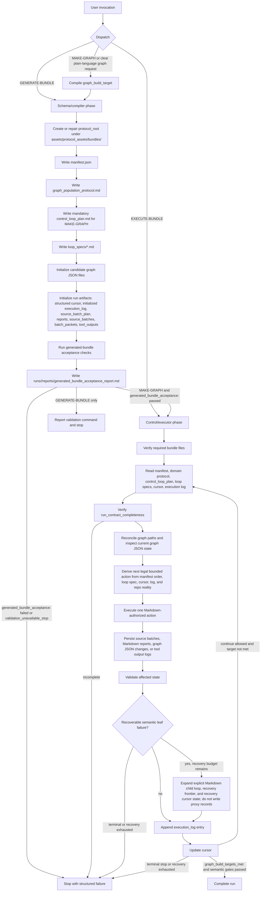

# Graph Population Protocol Schema

## Quick Use For Human Operator

Start here when you want Codex to create a new graph-population bundle, or when
you want to issue a short graph-building request.

Tell Codex:

```text
MAKE-GRAPH

Use assets/protocol_assets/system/graph_population/v001/graph_population_protocol_schema.md
as the graph-build request compilation schema.

Make graph on domain: <domain>, with <N> node types and <K> instances of each
type, and then <E> edge types and <J> instances of each.
```

If you only want Codex to create the protocol bundle and stop before population,
tell Codex:

```text
GENERATE-BUNDLE

Use assets/protocol_assets/system/graph_population/v001/graph_population_protocol_schema.md
as the protocol-generation schema.

domain_label: <domain>
domain_slug: <domain_slug>
protocol_id: protocol_001
protocol_root: assets/protocol_assets/bundles/<domain_slug>/protocol_001
type_graph_id: <domain_slug>_tg
fiber_graph_id: <domain_slug>_fg
run_contract_id: run_contract_001

Create the generated graph-population protocol bundle. Do not populate graph
facts yet.
```

If a protocol bundle already exists and you want Codex to continue or execute
it, point Codex at the control protocol instead:

```text
assets/protocol_assets/system/graph_population/v001/graph_population_control_protocol.md
```

## Corrected Soft Control Flow Diagram

This diagram is the whole-system control flow. It is normative for both the
schema/compiler phase and the control/executor phase.



## 0. Cold-Start Operational Bootloader

This document must be sufficient for a Codex instance with no prior
conversation context.

Read this section first. Later sections are normative, but they are subordinate
to this bootloader for initial routing, artifact authority, and first action
selection.

### 0.0.1 Document Identity

This file is the domain-agnostic graph-population protocol schema.

Its job is to compile a human graph-building request into a concrete,
repo-local graph-population protocol bundle.

It is not:

- the generated domain-specific protocol;
- the run executor;
- a source-crawl transcript;
- a graph database itself;
- a license to use model memory or helper scripts as hidden workflow state.

The companion executor is:

```text
assets/protocol_assets/system/graph_population/v001/graph_population_control_protocol.md
```

### 0.0.2 System Pair Roles

The two hand-authored system documents have separate jobs:

```text
graph_population_protocol_schema.md
  -> compiler / bundle generator

graph_population_control_protocol.md
  -> interpreter / run executor

generated protocol bundle
  -> workflow program

manifest + control_loop_plan + loop_specs + cursor + log + reports
  -> externalized program counter and run state
```

The generated Markdown/JSON/log surface, not Codex memory, is the authority for
what has been planned, executed, blocked, or completed.

### 0.0.2.0 Hard MAKE-GRAPH Continuation Rule

For any invocation compiled as ordinary `MAKE-GRAPH` with
`graph_build_target.completion_target: graph_build_targets_met`, Codex must not
stop after bundle generation, generated-bundle acceptance, domain suitability,
graph JSON initialization, source-scope setup, source-batch planning, validation
of empty graph files, or any other administrative/setup action. Those actions
are prerequisites only.

After the generated-bundle acceptance gate passes, this schema must hand off to
the control protocol through repo-local artifacts with an effective execution
contract equivalent to:

```text
EXECUTE-BUNDLE
continue_until: graph_build_targets_met
```

The execution phase must continue into source-grounded type discovery, then the
subsequent generated semantic loops, until one of these happens:

```text
1. semantic graph targets are met and semantic acceptance passes;
2. the human explicitly stops the run;
3. an explicit execution budget is exhausted and logged as a pause, not success;
4. validation fails in a way the current action cannot repair;
5. a real semantic/source blocker is logged after the generated recovery ladder
   has been attempted or ruled inapplicable.
```

A generated-bundle acceptance report proves only that the workflow program is
well formed. It does not prove that the graph has been built. A `MAKE-GRAPH`
run with zero accepted semantic graph records and no logged blocker must be
reported as `make_graph_stopped_before_semantic_action`, not as success or
near-success.

### 0.0.2.1 Recoverable Semantic Leaf Failure Directive

A graph-population run is supposed to push through recoverable semantic
difficulty by creating explicit child loops, not by stopping early and not by
writing proxy records.

For every generated semantic leaf action, this schema must require the bundle
to say what happens when the first attempt is shallow, sparse, rate-limited,
field-poor, evidence-poor, or under-count. The required behavior is:

```text
1. classify the trouble;
2. decide whether it is recoverable under the generated recovery policy;
3. create or update the explicit Markdown child-loop surface;
4. persist any source batch, frontier, or report state under the run directory;
5. update cursor/log recovery state;
6. execute the next bounded child-loop action;
7. resume the parent loop only when the generated resume condition is met.
```

A recoverable semantic failure must not be repaired by synthetic,
deterministic, serial-numbered, placeholder, source-adapter-only, endpoint-
pairing, or scaffold records. Scaffold creation is not recovery. Raw count
completion is not recovery. The only legal recovery is explicit source, query,
frontier, field, relation, evidence, dedupe, or batching expansion represented
in repo-local Markdown/JSON/log state.

The generated bundle may stop only after the relevant recovery ladder is absent
because the failure is terminal, or present and explicitly exhausted.

### 0.0.3 Invocation Dispatch

At first contact, classify the invocation before doing any other work.

Use this dispatch table:

```text
GENERATE-BUNDLE
  Use this schema to create or repair a generated protocol bundle.
  Stop after bundle acceptance unless the human explicitly requests execution.

MAKE-GRAPH
  Treat as a front-door macro.
  Parse the short graph request.
  Compile graph_build_target.
  Default source policy is live_lookup_required_and_authorized unless the
  invocation explicitly says no_live_lookup, bundle_only, scaffold_only,
  smoke_only, or no_population.
  Generate the bundle under this schema.
  Run generated-bundle acceptance checks.
  If the prompt asks to make/populate the graph, hand off through files to
  graph_population_control_protocol.md and execute only under that protocol.

Plain-language request to make/populate/build a graph
  If counts and domain are clear, treat as MAKE-GRAPH even without the literal
  trigger word.
  If counts or domain are ambiguous, ask only the blocking clarification.

EXECUTE-BUNDLE
  Wrong document. Stop and route to graph_population_control_protocol.md.

No graph-building or bundle-generation intent
  Stop and ask for the intended mode.
```

Do not begin source lookup, graph JSON writes, bundle generation, or execution
until the dispatch decision is explicit.

### 0.0.4 First Actions For This Schema

After dispatch, perform only the first applicable action sequence.

For `GENERATE-BUNDLE`:

```text
1. identify required inputs;
2. ask for missing blocking inputs, if any;
3. state the bounded generation action;
4. create or repair the generated bundle files;
5. run generated-bundle acceptance checks;
6. report the validation command and stop.
```

For `MAKE-GRAPH`:

```text
1. parse the request into graph_build_target;
2. set default_source_policy_for_make_graph: live_lookup_required_and_authorized unless explicitly forbidden;
3. identify source-scope requirements and source boundaries;
4. create the generated bundle, including explicit Markdown loop surfaces;
5. run generated-bundle acceptance checks;
6. stop if the bundle is incomplete;
7. load the control protocol and hand off through repo-local artifacts with
   continue_until: graph_build_targets_met;
8. execute until semantic graph targets are met, the human stops, an explicit
   execution budget pauses the run, or a real logged blocker fires;
9. continue only through repo-local handoff artifacts, not memory.
```

For ordinary `MAKE-GRAPH`, steps such as domain suitability, graph JSON
initialization, source-scope setup, source-batch planning, or validation of
empty graph files are setup prerequisites. They are not completed graph actions
and must not be the final action unless they fail with a precise blocker.

For a guided or onboarding invocation, briefly explain where the run is before
asking for inputs. For expert invocations, give the short mode/readiness
summary and proceed.

### 0.0.5 Minimal Vocabulary At First Contact

Use these definitions before relying on later detailed sections:

```text
schema:
  this hand-authored generator document

control protocol:
  the hand-authored executor document

protocol bundle:
  generated repo-local files for one domain/protocol_id

domain protocol:
  generated graph_population_protocol.md inside a bundle

control loop plan:
  generated dotted nested loop plan that binds targets to traversal

loop spec:
  generated Markdown file defining one explicit loop/action surface

cursor:
  JSON run pointer recording the current externalized program counter

execution log:
  append-only Markdown record of actions, validation, failures, and handoffs

type graph / downstairs graph:
  graph of admissible domain types and relation types

fiber graph / upstairs graph:
  graph of concrete instances projected onto the type graph
```

If a later section uses a term that is not yet clear, resolve it against this
vocabulary and the bundle files. Do not improvise from model memory.

### 0.0.6 Hand-Authored Versus Generated Files

This file is hand-authored system guidance.

It may cause Codex to generate:

```text
manifest.json
graph_population_protocol.md
control_loop_plan.md
loop_specs/*.md
candidate_graphs/<type_graph_id>/nodes.json
candidate_graphs/<type_graph_id>/edges.json
candidate_graphs/<fiber_graph_id>/nodes.json
candidate_graphs/<fiber_graph_id>/edges.json
runs/<run_id>/cursor.json
runs/<run_id>/execution_log.md
runs/<run_id>/source_batch_plan.md
runs/<run_id>/reports/generated_bundle_acceptance_report.md
runs/<run_id>/reports/*.md
runs/<run_id>/source_batches/*
runs/<run_id>/batch_packets/*.md
runs/<run_id>/tool_outputs/*
```

Generated bundle files are data/control artifacts. They must not be confused
with this system schema.

### 0.0.7 Wrong-Mode Stops

If the prompt asks this schema to execute a pre-existing bundle without
generation, stop with:

```text
wrong_mode: use graph_population_control_protocol.md
```

If the prompt asks this schema to make graph claims while forbidding source
lookup needed by the source policy, stop with a structured failure instead of
writing unsupported graph records.

If a mode or required input is missing, ask at most three blocking questions.

### 0.0.8 Cold-Start Output Discipline

Before mutating files, report:

```text
mode:
document_role:
protocol_root:
files_that_may_change:
first_bounded_action:
stop_condition:
```

Do not expose manifest/cursor/log internals beyond what the human needs unless
`diagnostic_verbosity` is `full`, the user asks, or the detail is needed to
explain a stop condition.

### 0.0.9 Operational Read Order For The Rest Of This Document

After this bootloader, read and apply the remaining sections in this order:

```text
1. Agentic Loop Ownership Directive
2. Mode Boundary
3. Human Interaction Contract
4. Graph Build Request Compilation Contract
5. Purpose and Core Vocabulary
6. Invocation Inputs
7. Output Directory and Manifest Contracts
8. Initial Graph JSON, Source Adapter, Batch, Artifact, and Tool Contracts
9. Required Type-Graph Passes
10. Required Fiber-Graph Passes
11. Loop Spec and Domain-Specific Protocol Contracts
12. Control-Protocol and Graph-Tool Compatibility Rules
13. Candidate Invocation Prompts
14. Acceptance Checks For Generated Bundles
```

If a later section seems to conflict with the bootloader, obey the bootloader
and repair or report the conflict rather than improvising.

## 0.1 Agentic Loop Ownership Directive

When this schema generates a Markdown control surface, that generated surface
is the workflow program.

Codex is the interpreter of that program. The externalized program counter is
the combination of:

```text
manifest.ordered_loop_specs
control_loop_plan.md
loop_specs/
runs/<run_id>/cursor.json
runs/<run_id>/execution_log.md
runs/<run_id>/reports/
```

All semantic iteration must be represented in that Markdown/JSON/log surface
before it is executed.

Generated Python, shell scripts, notebooks, or other helper code must not own,
traverse, or complete graph-building loops. They must not decide, select,
iterate over, or write:

```text
type nodes
type fields
type edges
type-edge fields
fiber nodes
fiber-node field values
fiber edges
fiber-edge field values
```

If Codex realizes that a step requires iteration, it must expand the generated
Markdown loop surface first. If the full nested loop is known, write it as a
nested list or dotted loop plan. If only one level is known, write the current
loop item plus a bounded child-loop-generation action. Then execute that
Markdown loop through the cursor and log.

Existing repository Python tools may be used as validators, inspectors, or
materializers after Codex has written graph JSON according to an authorized
Markdown action. They are not the workflow engine.

If a generated script or ad hoc code loop appears necessary to perform graph
population, the generated protocol must stop with:

```text
generated_code_loop_forbidden
```

and must report the Markdown loop surface that needs to be expanded instead.

## 0.2 Mode Boundary

This document is used in `GENERATE-BUNDLE` mode and in the compilation phase
of the `MAKE-GRAPH` front-door macro.

`GENERATE-BUNDLE` mode creates or revises a domain-specific graph-population
protocol bundle. It must not populate graph facts.

`MAKE-GRAPH` is not a third execution mode that erases this boundary. It is a
front-door macro that must be decomposed into explicit mode phases:

```text
MAKE-GRAPH request
  -> GENERATE-BUNDLE phase
  -> generated-bundle acceptance gate
  -> EXECUTE-BUNDLE phase
```

The handoff between phases must happen through generated files: manifest,
control loop plan, loop specs, cursor, execution log, Markdown reports, source
caches, and graph JSON. Codex must not carry hidden phase state in memory.

If an invocation asks Codex to crawl sources, add graph records, or advance a
run cursor without first entering the `MAKE-GRAPH` handoff or
`EXECUTE-BUNDLE`, Codex must stop and report:

```text
wrong_mode: use EXECUTE-BUNDLE with graph_population_control_protocol.md
```

The accepted trigger phrases for this document are:

```text
GENERATE-BUNDLE
MAKE-GRAPH
```

Live source lookup during `GENERATE-BUNDLE`, when explicitly allowed by the
human, is `design_reconnaissance`, not `population_crawl`.

`design_reconnaissance` may only determine:

```text
source families
source boundaries
source adapter candidates
domain suitability
likely loop shapes
field/relation research strategy
```

It must not write graph records, fill graph fields, satisfy target counts,
advance the run cursor, or authorize graph JSON writes. Any source-derived
claim that will affect graph contents later must be re-expressed in the
generated Markdown loop/report surface and revalidated or imported as an
`EXECUTE-BUNDLE` source batch before graph writing.

`population_crawl` means source lookup that selects, rejects, deduplicates,
fields, or writes graph records. It is allowed only under `EXECUTE-BUNDLE`.

## 0.3 Human Interaction Contract

This document controls conversation with the human prompter as well as bundle
generation.

Use progressive disclosure: show the human only the amount of system machinery
needed for the current decision, unless the human asks for more detail or
`diagnostic_verbosity` is `full`.

The closest standard terms for this behavior are:

- human-in-the-loop workflow;
- interaction contract;
- diagnostic UX;
- structured error reporting;
- adaptive expertise-aware prompting.

### Interaction Mode

Every invocation must support:

```text
interaction_level: expert | guided | onboarding
diagnostic_verbosity: terse | normal | full
```

Defaults:

```text
interaction_level: guided
diagnostic_verbosity: normal
```

Interaction meanings:

- `expert`: assume the human knows `GENERATE-BUNDLE`, `EXECUTE-BUNDLE`, graph
  IDs, manifests, loop specs, cursors, and graph roots. Do not overexplain.
- `guided`: briefly explain current state, identify the next bounded action,
  and ask only blocking questions.
- `onboarding`: teach enough of the system for the human to make the next
  decision, while still keeping questions bounded.

### Expert Fast Path

If the human supplies complete protocol language, respond tersely:

```text
Mode: GENERATE-BUNDLE
Protocol root: <protocol_root>
Domain: <domain_label>
Next action: create or update protocol bundle
Missing inputs: none
Proceeding.
```

### New User Ramp Path

If the human request is vague or uses ordinary language, do not dump internals.
Start with this kind of orientation:

```text
This system builds a typed graph in two layers:
1. a type graph defining what kinds of things and relations exist;
2. a fiber graph containing concrete instances over those types.

Right now we are generating the protocol bundle, not populating facts yet.
I need these decisions before I can proceed: ...
```

### Question Discipline

Ask at most three blocking questions at once.

For each question:

- say why it matters;
- give the recommended default when one exists;
- avoid implementation-internal questions unless the answer changes
  user-visible behavior or run safety.

### Situation Briefing Before Action

Before creating or modifying bundle files, state:

- where the run is;
- what mode is active;
- what files may change;
- what the next bounded action is;
- what would cause a stop.

In `expert` mode, this may be a compact status block. In `guided` or
`onboarding` mode, use plain language first and technical labels second.

### Behind-The-Scenes Filtering

Do not expose cursor, log, manifest, or loop-spec details unless:

- they are relevant to the human's decision;
- they explain a failure or stop;
- the human asks for them;
- `diagnostic_verbosity` is `full`.

### Plain-Language Glossary On Demand

When the human appears unfamiliar with the system, translate terms:

```text
type graph = the graph of categories and allowed relation kinds
fiber graph = the graph of actual things mapped onto those categories
loop spec = the checklist that keeps Codex from wandering
cursor = the saved place in the run
```

### Dual-Layer Error Messages

Every error or stop should have:

1. a user-facing diagnosis;
2. a technical failure report when technical detail is relevant.

Example:

```text
I cannot generate a runnable protocol bundle yet because the graph IDs are
missing. The graph IDs tell the later control protocol where generated JSON
should live.

Technical:
failure_kind: incomplete_generation_inputs
missing_field: type_graph_id
safe_to_resume: yes
recommended_next_action: provide type_graph_id or accept the protocol default
```

### User Alignment Checkpoints

In `guided` and `onboarding` mode, before moving from bundle generation to
graph population, summarize what was created and ask for confirmation unless
the human explicitly requested automatic continuation.

## 0.4 Graph Build Request Compilation Contract

The system must support short graph-build requests.

If the human gives a compact request such as:

```text
Make graph on domain: <domain label>, with 10 node types and 10 instances
of each type, and then 5 edge types and 10 instances of each.
```

Codex must not treat that as a vague brainstorming prompt. It must compile the
sentence into an explicit graph-build target contract before generating the
bundle.

This front-door compilation does not replace `GENERATE-BUNDLE` and
`EXECUTE-BUNDLE`. It binds them together. The generated bundle is still the
artifact, and the control protocol still executes it, but the manifest must
carry the target counts that make success or failure checkable.

For a `MAKE-GRAPH` invocation, Codex must run this macro sequence:

```text
1. parse the short request;
2. compile graph_build_target;
3. set source policy to live_lookup_required_and_authorized unless explicitly forbidden;
4. run GENERATE-BUNDLE under this schema;
5. run generated-bundle acceptance checks;
6. stop if the generated bundle is incomplete;
7. hand off only through repo-local generated artifacts;
8. run EXECUTE-BUNDLE under graph_population_control_protocol.md with
   continue_until: graph_build_targets_met;
9. execute the explicit Markdown loop surface until semantic graph targets are
   met, the human stops, an explicit execution budget pauses the run, or a real
   logged blocker fires.
```

If the human asks only to generate a bundle, Codex must stop after step 4. If
the human says `MAKE-GRAPH` or otherwise asks to make the graph, automatic
continuation into `EXECUTE-BUNDLE` is allowed only after the generated-bundle
acceptance gate passes.

The `MAKE-GRAPH` macro must not skip source policy, source boundary, batch
packet, Markdown report, validation, or run-contract checks in order to feel
like a single command.

For ordinary `MAKE-GRAPH`, source policy must not be interpreted as missing
just because the human did not separately write "live lookup authorized." The
command to make the graph authorizes the source lookup needed to satisfy
source-backed semantic graph targets. A generated bundle may use
`live_population_lookup_authorization: not_supplied_in_invocation` only when
the invocation explicitly requests `GENERATE-BUNDLE`, `bundle_only`,
`no_live_lookup`, `no_population`, `scaffold_only`, or `smoke_only`.

The generated-bundle acceptance gate is a schema-side proof step. It is not the
same thing as control-time run-contract completeness.

Acceptance means:

```text
1. the schema has created the required bundle files;
2. the bundle has passed the generated-bundle acceptance checklist;
3. the validation command has been run or a validation-unavailable stop has
   been logged;
4. the result has been written to
   runs/<run_id>/reports/generated_bundle_acceptance_report.md.
```

For `MAKE-GRAPH`, generated-bundle acceptance must also state that the bundle is
accepted for execution but the graph is not yet built. The report must name the
required continuation target:

```text
bundle_status: accepted_for_execution
graph_build_status: not_built_yet
next_required_control_continuation: graph_build_targets_met
setup_actions_count_as_graph_progress: false
```

A generated bundle may be handed to the control protocol only when that report
records:

```text
generated_bundle_acceptance: passed
```

If the report records `generated_bundle_acceptance: validation_unavailable_stop`
or any other stop/failure result, the schema phase must stop and must not enter
`EXECUTE-BUNDLE`.

For generated bundles that can be checked by the repository CLI, the canonical
acceptance command is:

```bash
uv run ortelius protocol validate-bundle --protocol-root <protocol_root>
```

Control-time run-contract completeness is the executor's independent first
gate. The control protocol must still verify the manifest, loop specs, cursor,
log, reports, and graph files before executing. A passing acceptance report
does not authorize the control protocol to skip its own run-contract check.

The compiled contract must include:

```json
{
  "mode": "MAKE-GRAPH",
  "domain": {
    "label": "Example domain",
    "slug": "example_domain"
  },
  "type_graph_targets": {
    "node_type_count": 10,
    "edge_type_count": 5
  },
  "fiber_graph_targets": {
    "instances_per_node_type": 10,
    "instances_per_edge_type": 10,
    "expected_node_instances": 100,
    "expected_edge_instances": 50
  },
  "completion_target": "graph_build_targets_met"
}
```

If the sentence contains ambiguous counts, Codex may ask a bounded clarification
question. If the counts are clear, Codex must derive them without asking.

The generated manifest must store the compiled contract under
`graph_build_target`. A bundle generated from a graph-build request is
incomplete if `graph_build_target` is missing, if the expected fiber counts
cannot be derived, or if the generated loop specs do not expose those targets
as loop completion conditions.

### Control Loop Plan Contract

The generated bundle must also include a serialized control loop plan.

This plan is the dotted loop-path work surface for the run. It is not
decorative prose. It is the explicit loop plan that lets Codex traverse the
graph build instead of improvising.

`Phase.Stage.Action` is only one possible notation. The important structure is:

```text
LoopClass.LoopClass...LoopClass.Action
```

Each nonterminal segment names a loop class, iterator, target, and cursor
position. The terminal segment names the bounded action to perform at that
cursor position.

Examples:

```text
TypeSetDiscovery.SourceBatch.ResearchCandidateTypes
TypeSetDiscovery.CandidateComparison.SelectFrozenTypeSet
TypeFieldDiscovery.Type.SourceBatch.SearchFieldCandidates
TypeEdgeDiscovery.EnrichedTypePair.SourceBatch.SearchRelationCandidates
TypeEdgeFieldDiscovery.EdgeType.SourceBatch.SearchRelationFieldCandidates
InstancePopulation.Type.SourceBatch.WriteInstanceNodes
EdgePopulation.EdgeType.SourceBatch.WriteEdgeInstances
```

Every semantic leaf path must also have recovery companion paths. These are not
optional commentary; they are the generated child-loop surfaces used when a
leaf action gets hard but is still recoverable.

Examples:

```text
TypeSetDiscovery.Recovery.ExpandCandidateSourceClasses
TypeFieldDiscovery.Type.Recovery.ExpandFieldSourceStrategy
TypeEdgeDiscovery.EnrichedTypePair.Recovery.ExpandRelationSearch
TypeEdgeFieldDiscovery.EdgeType.Recovery.ExpandRelationFieldSearch
InstancePopulation.Type.Recovery.ExpandInstanceSourceStrategy
InstancePopulation.Type.Recovery.ResumeParentPopulation
EdgePopulation.EdgeType.Recovery.ExpandPairEvidenceSearch
EdgePopulation.EdgeType.Recovery.ResumeParentPopulation
```

Equivalent names such as `Type.Instance.Action`, `Domain.Type.Instance.Action`,
or `Phase.Stage.Action` are allowed only when they expose the same loop indices,
targets, writes, evidence rules, validation, cursor update rule, and handoff.
Do not treat the literal words `Phase` and `Stage` as special.

For `MAKE-GRAPH`, the plan must be represented in a dedicated generated file:

```text
control_loop_plan.md
```

The manifest must reference that file at `manifest.control_loop_plan.location`.
The domain protocol may summarize the plan, but the dedicated
`control_loop_plan.md` is the authoritative dotted-loop work surface for
`MAKE-GRAPH`.

For non-`MAKE-GRAPH` bundle-generation use, an equivalent plan may be embedded
in the manifest or domain protocol only when the manifest explicitly declares
that no graph-build target is being executed. If a graph-build target exists,
`control_loop_plan.md` is mandatory.

Minimum shape:

```text
TypeSetDiscovery.SourceBatch.ResearchCandidateTypes:
  target_count: graph_build_target.type_graph_targets.node_type_count
  writes: candidate_graphs/<type_graph_id>/nodes.json
  completion: admissible type candidate frontier is sufficient or stop condition fires

TypeSetDiscovery.CandidateComparison.SelectFrozenTypeSet:
  target_count: graph_build_target.type_graph_targets.node_type_count
  writes: candidate_graphs/<type_graph_id>/nodes.json
  completion: frozen ordinary-domain type set reaches target or stop condition fires

TypeFieldDiscovery.Type.SourceBatch.SearchFieldCandidates:
  iterator: each frozen type node
  writes: candidate_graphs/<type_graph_id>/nodes.json
  completion: each frozen type has field-complete, field-deferred, or field-blocked state

TypeEdgeDiscovery.EnrichedTypePair.SourceBatch.SearchRelationCandidates:
  target_count: graph_build_target.type_graph_targets.edge_type_count
  iterator: enriched type pairs, type neighborhoods, or relation frontier items
  writes: candidate_graphs/<type_graph_id>/edges.json
  completion: frozen ordinary-domain type-edge set reaches target or stop condition fires

TypeEdgeFieldDiscovery.EdgeType.SourceBatch.SearchRelationFieldCandidates:
  iterator: each frozen type edge
  writes: candidate_graphs/<type_graph_id>/edges.json
  completion: each frozen type edge has edge-field-complete, edge-field-deferred, or edge-field-blocked state

InstancePopulation.Type.SourceBatch.WriteInstanceNodes:
  iterator: each fiber-population-eligible frozen type node
  target_count_per_type: graph_build_target.fiber_graph_targets.instances_per_node_type
  writes: candidate_graphs/<fiber_graph_id>/nodes.json
  completion: each eligible type node has target_count_per_type accepted, source-backed, field-complete fiber nodes or stop condition fires

EdgePopulation.EdgeType.SourceBatch.WriteEdgeInstances:
  iterator: each fiber-population-eligible frozen type edge
  target_count_per_edge_type: graph_build_target.fiber_graph_targets.instances_per_edge_type
  writes: candidate_graphs/<fiber_graph_id>/edges.json
  completion: each eligible type edge has target_count_per_edge_type accepted, pair-evidenced, edge-field-complete fiber edges or stop condition fires
```

For each semantic leaf path in the minimum shape, the generated plan must also
name the recovery loop that owns recoverable failure handling. A parent path is
incomplete if it can fail from sparse sources, shallow fields, rate limits,
insufficient pair evidence, entity-resolution ambiguity, or target shortfall
without naming a child loop and recovery budget.

The generated bundle must not call scaffold creation, graph JSON initialization,
source-scope setup, or a single first action sufficient for a `MAKE-GRAPH`
request. Those are prerequisites. Completion means the requested graph target
counts are met, or the run stops with a precise logged blocker explaining which
target could not be met and why.

For ordinary `MAKE-GRAPH`, the first source-grounded graph-population action
after setup must enter the type-set discovery loop. If setup succeeds, the
control surface must auto-advance into source-grounded type discovery rather
than returning a user-facing completion report. If type discovery cannot begin,
the run must log the blocker that prevents the first semantic action.

### Semantic Richness Contract

For `MAKE-GRAPH` runs, target counts are semantic targets, not merely raw JSON
counts.

`node_type_count` means that many nonredundant ordinary domain entity types.
The generated protocol must not satisfy the requested count with shallow source
categories, source taxonomies, or near-duplicates unless the requested domain
explicitly asks for that narrow slice.

`node_type_count` also means base entity types, not query-derived cohorts or
defined classes. A type whose membership is obtained by filtering, joining,
projecting, intersecting roles, following a graph path, or analyzing existing
records is a derived type or analytical view. It must not count as a base
type-graph node.

`edge_type_count` means that many distinct semantic relation families. It does
not mean source/target variants of the same predicate.

`edge_type_count` also means base relation types, not query-derived,
path-derived, projected, co-membership, transitive-closure, or analytical-view
relations. Deep relations are primitive, domain-native, and source-attested.
Deep does not mean compound.

Invalid unless the human explicitly asks for address-only graph structure:

```text
restaurant_has_street_address_on_street
cafe_has_street_address_on_street
school_has_street_address_on_street
```

These are three typed endpoint variants of one predicate family:

```text
has_street_address_on_street
```

They count as one relation family for graph-build target purposes.

Every generated graph-build bundle must include these gates before graph JSON
can be accepted as complete:

```text
base_entity_type_admission_gate
query_derived_type_rejection_gate
type_diversity_gate
type_field_richness_gate
base_relation_admission_gate
query_derived_relation_rejection_gate
relation_family_diversity_gate
relation_field_richness_gate
source_diversity_or_limitation_gate
```

If a source adapter makes one cheap relation family easy to populate, the
protocol must not stop there. It must search for other relation families using
different source classes where available, or stop with a precise limitation.

Allowed limitation states:

```text
rich_semantic_target_met
rich_semantic_target_blocked_by_source_depth
rich_semantic_target_blocked_by_domain_scope
rich_semantic_target_requires_human_research_scope_decision
```

Raw counts can be complete only when the relevant semantic richness gates have
also passed. A graph that hits raw counts but fails these gates must be reported
as structurally valid but semantically incomplete.

Intermediate semantic gates must not use ambiguous pass states. In ordinary
`MAKE-GRAPH` mode, these values are not passing values:

```text
passed_seed_contract
passed_structural_only
passed_source_adapter_only
passed_count_probe_only
passed_query_result_count_only
passed_with_generic_fields
```

They must be interpreted as candidate/frontier states, not semantic
completion. A generated bundle that writes one of those values must continue
into the relevant semantic child loop or stop with a precise limitation. It
must not advance as if the type, field, relation, instance, or edge target is
semantically satisfied.

For `MAKE-GRAPH` completion, generated bundles must expose semantic target
metrics, not only raw JSON record counts:

```text
actual_eligible_ordinary_type_node_count
actual_base_entity_type_count
actual_query_derived_type_count
actual_distinct_predicate_family_count
actual_base_relation_type_count
actual_query_derived_relation_type_count
actual_fiber_node_count
actual_fiber_edge_count
```

These raw metrics are not sufficient by themselves. The generated bundle must
also expose semantic acceptance metrics that distinguish written records from
accepted semantic records:

```text
written_type_node_records
accepted_base_entity_type_records
type_nodes_with_domain_descriptive_fields
written_type_edge_records
accepted_base_relation_type_records
type_edges_with_relation_descriptive_fields
written_fiber_node_records
candidate_fiber_node_records
accepted_source_backed_fiber_nodes
accepted_field_complete_fiber_nodes
written_fiber_edge_records
candidate_fiber_edge_records
accepted_pair_evidenced_fiber_edges
accepted_edge_field_complete_fiber_edges
synthetic_or_deterministic_node_records
synthetic_or_deterministic_edge_records
scaffold_node_records
scaffold_edge_records
synthetic_records_counted_toward_target
scaffold_records_counted_toward_target
```

`MAKE-GRAPH` target counts are satisfied only by accepted semantic records:

```text
accepted_base_entity_type_records == graph_build_target.type_graph_targets.node_type_count
accepted_base_relation_type_records == graph_build_target.type_graph_targets.edge_type_count
accepted_source_backed_fiber_nodes == graph_build_target.fiber_graph_targets.expected_node_instances
accepted_field_complete_fiber_nodes == graph_build_target.fiber_graph_targets.expected_node_instances
accepted_pair_evidenced_fiber_edges == graph_build_target.fiber_graph_targets.expected_edge_instances
accepted_edge_field_complete_fiber_edges == graph_build_target.fiber_graph_targets.expected_edge_instances
synthetic_records_counted_toward_target == false
scaffold_records_counted_toward_target == false
```

Synthetic, deterministic, placeholder, scaffold, or completion-policy records
must not be used to pursue target-scale population in ordinary `MAKE-GRAPH`
mode. They may appear only in explicit scaffold/smoke mode or as small,
clearly labeled diagnostic/frontier aids that do not resemble accepted records
and do not fill raw target counts. They must not count toward accepted
graph-build targets unless the human explicitly requests scaffold mode. A run
that reaches requested raw counts by writing those records has executed the
wrong recovery behavior and must stop with `proxy_substitution_forbidden` or
`semantic_acceptance_incomplete`, not present the raw counts as progress.

Accepted fiber nodes must be source-backed and field-complete according to the
type-specific `type_fields` discovered earlier in the generated bundle. The
schema must not allow a fiber node to count merely because it has a source ID,
label, URL, coordinate, source category, or other source-adapter field.

For a fiber node to count, the source evidence must support the concrete
record's membership in the declared type, not merely show that the source
query returned the row. A query result count is a source-navigation fact, not
record-level evidence. If the same external entity appears under multiple
type IDs, the bundle must apply an explicit multi-typing policy:

```text
canonical_entity_id:
allowed_multiple_fiber_nodes_for_one_entity:
membership_evidence_per_type:
counting_policy_for_duplicate_source_entities:
dedupe_or_role_split_reason:
```

Absent that policy and per-type membership evidence, duplicate source entities
must be deduplicated or left candidate, and they must not be used to satisfy
accepted target counts across multiple type buckets.

Accepted fiber edges must have pair-specific evidence for the exact source
node, primitive relation, and target node. A source-backed source node plus a
source-backed target node plus a compatible type edge is not evidence of a
concrete edge. Deterministic endpoint pairing, shared bucket membership,
co-presence in the graph, endpoint compatibility, or source-category overlap
must not count as pair-specific evidence.

For graph-build targets that request `instances_per_edge_type`, type-edge
discovery must not freeze an edge type merely because the relation family is
valid or distinct. The generated bundle must prove or explicitly defer
edge-population feasibility before the edge set freezes:

```text
edge_type_id:
predicate_family:
source_type_id:
target_type_id:
target_edges_for_this_type:
pair_evidence_feasibility_status:
pair_evidence_probe_count:
actual_or_planned_source_node_selection_strategy:
actual_or_planned_target_node_selection_strategy:
recovery_or_revision_action_if_below_target:
```

A relation family that is semantically valid but cannot plausibly produce the
requested number of pair-evidenced concrete edges under the current endpoint
contract must be recorded as a candidate/deferred relation, not an accepted
target-counting edge type, unless the manifest explicitly says the run may
accept semantically valid but under-populated edge types.

Every `MAKE-GRAPH` generated bundle must include:

```text
runs/<run_id>/reports/semantic_acceptance_report.md
```

The semantic acceptance report is the completion authority for accepted target
counts. It must include the counters above, sources or report paths supporting
the counters, the relevant validation result, and the final status:

```text
semantic_acceptance_status:
  passed | semantic_acceptance_incomplete | source_depth_limited | field_richness_limited | edge_evidence_limited
```

Structural validation alone never satisfies `MAKE-GRAPH`.

Ineligible metadata, source, taxonomy, schema, provenance, evidence, helper, or
classification records must not count toward graph-build targets. Endpoint
variants of one predicate family must not count as multiple edge-type targets
unless the manifest explicitly declares an endpoint-variant target.

The shortest invariant is:

```text
Base node types are not views.
Base edges are not queries.
```

### Recoverable Semantic Leaf Failure Contract

The generated bundle must distinguish terminal control failures from
recoverable semantic failures.

Terminal control failures include missing files, invalid JSON, contradictory
cursor/log state, forbidden write targets, source lookup being disallowed, or a
projection invariant violation. These may stop immediately with a structured
failure report.

Recoverable semantic failures include:

```text
insufficient_results
source_rate_limited
source_depth_limited
field_richness_limited
relation_family_diversity_unmet
relation_field_richness_limited
instance_count_shortfall
field_completion_shortfall
edge_pair_evidence_shortfall
edge_field_completion_shortfall
entity_resolution_ambiguous_when_review_policy_exists
```

For recoverable semantic failures, the generated bundle must define a recovery
ladder before the control protocol executes the loop. The ladder may include:

```text
retry_with_backoff
paginate_or_continue_source
rewrite_query
narrow_query
broaden_query
switch_source_adapter
switch_source_class
seed_from_authoritative_index
extract_seed_list
split_current_type_or_edge_work_into_batches
create_field_enrichment_child_loop
create_relation_evidence_child_loop
create_entity_resolution_review_child_loop
write_unprocessed_items_to_frontier
resume_parent_loop
```

Every ladder step must be represented as Markdown loop work under the run
directory. Recovery may not be hidden in Python, shell scripts, notebooks,
model memory, terminal history, or temporary files.

A recovery ladder is exhausted only when the generated attempt budget, source
fallback order, query rewrite policy, source-class expansion policy, and
frontier expansion policy have all been tried or explicitly ruled out. Only
then may the run stop with a recovery-exhausted limitation such as:

```text
source_strategy_recovery_exhausted
field_recovery_exhausted
relation_discovery_recovery_exhausted
instance_population_recovery_exhausted
edge_evidence_recovery_exhausted
```

The semantic acceptance report must say whether unmet targets are unmet because
recovery is still available, recovery was exhausted, source policy forbids more
work, or a human scope decision is required.

## 1. Purpose

The purpose of this schema is to produce a domain-specific graph-population
protocol bundle.

The generated bundle must be usable by:

```text
assets/protocol_assets/system/graph_population/v001/graph_population_control_protocol.md
```

The generated bundle has two jobs:

1. define how to populate a type graph and a graph fibered over it for a
   particular domain;
2. create or identify the JSON surfaces where that population work can begin.

It also has one control job: create a complete run contract. The control
protocol should be able to inspect the generated bundle and either identify the
next legal action or report the exact missing contract element.

For any domain, the generated graph pair is:

```text
<type_graph_id>  = graph of types
<fiber_graph_id> = graph of concrete records fibered over those types
<fiber_graph_id> -> <type_graph_id>
```

This schema is domain agnostic. A domain-specific use case is only generated
data: specific JSON contents, specific type names, specific fields, and
specific relation types.

## 2. Core Vocabulary

### Domain

The subject area to be modeled as a typed, fibered graph.

Examples:

```text
example_domain
literary_world
scientific_instrument_history
```

### Type Graph

The downstairs graph. It contains:

- entity types;
- directed type edges, where each edge is a relation type that can exist;
- admissible source and target type constraints on those directed type edges;
- field contracts for each entity type and relation type.

Relation types are not separate non-edge records in this model. A type-graph
edge is the relation type. Its `source_type_id` and `target_type_id` define the
allowed direction and endpoint types for concrete upstairs edges.

All graphs in this protocol family are directed. A symmetric relation must be
represented as a pair of directed arrows, not as one undirected edge. If both
directions are valid, the type graph should contain two directed type edges,
and those edges may point to each other with `inverse_edge_type_id`.

### Base Entity Type

A primitive, domain-native kind of entity whose instances can be identified
directly from sources or supplied evidence.

A base entity type is not a query result. If membership in the type is defined
as `base_type WHERE field = value`, a join over another relation, a path query,
an intersection of roles, a source taxonomy filter, or an analytical cohort,
then it is a derived type, not a base type-graph node.

Examples of derived or cohort types that must not be admitted as base types
unless the human explicitly asks for analytical views:

```text
award_winning_entity
entities_with_shared_affiliation
organizations_with_items_matching_filter
entity_connected_to_entity_by_path
entities_created_after_date_threshold
entity_reachable_by_two_step_relation
wikidata_occupation_class
osm_feature_class
```

### Base Relation Type

A primitive, domain-native relation whose concrete instances can be directly
supported by sources or supplied evidence.

A base relation type is not a query result. If the relation exists only by
composing other relations, projecting a two-mode graph into a one-mode graph,
following a path, computing a transitive closure, testing co-membership, or
materializing a database view, then it is a derived relation, not a base
type-graph edge.

Examples of derived relation types that must not be admitted as base edges
unless the human explicitly requests an analytical/projection layer:

```text
entity_shares_affiliation_with_entity
entity_shares_award_with_entity
entity_is_connected_by_two_step_path_to_entity
entity_has_same_related_entity_as_entity
entity_has_same_source_category_as_entity
```

Valid primitive relations can still be deep:

```text
person_founded_organization
organization_operates_facility
entity_created_work
entity_participated_in_event
organization_sponsored_program
place_hosts_institution
person_mentored_person
organization_acquired_asset
```

### Fiber Graph

The upstairs graph. It contains concrete entities and concrete relations.

Every upstairs node maps to one type-graph node. Every upstairs edge maps to
one type-graph edge.

Every upstairs edge is directed. If a domain-specific protocol needs to record
a symmetric concrete relation, it must write the appropriate directed edge
records rather than inventing an undirected edge form.

### Downstairs/Upstairs Separation Invariant

Type graph records define admissible kinds of things and relations. Fiber graph
records are concrete domain instances.

A type node label, source taxonomy label, schema class, provenance class,
evidence class, or classification category must not be written as a fiber node
unless the domain explicitly treats that label as a concrete domain entity.

The projection from fiber graph to type graph is encoded only by:

```text
fiber_node.type_id -> type_node.id
fiber_edge.type_id -> type_edge.id
```

This projection must not be duplicated as ordinary fiber graph edges.

Disallowed ordinary fiber edge meanings include:

```text
classified_as
has_type
instance_of
source_classified_as
derived_from_source_class
has_source
mentioned_in
evidence_for
```

and any relation whose only purpose is to restate `type_id`, record
provenance, encode source taxonomy, or satisfy an edge-count target.

Do not store analytical projections over the fiber graph as ordinary fiber
edges. One-mode projections, co-membership edges, path-derived edges,
transitive closures, and materialized query results may be documented as
candidate views or future analytical layers, but they are not base fiber edges.

### Domain-Specific Protocol

The generated Markdown protocol that says how to populate the type graph and
fiber graph for one domain.

### Loop Spec

A generated explicit list or work surface that makes an implicit control loop
visible to Codex.

Loop specs are dotted-loop-path artifacts. They turn "crawl until this part is
populated" into stable, bounded, ordered work by naming the nested loop classes,
their indices, and the terminal action.

### Protocol Bundle

The generated directory that contains the domain-specific protocol, its loop
specs, initialized JSON surfaces, and run state placeholders.

## 3. Invocation Inputs

When Codex is pointed at this schema, the invocation must supply or derive the
generation-phase inputs. For `MAKE-GRAPH`, the effective generation phase is
still `GENERATE-BUNDLE`; the front-door macro is recorded separately as
`front_door_mode`.

```text
mode: GENERATE-BUNDLE
interaction_level
diagnostic_verbosity
domain_label
domain_slug
protocol_id
protocol_root
type_graph_id
fiber_graph_id
candidate_graph_root
source_policy
initial_type_target_count
initial_instance_target_count_policy
run_contract_id
```

If the invocation was derived from a short graph-build request, it must also
supply or derive:

```text
front_door_mode: MAKE-GRAPH
graph_build_target
control_loop_plan
```

For a request such as "10 node types and 10 instances of each type, then 5 edge
types and 10 instances of each," the generated bundle must derive:

```text
type_node_target_count: 10
type_edge_target_count: 5
fiber_node_target_count: 100
fiber_edge_target_count: 50
```

Those targets must appear in the manifest and in the relevant loop completion
rules.

A complete example invocation may use:

```text
mode: GENERATE-BUNDLE
interaction_level: guided
diagnostic_verbosity: normal
domain_label: Example domain
domain_slug: example_domain
protocol_id: protocol_001
protocol_root: assets/protocol_assets/bundles/example_domain/protocol_001
type_graph_id: tg
fiber_graph_id: fg
candidate_graph_root: assets/protocol_assets/bundles/example_domain/protocol_001/candidate_graphs
run_contract_id: run_contract_001
```

Source policy defaults are mode-sensitive:

```text
GENERATE-BUNDLE:
  Live web/source lookup is not implied unless explicitly allowed. The bundle
  should include source requirements but should not perform live population.

MAKE-GRAPH:
  Live web/source lookup for population is required and authorized by default,
  because source-backed semantic targets cannot be met without source access.
  The generated manifest must record
  live_population_lookup_authorization: authorized_by_make_graph unless the
  invocation explicitly says no_live_lookup, bundle_only, scaffold_only,
  smoke_only, or no_population.
```

If the execution environment requires a separate tool approval before browsing
or source access, Codex must ask for that approval at execution time. It must
not convert missing tool approval into a graph-population blocker.

## 4. Output Directory Contract

The schema should cause Codex to create or update a protocol bundle with this
shape:

```text
<protocol_root>/
  manifest.json
  graph_population_protocol.md
  control_loop_plan.md
  loop_specs/
    01_domain_suitability.md
    02_graph_json_initialization.md
    03_type_set_discovery.md
    04_type_set_review.md
    05_type_field_discovery_for_each_type.md
    06_type_field_review.md
    07_type_edge_discovery_from_enriched_types.md
    08_type_edge_review.md
    09_type_edge_field_discovery_for_each_edge_type.md
    10_type_graph_ready_gate.md
    11_instance_target_selection.md
    12_instance_discovery.md
    13_instance_field_completion.md
    14_edge_instance_discovery.md
    15_edge_instance_field_completion.md
    16_fiber_graph_review.md
  candidate_graphs/
    <type_graph_id>/
      nodes.json
      edges.json
    <fiber_graph_id>/
      nodes.json
      edges.json
  runs/
    run_001/
      cursor.json
      execution_log.md
      source_batch_plan.md
      source_batches/
        <batch_id>.json
      batch_packets/
        <batch_id>.md
      reports/
        generated_bundle_acceptance_report.md
        semantic_acceptance_report.md
        design_reconnaissance_report.md
        type_set_discovery_report.md
        type_field_discovery_report.md
        type_edge_discovery_report.md
        type_edge_field_discovery_report.md
        instance_selection_report.md
        edge_instance_selection_report.md
      tool_outputs/
        <tool_run_id>.md
```

The exact loop-spec filenames may change, but the generated bundle must expose
the same logical passes.

Source caches and decision reports must be repo-local run artifacts. They must
not live only in `/tmp`, `/private/tmp`, an untracked external scratch
directory, generated code, or a shell transcript. Temporary external files may
be used only as transport buffers that are immediately copied into the run
artifact tree before they affect graph decisions.

Generated helper scripts are not normal bundle artifacts. If a graph-building
step appears to need code traversal, the bundle is missing an explicit Markdown
loop and must stop with `generated_code_loop_forbidden`.

The two hand-authored system protocol documents live under
`assets/protocol_assets/system/graph_population/v001/`. Generated protocol
bundles and their run state live under `assets/protocol_assets/bundles/`.

## 5. Manifest Contract

`manifest.json` must identify the bundle and make it machine-checkable.

The manifest is the canonical execution spine. Its `ordered_loop_specs` list is
the only authoritative run order. Filenames, headings, and prose in
`graph_population_protocol.md` are descriptive unless they agree with this
manifest order.

Minimum candidate shape:

```json
{
  "schema_version": "ortelius.protocol_bundle.v0",
  "protocol_id": "protocol_001",
  "domain": {
    "label": "Example domain",
    "slug": "example_domain"
  },
  "graphs": {
    "type_graph_id": "tg",
    "fiber_graph_id": "fg",
    "projection": "fg -> tg",
    "candidate_graph_root": "candidate_graphs",
    "declared_graph_paths": {
      "type_nodes": "candidate_graphs/tg/nodes.json",
      "type_edges": "candidate_graphs/tg/edges.json",
      "fiber_nodes": "candidate_graphs/fg/nodes.json",
      "fiber_edges": "candidate_graphs/fg/edges.json"
    },
    "existing_graph_paths_checked": [],
    "path_migration_policy": "stop_for_path_reconciliation"
  },
  "graph_build_target": {
    "front_door_mode": "MAKE-GRAPH",
    "domain_request": "Make graph on domain: Example domain, with 10 node types and 10 instances of each type, and then 5 edge types and 10 instances of each.",
    "type_graph_targets": {
      "node_type_count": 10,
      "edge_type_count": 5
    },
    "fiber_graph_targets": {
      "instances_per_node_type": 10,
      "instances_per_edge_type": 10,
      "expected_node_instances": 100,
      "expected_edge_instances": 50
    },
    "completion_target": "graph_build_targets_met",
    "overflow_policy": "stop_before_exceeding_requested_counts"
  },
  "semantic_acceptance": {
    "required_report": "runs/run_001/reports/semantic_acceptance_report.md",
    "accepted_records_count_toward_targets_only": true,
    "synthetic_or_deterministic_records_count_toward_targets": false,
    "scaffold_records_count_toward_targets": false,
    "source_backed_fiber_nodes_required": true,
    "field_complete_fiber_nodes_required": true,
    "pair_evidenced_fiber_edges_required": true,
    "edge_field_complete_fiber_edges_required": true
  },
  "control_loop_plan": {
    "plan_id": "control_loop_plan_001",
    "representation": "dotted_loop_path",
    "location": "control_loop_plan.md",
    "target_binding": "graph_build_target"
  },
  "make_graph_orchestration": {
    "macro_mode": "MAKE-GRAPH",
    "phase_sequence": [
      "GENERATE-BUNDLE",
      "ACCEPT-GENERATED-BUNDLE",
      "EXECUTE-BUNDLE"
    ],
    "handoff_state": "repo_local_artifacts_only",
    "acceptance_command": "uv run ortelius protocol validate-bundle --protocol-root <protocol_root>",
    "acceptance_report": "runs/run_001/reports/generated_bundle_acceptance_report.md",
    "execute_after_acceptance": true
  },
  "source_execution": {
    "source_adapter_contract_defined": true,
    "batch_execution_contract_defined": true,
    "batch_log_shape_defined": true,
    "entity_resolution_contract_defined": true,
    "default_source_policy_for_make_graph": "live_lookup_required_and_authorized",
    "live_population_lookup_authorization": "authorized_by_make_graph",
    "population_without_live_or_supplied_sources": "not_applicable_live_lookup_authorized",
    "explicit_no_live_lookup_overrides_make_graph_default": false,
    "source_fallback_order": []
  },
  "field_policy": {
    "field_tier_contract_defined": true,
    "field_completion_contract_defined": true,
    "record_status_policy": "protocol_generated_records_default_to_candidate",
    "field_value_status_policy": "field_value_status_records evidence state independently from record lifecycle"
  },
  "documents": {
    "domain_protocol": "graph_population_protocol.md",
    "control_protocol": "assets/protocol_assets/system/graph_population/v001/graph_population_control_protocol.md"
  },
  "ordered_loop_specs": [
    "loop_specs/01_domain_suitability.md",
    "loop_specs/02_graph_json_initialization.md",
    "loop_specs/03_type_set_discovery.md",
    "loop_specs/04_type_set_review.md",
    "loop_specs/05_type_field_discovery_for_each_type.md",
    "loop_specs/06_type_field_review.md",
    "loop_specs/07_type_edge_discovery_from_enriched_types.md",
    "loop_specs/08_type_edge_review.md",
    "loop_specs/09_type_edge_field_discovery_for_each_edge_type.md",
    "loop_specs/10_type_graph_ready_gate.md",
    "loop_specs/11_instance_target_selection.md",
    "loop_specs/12_instance_discovery.md",
    "loop_specs/13_instance_field_completion.md",
    "loop_specs/14_edge_instance_discovery.md",
    "loop_specs/15_edge_instance_field_completion.md",
    "loop_specs/16_fiber_graph_review.md"
  ],
  "runs": {
    "default_run_id": "run_001",
    "default_cursor": "runs/run_001/cursor.json",
    "default_execution_log": "runs/run_001/execution_log.md",
    "source_batch_plan": "runs/run_001/source_batch_plan.md",
    "source_batch_root": "runs/run_001/source_batches",
    "batch_packet_root": "runs/run_001/batch_packets",
    "report_root": "runs/run_001/reports",
    "generated_bundle_acceptance_report": "runs/run_001/reports/generated_bundle_acceptance_report.md",
    "semantic_acceptance_report": "runs/run_001/reports/semantic_acceptance_report.md",
    "tool_output_root": "runs/run_001/tool_outputs"
  },
  "initial_run_state": {
    "cursor_schema_version": "ortelius.protocol_cursor.v0",
    "cursor_status": "not_started",
    "execution_log_schema_version": "ortelius.protocol_execution_log.v0",
    "execution_log_status": "initialized_no_execution_actions",
    "execution_entries_status": "none",
    "active_recovery": null,
    "last_log_entry_id": null
  },
  "run_artifact_policy": {
    "repo_local_artifacts_required": true,
    "external_tmp_policy": "transport_only_not_decision_state",
    "design_reconnaissance_is_not_population_crawl": true,
    "markdown_decision_surface_required": true,
    "semantic_iteration_must_be_markdown": true,
    "generated_helper_scripts_allowed": false,
    "python_tools_allowed_for_validation_and_materialization_only": true,
    "graph_json_written_by_codex_from_markdown_report": true,
    "batch_packets_required_for_batched_work": true,
    "tool_outputs_are_logs_only": true,
    "source_caches_persisted_under_run": true,
    "selection_reports_required_before_graph_writes": true
  },
  "run_contract_completeness": {
    "generated_by_mode": "GENERATE-BUNDLE",
    "execution_mode": "EXECUTE-BUNDLE",
    "status": "complete",
    "required_loop_spec_headings_present": true,
    "validation_defined": true,
    "source_boundaries_defined": true,
    "type_graph_ready_gate_defined": true,
    "type_set_discovery_project_defined": true,
    "type_set_freeze_gate_defined": true,
    "type_field_discovery_for_each_type_defined": true,
    "type_fields_complete_gate_defined": true,
    "type_edge_discovery_from_enriched_types_defined": true,
    "edge_set_freeze_gate_defined": true,
    "type_edge_field_discovery_for_each_edge_type_defined": true,
    "edge_fields_complete_gate_defined": true,
    "type_node_admissibility_defined": true,
    "type_edge_admissibility_defined": true,
    "fiber_population_eligibility_defined": true,
    "downstairs_upstairs_separation_defined": true,
    "source_adapter_contract_defined": true,
    "batch_execution_contract_defined": true,
    "markdown_batch_packet_contract_defined": true,
    "batch_log_shape_defined": true,
    "entity_resolution_contract_defined": true,
    "field_tier_contract_defined": true,
    "field_completion_contract_defined": true,
    "path_reconciliation_defined": true,
    "edge_completion_budgets_defined": true,
    "graph_build_target_defined": true,
    "control_loop_plan_defined": true,
    "make_graph_orchestration_defined": true,
    "initial_cursor_scaffold_defined": true,
    "initial_execution_log_scaffold_defined": true,
    "initial_cursor_matches_manifest": true,
    "initial_log_matches_cursor": true,
    "repo_local_run_artifact_policy_defined": true,
    "markdown_decision_reports_defined": true,
    "agentic_loop_ownership_defined": true,
    "generated_code_loop_forbidden": true,
    "tool_output_artifact_policy_defined": true,
    "source_cache_persistence_defined": true,
    "make_graph_live_lookup_default_defined": true,
    "make_graph_not_supplied_source_authorization_forbidden": true,
    "source_tool_approval_boundary_defined": true,
    "recoverable_leaf_failure_policy_defined": true,
    "semantic_child_loop_generation_defined": true,
    "recovery_cursor_state_defined": true,
    "proxy_substitution_forbidden": true,
    "semantic_acceptance_report_defined": true,
    "accepted_record_counting_policy_defined": true,
    "synthetic_scaffold_exclusion_defined": true,
    "source_backed_instance_target_defined": true,
    "pair_evidenced_edge_target_defined": true
  }
}
```

### 5.1 Run Contract Completeness

The schema must generate a complete run contract.

The run contract is complete only if:

- the invocation mode is `GENERATE-BUNDLE`;
- the manifest has a canonical `ordered_loop_specs` list;
- all loop specs exist;
- all loop specs use the required headings;
- all loop specs define source boundaries;
- all loop specs define validation as a command, named checklist, or
  unavailable-stop rule;
- path reconciliation has been recorded;
- type set discovery and type set review/freeze are defined;
- type-field discovery iterates over the frozen type set, one type at a time;
- type-field review records complete, deferred, or blocked field discovery for
  every frozen type;
- type-edge discovery begins only after the enriched type set exists;
- type-edge discovery searches meaningful relations from enriched type
  knowledge and rejects filler/source-convenience relations;
- type-edge review/freeze is defined;
- type-edge-field discovery iterates over frozen edge types, one edge type at
  a time;
- type-edge-field review records complete, deferred, or blocked field
  discovery for every frozen edge type;
- the type graph ready gate is defined after those staged projects;
- type node admissibility rules are defined;
- type edge admissibility rules are defined;
- fiber-population eligibility review is defined;
- instance discovery loops are restricted to fiber-population-eligible type
  nodes and type edges;
- source adapters, source fallback order, timeouts, retries, and rate-limit
  behavior are defined;
- batch execution, batch logging, partial success, and checkpoint behavior are
  defined;
- every batch-capable loop defines Markdown batch packets with
  `batch_execution_meaning`,
  `batch_plan_path`, and `batch_markdown_packet_path`;
- deduplication and entity-resolution rules are defined before instance
  discovery;
- field tiers and field completion trouble rules are defined before instance
  discovery;
- edge-instance discovery budgets and edge-field completion policies are
  defined;
- if the request came through `MAKE-GRAPH`, `graph_build_target` is defined;
- if the request came through `MAKE-GRAPH`, a control loop plan binds target
  counts to loop completion rules;
- if the request came through `MAKE-GRAPH`, manifest `make_graph_orchestration`
  defines the phase sequence, generated-bundle acceptance gate, and repo-local
  handoff rule;
- if the request came through `MAKE-GRAPH`, `control_loop_plan.md` exists as a
  dedicated generated file and is referenced by
  `manifest.control_loop_plan.location`;
- if the request came through `MAKE-GRAPH`, the generated-bundle acceptance
  report path is defined as
  `runs/<run_id>/reports/generated_bundle_acceptance_report.md`;
- if the request came through `MAKE-GRAPH`, the semantic acceptance report path
  is defined as `runs/<run_id>/reports/semantic_acceptance_report.md`;
- if the request came through `MAKE-GRAPH`, the generated-bundle acceptance
  command is defined or a validation-unavailable stop has been logged;
- if the request came through ordinary `MAKE-GRAPH`, the manifest records
  `live_population_lookup_authorization: authorized_by_make_graph` unless the
  invocation explicitly forbids live lookup or population;
- if the request came through ordinary `MAKE-GRAPH`, the manifest must not
  record `live_population_lookup_authorization: not_supplied_in_invocation`;
- if the request came through `MAKE-GRAPH`, the accepted-record counting policy
  says that only source-backed, field-complete accepted semantic records count
  toward graph-build targets;
- if the request came through `MAKE-GRAPH`, synthetic, deterministic,
  placeholder, scaffold, or completion-policy records are explicitly excluded
  from accepted target counts unless the human explicitly requested scaffold
  mode;
- if the request came through `MAKE-GRAPH`, accepted fiber-edge target counts
  require pair-specific evidence for the exact source node, primitive relation,
  and target node;
- the initial cursor scaffold is defined and matches the manifest run ID and
  protocol ID;
- the initial execution log scaffold is defined and matches the cursor and
  manifest;
- the initial cursor/log pair represents no executed actions unless an actual
  execution log entry exists and `cursor.last_log_entry_id` points to it;
- repo-local run artifact paths are defined for source batches and Markdown
  decision reports;
- repo-local run artifact paths are defined for batch packets and graph-tool
  output logs;
- semantic iteration is explicitly owned by Markdown loop specs, cursor state,
  execution logs, and decision reports;
- generated helper scripts are forbidden from owning graph-building traversal,
  selection, or graph JSON writes;
- source caches are persisted under the run directory before they influence
  type selection, field selection, edge selection, instance selection, or JSON
  writes;
- Markdown decision reports are required before graph writes for type-set
  selection, type-field selection, edge selection, edge-field selection,
  instance selection, and edge-instance selection;
- cursor and execution log placeholders exist;
- the control protocol can identify the first legal action without guessing.

If any item is missing, the generated bundle must mark:

```text
run_contract_completeness.status: incomplete
```

and must not claim to be executable.

### 5.2 Initial Run State Contract

The schema must generate the exact initial run-state objects that the control
protocol expects.

For a newly generated bundle, `runs/<run_id>/cursor.json` must be valid JSON
with this shape:

```json
{
  "schema_version": "ortelius.protocol_cursor.v0",
  "run_id": "<run_id>",
  "protocol_id": "<protocol_id>",
  "status": "not_started",
  "active_loop_id": null,
  "active_action_id": null,
  "active_iteration": {
    "current_project": null,
    "current_type_id": null,
    "current_type_pair": null,
    "current_edge_type_id": null,
    "current_batch_id": null
  },
  "active_recovery": null,
  "completed_loop_ids": [],
  "completed_action_ids": [],
  "blocked_on": null,
  "last_log_entry_id": null,
  "updated_at": null
}
```

The generated cursor must satisfy:

- `run_id` equals the manifest's default run ID;
- `protocol_id` equals `manifest.protocol_id`;
- `status` is `not_started`;
- `active_loop_id` and `active_action_id` are `null`;
- every field in `active_iteration` is `null`;
- `active_recovery` is `null`;
- `completed_loop_ids` and `completed_action_ids` are empty arrays;
- `blocked_on` is `null`;
- `last_log_entry_id` is `null`;
- `updated_at` is `null` unless the generated bundle explicitly records a
  creation timestamp without treating it as execution progress.

The schema must also generate `runs/<run_id>/execution_log.md` with an
explicit empty-log scaffold:

```text
# Execution Log

schema_version: ortelius.protocol_execution_log.v0
run_id: <run_id>
protocol_id: <protocol_id>
log_status: initialized_no_execution_actions
entries_status: none
```

The initial execution log must not contain a fake bootstrap execution entry.
If the log contains no execution entries, `cursor.last_log_entry_id` must be
`null`.

If a generated bundle intentionally creates an initialization entry, that entry
must be a real log entry, and `cursor.last_log_entry_id` must point to it. The
default and preferred initial state is no execution entries.

## 6. Initial Graph JSON Contract

The generated bundle must initialize the graph JSON files needed for
population.

The type-graph files must use:

```text
<candidate_graph_root>/<type_graph_id>/nodes.json
<candidate_graph_root>/<type_graph_id>/edges.json
```

The fiber-graph files must use:

```text
<candidate_graph_root>/<fiber_graph_id>/nodes.json
<candidate_graph_root>/<fiber_graph_id>/edges.json
```

Each file must be a valid top-level object:

```json
{
  "schema_version": "ortelius.graph.v0",
  "graph_id": "<type_graph_id>",
  "record_kind": "nodes",
  "records": []
}
```

The generated files may start empty. They are valid starting points for the
control protocol.

The generated protocol must not write accepted canonical graph facts into the
main graph truth surface unless the invocation explicitly says to do so.

### 6.1 Path Reconciliation Contract

The generated bundle must not silently choose graph paths.

Before declaring the run contract complete, the schema must require Codex to
record:

```text
declared_graph_ids
declared_graph_paths
existing_graph_paths_checked
path_migration_policy
```

If existing graph paths conflict with the declared type graph or fiber graph
IDs, the generated bundle must use:

```text
path_migration_policy: stop_for_path_reconciliation
```

The generated bundle must not guess that a nearby directory is equivalent to
the declared graph ID. Graph IDs, graph paths, and any aliases must be declared
explicitly.

## 7. Domain Suitability Gate

Before generating population loops, the schema must force a domain suitability
check.

The generated protocol must answer:

- Can this domain be modeled as typed entities and typed relations?
- Can this domain support base entity types rather than only queryable cohorts,
  source taxonomies, or analytical views?
- Can this domain support base relation types rather than only projections,
  path queries, co-membership shortcuts, or other derived relations?
- Are entity types likely to be discoverable from public or supplied sources?
- Are relation types likely to be discoverable from public or supplied sources?
- Can instances be identified with stable names or identifiers?
- Can sources support field-level or record-level evidence?
- Is there a plausible first bounded crawl target?

If the answer is no, the generated protocol must stop with a suitability report
instead of pretending the graph can be populated.

## 7.1 Source Adapter Contract

Every generated protocol bundle that permits source lookup must define source
adapters before any crawl loop can execute.

A source adapter is a named interface to a source family. It is not a graph
type, not a fiber node, and not a domain fact. It is execution machinery.

The generated bundle must record, in the manifest, domain protocol, or loop
specs:

```text
source_adapter_id
source_family
allowed_loops
allowed_query_shapes
required_query_inputs
allowed_source_locations
disallowed_source_locations
timeout_seconds
max_retries
backoff_seconds
rate_limit_policy
pagination_policy
fallback_adapter_ids
partial_success_policy
source_evidence_shape
```

The protocol must define a fallback order when more than one source adapter can
serve the same loop. Fallback is allowed only when it preserves the loop's
evidence standard and source boundaries.

If a source adapter times out, rate-limits, or returns malformed data, the
generated control surface must tell the executor whether to:

```text
retry_same_adapter
backoff_then_retry
fallback_to_next_adapter
accept_partial_success_and_checkpoint
stop_with_source_failure
```

The executor must not invent this policy during the run.

## 7.2 Markdown Batch Partition Contract

Every crawl loop that can touch an external source or a large graph surface
must define batch behavior.

Batches are not generated code execution units. They are explicit Markdown work
packets inside the agentic loop surface.

A batch exists to bound attention, runtime, source access, validation, and
resume state. It does not transfer loop ownership to Python, shell scripts, or
any generated helper.

The generated protocol must define:

```text
batch_plan_path
batch_markdown_packet_path
batch_kind
batch_scope
batch_item_source
batch_item_ids_or_selection_rule
batch_size
max_runtime_seconds_per_batch
max_records_written_per_batch
max_source_queries_per_batch
max_retries_per_batch
backoff_seconds
checkpoint_after_each_batch
partial_success_policy
resume_from_batch_cursor
source_fallback_order
frontier_output_path
```

Batching is required for:

- type-set discovery when sources are queried;
- type-field discovery when field evidence is queried;
- type-edge discovery when relation evidence is queried;
- type-edge-field discovery when relation-field evidence is queried;
- instance discovery;
- instance field completion;
- edge instance discovery;
- edge instance field completion;
- any validation pass that would otherwise require checking an unbounded
  surface.

Each batch must be represented as Markdown before execution. The batch packet
must name:

```text
active_loop_path
batch_id
current_loop_item
batch_scope
source_queries_or_graph_items_to_check
candidate_items_to_consider
maximum_writes_allowed
markdown_report_rows_to_update
source_batch_cache_path
cursor_before
cursor_after_success
frontier_output_path
stop_conditions
```

Codex executes the batch by walking those Markdown rows and updating the cursor
and execution log. Source lookup may use Codex's available source-access tools
or human-provided source material, but the batch boundary and next action must
remain visible in Markdown.

Graph JSON writes are allowed only when the batch's Markdown report row names
the exact record or record template to write. A source batch cache by itself is
not authorization to write graph JSON.

If a batch times out after Codex has written valid, Markdown-authorized records,
those records must not be discarded. The generated protocol must require a
checkpoint and a log entry that distinguishes completed writes from unprocessed
frontier items.

If a loop has no meaningful batch boundary, the loop spec must explicitly state
why and set:

```text
batching_policy: not_applicable
```

## 7.3 Batch Log Shape

The execution log must be able to explain source behavior without replaying
memory from a previous Codex turn.

Every source or graph-processing batch must log:

```text
batch_id
loop_id
action_id
batch_markdown_packet_path
source_adapter_id
query_or_operation
requested_count
returned_count
selected_count
rejected_count
deduped_count
written_count
timeout_status
retry_count
fallback_used
partial_success
frontier_output
next_batch_cursor
validation_result
```

For loops that do not query external sources, `source_adapter_id` may be
`not_applicable`, but the batch still needs a count and validation summary
when it writes graph JSON.

## 7.4 Dedupe And Entity Resolution Contract

Instance discovery must define deduplication before writing fiber nodes.

The generated protocol must distinguish:

```text
source_record = one returned source item
candidate_entity = a possible upstairs graph node
resolved_entity = the graph node after dedupe/entity resolution
```

The dedupe rule must define:

```text
canonical_identity_fields
source_native_id_fields
label_normalization_rule
coordinate_or_location_tolerance, if relevant
same_source_duplicate_rule
cross_source_duplicate_rule
conflict_resolution_rule
merge_or_keep_separate_policy
review_required_conditions
```

If the protocol cannot decide whether two source records are the same entity,
it must either:

- keep both as candidate records with explicit review notes; or
- stop with `entity_resolution_ambiguous`;

according to the generated loop spec. It must not silently merge or silently
duplicate when the rule is absent.

## 7.5 Staged Research Project Contract

The generated protocol bundle must not collapse type discovery, field
discovery, edge discovery, and population into one blended research cloud.

The schema must generate a staged set of secondary protocols. Each stage is a
project with its own loop variables, batches, gates, and allowed outputs.

Required project order:

```text
Project 1: Type Set Discovery of base entity types
Project 2: Type Field Discovery For Each Frozen Type
Project 3: Type Edge Discovery of base relation types from enriched types
Project 4: Type Edge Field Discovery For Each Frozen Edge Type
Project 5: Instance Population
Project 6: Edge Population
```

The generated `control_loop_plan.md` must use dotted loop paths to expose this
structure. Example paths:

```text
TypeSetDiscovery.SourceBatch.ResearchCandidateTypes
TypeSetDiscovery.CandidateComparison.SelectFrozenTypeSet

TypeFieldDiscovery.Type.SourceBatch.SearchFieldCandidates
TypeFieldDiscovery.Type.FieldReview.WriteFieldContract
TypeFieldDiscovery.Type.FieldReview.LogDeferredOrRejectedFields

TypeEdgeDiscovery.EnrichedTypePair.SourceBatch.SearchRelationCandidates
TypeEdgeDiscovery.EnrichedTypePair.RelationReview.RejectFillerRelations
TypeEdgeDiscovery.EnrichedTypePair.RelationReview.WriteTypeEdge

TypeEdgeFieldDiscovery.EdgeType.SourceBatch.SearchRelationFieldCandidates
TypeEdgeFieldDiscovery.EdgeType.FieldReview.WriteEdgeFieldContract

InstancePopulation.Type.SourceBatch.WriteInstanceNodes
InstancePopulation.Type.Instance.WriteDeclaredFieldValues

EdgePopulation.EdgeType.SourceBatch.WriteEdgeInstances
EdgePopulation.EdgeType.EdgeInstance.WriteDeclaredFieldValues
```

The exact names may vary, but the generated paths must make the active loop
variable unambiguous:

```text
current_project
current_type_id
current_type_pair
current_edge_type_id
current_batch_id
```

The purpose of the staging is cognitive as well as operational. Codex should
research broadly only during type-set discovery. Once the type set is frozen,
field discovery must be pinned to one frozen type at a time. Once type fields
are enriched, edge discovery must use that enriched understanding of types.
Once edge types are frozen, edge-field discovery must be pinned to one edge
type at a time.

Project 1 must reject query-derived types, cohorts, source taxonomy classes,
role intersections, and analytical views. Project 3 must reject
query-derived relations, one-mode projections, path-derived edges,
co-membership shortcuts, transitive closures, and materialized query results.

New ideas discovered out of phase must be logged to a candidate frontier
rather than changing the active project. For example, a new type idea found
during type-field discovery belongs in a type frontier, not in the frozen type
set, unless the generated protocol explicitly enters a repair/revision stage.

## 7.6 Repo-Local Run Artifact And Tool Contract

The generated protocol must not hide workflow state in ad hoc scripts, shell
history, model memory, temporary directories, or generated code.

All run artifacts that affect graph decisions must live under:

```text
<protocol_root>/runs/<run_id>/
```

Minimum repo-local run artifact roots:

```text
runs/<run_id>/source_batch_plan.md
runs/<run_id>/source_batches/
runs/<run_id>/reports/generated_bundle_acceptance_report.md
runs/<run_id>/reports/
```

### Markdown Decision Surface

The workflow logic must be represented in Markdown before it is executed, and
the Markdown loop surface remains the owner of traversal throughout execution.

The generated bundle must include or create Markdown reports for the staged
decisions that determine graph contents:

```text
runs/<run_id>/reports/type_set_discovery_report.md
runs/<run_id>/reports/type_field_discovery_report.md
runs/<run_id>/reports/type_edge_discovery_report.md
runs/<run_id>/reports/type_edge_field_discovery_report.md
runs/<run_id>/reports/instance_selection_report.md
runs/<run_id>/reports/edge_instance_selection_report.md
```

These reports should use nested lists that mirror the dotted loop paths. For
example:

```text
- TypeSetDiscovery
  - SourceBatch
    - query:
    - returned_count:
    - selected_count:
    - rejected_count:
  - CandidateComparison
    - candidate_type:
    - evidence:
    - selected: true | false
    - rejection_or_deferral_reason:
  - SelectFrozenTypeSet
    - frozen_type_id:
    - target_binding:
    - gate_result:
```

The reports, not helper scripts, must explain:

- what candidates existed;
- which candidates were selected;
- which candidates were rejected or deferred;
- why the selection satisfies the active loop target;
- what source batches support the selection;
- what exact graph records may be written next.

Graph JSON writes are not allowed until the relevant Markdown report exists
and names the records or selection rule being written.

### Generated Code Loop Policy

Generated helper scripts are not allowed to perform graph-building loops.

Forbidden generated-code jobs:

- traverse `manifest.ordered_loop_specs`;
- decide or iterate the type set;
- decide or iterate type fields;
- decide or iterate type edges;
- decide or iterate edge fields;
- select, deduplicate, or count domain instances for graph-population purposes;
- select or count edge instances for graph-population purposes;
- transform source batches into graph records;
- write graph JSON;
- contain the only executable representation of a graph-building loop;
- repair or advance cursor/log state.

If any of those jobs seem useful, the generated protocol must instead expand
the Markdown loop surface:

```text
1. add or update the relevant loop spec;
2. add nested TODO/report rows for the needed iteration;
3. bind cursor fields for the current loop item;
4. execute the next bounded Markdown action;
5. log the action and validation result.
```

Allowed tool use is limited to existing repository tools that validate,
inspect, or materialize graph JSON after Codex has written records from an
authorized Markdown action. Examples:

```text
uv run ortelius validate ...
uv run ortelius inspect ...
uv run ortelius materialize networkx ...
uv run ortelius materialize pyg ...
uv run ortelius materialize dgl ...
```

Existing repo tools may produce logs or command output, but those logs do not
choose graph contents and do not advance graph-population loops.

Tool output artifacts must live under the run tool output root when they affect
validation, inspection, materialization, or final reporting. They are logs only.
They must not contain generated graph-building code, hidden source selection,
cursor advancement, or graph JSON write instructions.

If generated code is requested or appears necessary, stop with:

```text
generated_code_loop_forbidden
```

The failure report must name the loop that needs Markdown expansion and the
missing cursor/report fields that prevented direct agentic traversal.

### Source Cache Policy

Every source batch that influences graph contents must be persisted under:

```text
runs/<run_id>/source_batches/<batch_id>.json
```

The batch cache must include:

```text
batch_id
loop_id
source_adapter_id
query_or_operation
retrieved_at
source_endpoint
source_boundary
raw_or_filtered_records
filter_rule_applied
markdown_report_path
selection_authority
returned_count
selected_count
rejected_count
next_batch_cursor
```

If privacy, licensing, or size constraints prevent saving raw source data, the
protocol must save a filtered cache plus an explicit reason. It must not rely
on source results that exist only in a terminal buffer or a temporary file.

`selected_count` and `rejected_count` in a source cache are not independent
selection authority. They must summarize selections already recorded in the
named Markdown report or be marked `not_yet_selected`. A source cache by itself
must never authorize graph JSON writes.

### External Temporary File Policy

External temporary files are transport-only.

Codex may use `/tmp`, `/private/tmp`, or another external scratch location only
when a tool requires it or when a short-lived intermediate file is unavoidable.
Before the result influences a protocol decision or graph write, Codex must:

1. copy the relevant cache, report, or output into the repo-local run
   artifact tree;
2. record the repo-local path in the execution log;
3. continue from the repo-local artifact, not from the external temporary path.

If a run has already used external temporary files for decision-bearing work,
the next legal action is a repair action that imports or summarizes those
artifacts into the run directory before further graph writes.

## 8. Required Type-Graph Passes

The generated protocol must contain explicit loops for populating the type
graph.

### 8.1 Type Set Discovery

Purpose: discover, compare, select, and freeze a strong set of ordinary domain
entity types.

This is a broad research project. During this project Codex may range across
reliable sources to understand the domain and propose candidate types. It must
not yet perform deep field discovery, edge discovery, instance population, or
edge population. Field and edge ideas found during type-set discovery should be
logged as hints/frontier notes for later projects.

Type set discovery may write only ordinary domain entity types.

Before freezing the type set, the generated protocol must require a candidate
pool larger than the requested count:

```text
candidate_type_pool_min_count >= requested_node_type_count * 2
```

If the current source pass does not support a 2x candidate pool, the generated
protocol must first enter the type-candidate recovery ladder when source-class
expansion, query rewriting, seed indexes, or frontier expansion remain. The run
may continue with a smaller pool only after recovery is exhausted or source
policy/domain scope makes recovery inapplicable, and only after logging:

```text
type_candidate_pool_limitation
sources_checked
recovery_attempted
candidate_count_observed
why_more_candidates_are_not_available
effect_on_graph_depth
```

The type candidate report must score every serious candidate on:

- source support;
- base entity type admissibility;
- query-derived/cohort rejection result;
- field richness potential;
- relation potential;
- domain role diversity;
- nonredundancy with already selected types;
- whether it exposes a different facet of the domain.

The frozen type set must avoid selecting many variants of the same domain role
when broader source-supported roles exist. It should prefer a balanced set of
facets such as organizations, places, events, artifacts, people, programs,
infrastructure, services, documents, and governance objects when those facets
are relevant to the requested domain.

A candidate type node is admissible only if:

- it names a kind of concrete thing in the requested domain;
- instances of that kind could exist independently of the source system;
- the type would still make sense if the source vocabulary changed;
- membership in the type can be identified directly, not only by a query,
  join, path traversal, role intersection, source taxonomy filter, or
  analytical cohort definition;
- the type is not introduced merely to satisfy a count target or make edge
  construction easier.

Primitive Type Admission Rule:

```text
If membership in a candidate type can be defined only as:
  base_type WHERE field = value
  base_type JOIN relation
  graph path query
  source taxonomy filter
  role intersection
  computed cohort
  analytical view
then reject it as a derived type unless the human explicitly requests an
analytical/view layer.
```

Disallowed type nodes:

- source taxonomy classes;
- schema categories;
- provenance or evidence classes;
- source-system labels;
- classification buckets;
- helper or metadata types;
- relation placeholders;
- query-derived cohorts;
- role intersections;
- path-derived classes;
- analytical views or materialized view classes;
- anything whose main purpose is to encode where a record came from or how it
  was classified by a source.

Example:

```text
School
```

is admissible for a city graph because there are concrete schools in a city.

```text
OSM Feature Class
```

is not admissible because it is a source taxonomy/category, not an ordinary
city entity type.

Graph target counts do not relax admissibility. If the current pass cannot
find enough admissible domain entity types, the generated protocol must route
the shortfall into the type-discovery recovery ladder when source classes,
query rewrites, seed indexes, or candidate-frontier expansion remain. It may
stop with `graph_build_target_unmet` only after that recovery ladder is
exhausted or source policy makes recovery inapplicable. It must not introduce
metadata, schema, source, provenance, or classification types, query-derived
cohorts, role intersections, or analytical views to satisfy node-type counts.

The loop spec must define:

- target number of candidate types;
- candidate comparison criteria;
- type selection and freeze rule;
- rejected/deferred candidate logging rule;
- base entity type admission rule;
- query-derived/cohort type rejection rule;
- query definition test;
- cohort filter test;
- source taxonomy test;
- role intersection test;
- allowed sources for discovering type candidates;
- allowed source locations;
- disallowed source types or locations;
- maximum sources checked per action;
- maximum candidates written per action;
- evidence threshold for writing a candidate;
- evidence required for accepting a candidate type;
- admissibility rule for ordinary domain entity types;
- disallowed metadata/source/provenance/classification type rule;
- type diversity scoring rule;
- candidate pool size or limitation rule;
- field and relation hints frontier output;
- JSON target: `<type_graph_id>/nodes.json`;
- record shape for type node candidates;
- stop condition when no defensible next type can be found.

The output records must map to type-graph node IDs such as:

```text
<type_graph_id>.node.<slug>
```

The prefix must use the generated bundle's declared type graph ID.

### 8.2 Type Set Review And Freeze

Purpose: freeze the type set before type-specific field discovery begins.

The generated protocol must define a `type_set_frozen_gate`.

The gate passes only when:

- the requested type target has been met or a precise unmet-target blocker has
  been logged;
- the `base_entity_type_admission_gate` has passed;
- the `query_derived_type_rejection_gate` has passed;
- the `type_diversity_gate` has passed or logged a precise limitation;
- the selected type set is nonredundant enough for the requested graph-build
  target;
- the candidate comparison report includes rejected and deferred alternatives
  rather than only the selected types;
- every type node is an ordinary domain entity type;
- rejected and deferred type candidates are logged outside the frozen type
  set;
- no source taxonomy, schema, provenance, evidence, helper, or classification
  type is counted toward the type target;
- no query-derived, cohort, role-intersection, path-derived, or analytical-view
  type is counted toward the type target;
- the frozen type set is written to the type graph nodes JSON;
- the next project has an iterator over exactly the frozen type nodes.

Once this gate passes, later stages must not silently add new type nodes. New
type ideas discovered during later field, edge, or population work must go to
a frontier or trigger an explicit repair/revision stage.

### 8.3 Type Field Discovery For Each Frozen Type

Purpose: discover fields for each type node.

This is a separate project that begins only after the type set is frozen.

The generated loop must iterate over the frozen type set:

```text
for each frozen type node:
  run a deep type-specific field search
  write fields for that type only
  log found, rejected, deferred, and relation-shaped fields
```

The current type is the loop variable. While this loop is active, Codex must
not invent new types, write type edges, or populate upstairs instances. Out of
scope discoveries go to a frontier.

If type-field discovery reveals that a frozen type is actually a query-derived
cohort, role intersection, source taxonomy class, or analytical view, Codex
must not continue as if the type were valid. It must log a type-set repair
frontier item or stop with `derived_type_discovered_after_freeze` according to
the loop spec.

The purpose is to get real domain meat for each specific type. Generic graph
fields and source-adapter fields are not enough.

The generated protocol must require a per-type field research report. For each
frozen type, that report must separate:

- fields needed to identify records;
- fields native to the source adapter;
- fields that describe the entity in domain terms;
- fields that create later relation-discovery affordances;
- fields rejected as too generic, unavailable, or merely provenance/review
  metadata.

When sources support them, each ordinary type should seek fields from multiple
semantic field families, for example:

```text
identity
classification/subtype
location/spatial
temporal
operational/function
ownership/governance
membership/participation
capacity/scale
status/lifecycle
relation_affordance
```

A type is field-rich only if it has at least one identity field and at least
one domain-descriptive field. For `MAKE-GRAPH` targets, the generated protocol
must require at least three domain-descriptive field entries, or at least three
non-source-adapter semantic field families, per selected type. If the current
source pass cannot support that depth, the generated protocol must enter the
field-recovery child loop when recovery budget remains. Only after the declared
field-recovery ladder is exhausted may the bundle log a precise source-depth
limitation and stop the graph-build run as semantically incomplete unless the
human explicitly requested scaffold or smoke mode.

The three domain-descriptive fields must be specific to the current type. A
generic reusable set such as:

```text
name
wikidata_id
source_url
description
domain_note
```

is a source-adapter seed contract, not type-specific field discovery. It may
be written as an ingestion scaffold, but it must not produce
`type_field_richness_gate_result: passed` and must not allow the run to treat
upstairs instances of that type as field-complete. If every type receives the
same domain-descriptive field set, the generated protocol must stop with
`generic_type_field_schema_reused` or enter the type-field recovery loop.

The loop spec must expose:

```text
current_type_id
field_source_batch_id
field_candidate_frontier
rejected_field_frontier
relation_shaped_field_frontier
```

The loop spec must iterate over frozen type nodes and ask:

- What fields identify records of this type?
- What fields describe records of this type?
- Which fields are required, recommended, optional, or repeatable?
- What value kinds should each field use?
- What source policy applies to each field?

The output must update `type_fields` on type nodes.

Generated fields must be assigned a tier:

```text
identity_field
source_adapter_field
domain_descriptive_field
computed_field
review_or_provenance_field
```

Tier meanings:

- `identity_field`: needed to recognize or dedupe a concrete upstairs record.
- `source_adapter_field`: records source machinery such as external IDs,
  source URLs, coordinates, query IDs, or source-native classes.
- `domain_descriptive_field`: says something meaningful in the domain itself,
  independent of the source adapter.
- `computed_field`: derived from other sourced fields, such as distance or
  normalized score.
- `review_or_provenance_field`: belongs in review/provenance metadata unless
  the domain explicitly models it as a user-facing field.

A source-adapter field can support ingestion, validation, or reproducibility,
but it does not by itself count as deep domain field discovery.

For each ordinary domain entity type, the generated protocol must either:

- define at least one identity field and the required domain-descriptive fields
  to seek; or
- record `domain_descriptive_field_status: unavailable_at_current_source_depth`
  with sources checked, reason, and the loop that must revisit it.

For `MAKE-GRAPH` runs, shallow source-adapter fields are allowed for smoke
graphs only when the generated protocol explicitly marks the graph as a
minimal source-backed candidate and schedules later field-enrichment loops.
They are not sufficient for a graph-build run whose requested output is meant
to demonstrate strong semantic structure.

Once a type's `type_fields` are declared, those fields become the type-specific
acceptance contract for upstairs records. An instance of that type must not
count toward `MAKE-GRAPH` target counts unless required identity and
domain-descriptive fields are filled, explicitly blocked, or explicitly
deferred according to the declared `missing_value_policy`.

Deferring all meaningful fields is not a successful field-completion strategy.
If the generated protocol cannot discover type-specific fields before
instance population, it must log `type_field_richness_limited` and keep the
graph-build run semantically incomplete rather than populating thousands of
source-adapter-only records.

The loop spec must also define source boundaries:

- allowed source types;
- allowed source locations;
- maximum sources checked per type;
- maximum fields written per type per pass;
- evidence threshold for adding or revising a field.

Candidate field metadata should include:

```json
{
  "label": "Name",
  "value_kind": "string",
  "cardinality": "required_one",
  "description": "Preferred display name.",
  "source_policy": "recommended",
  "field_tier": "identity_field",
  "missing_value_policy": "identity_blocking"
}
```

Every field definition must include or be accompanied by:

```text
field_tier
missing_value_policy
enrichment_priority
evidence_threshold
allowed_source_adapters
```

Allowed `missing_value_policy` values:

```text
identity_blocking
required_blocks_record_acceptance
candidate_allowed_with_missing_value
optional_omit_when_missing
computed_after_dependencies
human_review_required
```

### 8.4 Type Field Review

Purpose: close the type-field project before relation discovery begins.

The generated protocol must define a `type_fields_complete_gate`.

The gate passes only when every frozen type node has one of these states:

```text
fields_complete
fields_partially_complete_with_frontier
fields_blocked
```

For every frozen type, the review must record:

- fields written;
- sources checked;
- rejected field candidates and why they were rejected;
- deferred field candidates and the loop that should revisit them;
- relation-shaped field discoveries that should inform later edge discovery;
- whether at least one identity field exists;
- whether at least one domain-descriptive field exists or why it is currently
  unavailable.
- `type_field_richness_gate` result for each frozen type.

Type edge discovery must not begin until this gate has passed or has stopped
with a precise blocker. The point is to discover relations from enriched type
knowledge, not from a raw label list.

### 8.5 Type Edge Discovery From Enriched Types

Purpose: discover meaningful relation types between enriched type nodes.

This project begins only after the type-field review gate. It must use the
frozen type set, the fields discovered for each type, relation-shaped field
frontier entries, and source-backed domain research to propose type edges.

In this model, discovering a relation type means discovering a directed
type-graph edge. The edge itself is the relation type.

The generated protocol must distinguish a relation edge type from its predicate
family:

```text
edge_type_id: concrete directed type edge in the type graph
predicate_family: semantic relation family shared by equivalent predicates
```

For graph-build target counts:

```text
distinct_predicate_family_count >= requested_edge_type_count
```

unless the human explicitly requests multiple endpoint-specialized variants of
one predicate family.

Endpoint specialization alone does not create a new relation family.

Invalid as five relation families:

```text
restaurant -> street : located_on
cafe -> street : located_on
school -> street : located_on
church -> street : located_on
store -> street : located_on
```

Valid as one relation family with multiple endpoint variants:

```text
predicate_family: located_on
endpoint_variants: restaurant->street, cafe->street, school->street
```

The relation candidate report must include a candidate pool larger than the
requested edge-type count:

```text
candidate_relation_family_pool_min_count >= requested_edge_type_count * 2
```

If the current source pass does not support that pool, the generated protocol
must first enter the relation-candidate recovery ladder when source-class
expansion, query rewriting, enriched type-pair expansion, or relation-frontier
work remains. The report may log `relation_candidate_pool_limitation` only
after recovery is exhausted or source policy makes recovery inapplicable, and
must include sources checked, recovery attempted, observed candidate families,
and why deeper relation discovery is blocked.

The generated protocol must search across multiple relation-source classes
when available. Examples:

```text
geospatial/address
organizational/ownership
program/service
schedule/event
governance/jurisdiction
membership/participation
supply/dependency
hierarchy/part-whole
transportation/access
documented collaboration
```

A single source adapter may be used only if it can actually support distinct
relation families. If it only exposes one cheap predicate family, the generated
protocol must enter the relation-discovery recovery child loop when source
classes, query rewrites, or relation-frontier expansion remain. It may stop as
semantically incomplete only after that recovery ladder is exhausted or source
policy makes recovery inapplicable.

The generated loop must iterate over bounded relation-search work items such
as enriched type pairs, type neighborhoods, or relation frontier items:

```text
for each enriched type pair or relation frontier item:
  search for real domain relationships
  reject filler, proximity-only, source-convenience, and schema relations
  write admissible directed type edges
  log rejected and deferred relation candidates
```

The loop spec must expose:

```text
current_type_pair
relation_source_batch_id
relation_candidate_frontier
rejected_relation_frontier
edge_field_hint_frontier
```

A candidate type edge is admissible only if it represents a domain-level
relation between concrete upstairs instances of ordinary domain entity types.

The relation must say something true about the domain world itself. It must
still make sense if the source system, source taxonomy, or evidence mechanism
were removed.

Primitive Edge Admission Rule:

```text
A base type edge may be written only when the relation is a primitive,
domain-native, source-attested relation.

If the proposed relation can be obtained only by SQL query, graph traversal,
path composition, one-mode projection, co-membership test, transitive closure,
rule inference, or materialized view over other stored facts, reject it as a
derived relation.

Deep relation does not mean compound relation.
```

Disallowed type edges:

- `classified_as`;
- `has_type`;
- `instance_of`;
- `source_classified_as`;
- `derived_from_source_class`;
- `has_source`;
- `mentioned_in`;
- `evidence_for`;
- provenance/evidence/source-system relations;
- proximity-only relations such as `near` or `close_to` unless the requested
  domain explicitly treats proximity as a real relation of interest;
- co-membership or co-affiliation projections such as `shares_school_with`,
  `shares_award_with`, or `has_same_source_category_as`;
- path-derived relations such as `student_of_student_of` or
  `connected_to_through`;
- transitive-closure relations;
- materialized query/view relations;
- computed convenience relations whose only purpose is to make graph edges
  easy to populate;
- any edge whose only purpose is to restate `fiber_node.type_id`,
  `fiber_edge.type_id`, source metadata, source taxonomy, or a record field;
- any edge introduced merely to satisfy an edge-type count target.

If the current pass cannot find enough admissible domain relation types, the
generated protocol must route the shortfall into the relation-discovery
recovery ladder when source classes, query rewrites, relation-frontier items,
or enriched type-pair exploration remain. It may stop with
`graph_build_target_unmet` only after that recovery ladder is exhausted. It
must not introduce source, schema, provenance, classification, helper,
proximity-only, or filler relation types to satisfy edge-type counts.

The loop spec must define:

- candidate source type;
- candidate target type;
- relation label;
- predicate family;
- why this predicate family is semantically distinct from already selected
  relation families;
- directionality, always represented by a directed edge;
- allowed source types;
- allowed source locations;
- source class used for the relation family;
- maximum sources checked per relation candidate;
- maximum relation candidates written per pass;
- evidence threshold for writing a type edge;
- evidence or domain rationale;
- admissibility rule for ordinary domain relation types;
- disallowed classification/provenance/source/filler relation rule;
- relation field hints frontier output;
- relation family diversity report output;
- base relation admission report output;
- derived/projection/path-query relation rejection report output;
- JSON target: `<type_graph_id>/edges.json`.

The output records must include:

```text
source_type_id
target_type_id
directed
inverse_edge_type_id
type_fields
```

During edge discovery, `type_fields` may contain only minimal relation identity
fields and field hints unless the same bounded action is explicitly the
edge-field discovery action. Deep relation-field discovery belongs to the next
project.

No type edge may be added unless both endpoint type nodes already exist in the
frozen type graph and have passed type-field review.

No type edge may be counted toward `edge_type_count` unless its
`predicate_family` is distinct from every already counted predicate family, or
unless the manifest explicitly says endpoint variants of one family are the
requested target.

No generated protocol may use a single undirected edge to represent symmetry.
If the domain relation is symmetric, the protocol must create or request two
directed type edges:

```text
type_a -> type_b
type_b -> type_a
```

When useful, those paired edges should reference each other with
`inverse_edge_type_id`.

### 8.6 Type Edge Review And Freeze

Purpose: freeze the type-edge set before relation-specific field discovery.

The generated protocol must define an `edge_set_frozen_gate`.

The gate passes only when:

- the requested edge-type target has been met or a precise unmet-target
  blocker has been logged;
- the `base_relation_admission_gate` has passed;
- the `query_derived_relation_rejection_gate` has passed;
- the `relation_family_diversity_gate` has passed;
- the number of distinct predicate families meets the requested edge target
  unless an explicit endpoint-variant target is declared;
- the relation candidate report includes rejected and deferred alternatives
  rather than only the selected edge types;
- every type edge is an ordinary domain relation between eligible ordinary
  domain entity types;
- no source taxonomy, schema, provenance, evidence, helper, proximity-only,
  type-membership, or classification relation is counted toward the edge
  target;
- no query-derived, projected, path-derived, co-membership, transitive-closure,
  or materialized-view relation is counted toward the edge target;
- for any `MAKE-GRAPH` run with a requested `instances_per_edge_type`, every
  accepted type edge has a pair-evidence feasibility report showing that the
  selected source type, predicate family, and target type can plausibly produce
  the requested number of concrete pair-evidenced fiber edges, or else the edge
  is deferred and does not count toward the accepted edge-type target;
- every type edge has directed source and target type IDs;
- rejected and deferred relation candidates are logged outside the frozen edge
  set;
- the next project has an iterator over exactly the frozen type edges.

Once this gate passes, later stages must not silently add new type edges. New
relation ideas discovered during edge-field or population work must go to a
frontier or trigger an explicit repair/revision stage.

The feasibility report must be produced before instance target selection
whenever the fiber-edge target is part of the request. This is what prevents
the run from first selecting isolated node batches and only later discovering
that the selected edge types cannot be populated. If feasibility fails for too
many candidate relations, the correct next action is relation recovery or
target-scope revision, not accepting weak edge types and hoping the fiber pass
will fix them.

### 8.7 Type Edge Field Discovery For Each Frozen Edge Type

Purpose: discover fields for each frozen relation type.

This is a separate project that begins only after the edge set is frozen.

The generated loop must iterate over the frozen type-edge set:

```text
for each frozen type edge:
  run a deep relation-specific field search
  write fields for that edge type only
  log found, rejected, deferred, and population-shaped field candidates
```

The current edge type is the loop variable. While this loop is active, Codex
must not invent new type nodes, silently add new type edges, or populate
upstairs edge instances. Out-of-scope discoveries go to a frontier.

If edge-field discovery reveals that a frozen edge type is actually a
query-derived relation, projection, path-derived edge, co-membership shortcut,
transitive closure, or materialized query result, Codex must not continue as if
the edge were valid. It must log an edge-set repair frontier item or stop with
`derived_relation_discovered_after_freeze` according to the loop spec.

The loop spec must expose:

```text
current_edge_type_id
edge_field_source_batch_id
edge_field_candidate_frontier
rejected_edge_field_frontier
edge_instance_hint_frontier
```

The loop spec must ask:

- What fields identify an instance of this relation?
- What fields describe this relation in domain terms?
- What fields distinguish this relation family from other selected relation
  families?
- Which fields are required, recommended, optional, or repeatable?
- What value kinds should each relation field use?
- What source policy applies to each relation field?
- Which missing values block edge-instance acceptance, allow candidate
  continuation, or require review?

The output must update `type_fields` on type edges.

A relation field set is not rich merely because it contains source ID, source
URL, source node, target node, address, coordinate, or provenance fields. Each
edge type must either define at least one relation-descriptive field for the
predicate family or enter the edge-field-recovery child loop when recovery
budget remains. Only after the declared recovery ladder is exhausted may the
run log `relation_field_richness_limited` with sources checked, reason, and a
revisit frontier. For `MAKE-GRAPH` targets, a limitation here means the
graph-build run is semantically incomplete unless the human explicitly
requested scaffold or smoke mode.

Every relation field definition must include or be accompanied by:

```text
field_tier
missing_value_policy
enrichment_priority
evidence_threshold
allowed_source_adapters
```

Once an edge type's `type_fields` are declared, those fields become the
relation-specific acceptance contract for upstairs edge records. An instance
of that edge type must not count toward `MAKE-GRAPH` target counts unless the
concrete source-predicate-target assertion has pair-specific evidence and the
required relation fields are filled, explicitly blocked, or explicitly
deferred according to the declared `missing_value_policy`.

### 8.8 Type Graph Ready Gate

Purpose: validate the full downstairs graph before instance population.

The generated protocol must require:

- type node IDs are unique;
- type edge IDs are unique;
- all type edge endpoints exist;
- type fields on nodes are well formed;
- type fields on edges are well formed;
- type graph records have source/provenance/review scaffolds;
- the type set freeze gate has passed;
- the type-fields complete gate has passed or logged precise deferrals;
- the edge set freeze gate has passed;
- the edge-fields complete gate has passed or logged precise deferrals;
- the type diversity gate has passed or logged a precise limitation;
- the base entity type admission gate has passed;
- the query-derived type rejection gate has passed;
- the type field richness gate has passed or logged a precise limitation;
- the base relation admission gate has passed;
- the query-derived relation rejection gate has passed;
- the relation family diversity gate has passed or logged a precise
  limitation;
- the relation field richness gate has passed or logged a precise limitation;
- source diversity or source-depth limitations are recorded;
- every type node has `fiber_population_eligible: true | false`;
- every type edge has `fiber_population_eligible: true | false`;
- ineligible metadata/source/provenance/classification records are rejected or
  excluded from upstairs loops;
- the next upstairs pass has enough type structure to begin.

The generated protocol must define a `type_graph_ready_gate`.

Minimum required gate fields:

```text
min_type_nodes
min_type_edges
type_set_frozen
type_fields_complete_or_deferred
edge_set_frozen
edge_fields_complete_or_deferred
required_type_fields_complete
required_edge_fields_complete
type_diversity_gate_result
base_entity_type_admission_gate_result
query_derived_type_rejection_gate_result
type_field_richness_gate_result
base_relation_admission_gate_result
query_derived_relation_rejection_gate_result
relation_family_diversity_gate_result
relation_field_richness_gate_result
source_diversity_or_limitation_result
fiber_population_eligibility_review_complete
eligible_type_node_count
eligible_type_edge_count
allow_instance_population_with_zero_edges
validation_required
validation_command
validation_checklist
gate_pass_log_requirement
```

A type node is fiber-population eligible only if it represents an ordinary
domain entity type whose concrete instances should appear upstairs. A
query-derived cohort, source taxonomy class, role intersection, path-derived
class, or analytical view is not fiber-population eligible as a base type.

A type edge is fiber-population eligible only if it represents an ordinary
domain relation between concrete upstairs instances. A query-derived relation,
projection, co-membership edge, path-derived edge, transitive closure, or
materialized view is not fiber-population eligible as a base relation.

Ineligible examples:

- source taxonomy class;
- schema category;
- provenance object;
- evidence object;
- type label;
- classification bucket;
- query-derived cohort;
- role intersection;
- analytical view;
- helper or metadata node;
- source classification relation;
- type-membership relation;
- provenance/evidence/source relation;
- one-mode projection;
- co-membership or co-affiliation relation;
- path-derived relation;
- transitive closure;
- materialized query relation;
- proximity-only or computed-convenience relation not explicitly requested by
  the domain.

If the requested `MAKE-GRAPH` target asks for instances of each type, "each
type" means each fiber-population-eligible ordinary domain type. The protocol
must not count ineligible type records toward instance-population targets.

If the requested `MAKE-GRAPH` target asks for instances of each edge type,
"each edge type" means each fiber-population-eligible ordinary domain relation
type. The protocol must not count ineligible type-edge records toward
edge-instance targets.

If `allow_instance_population_with_zero_edges` is false and no eligible type
edges exist, the fiber-graph passes must not begin.

If no validation command exists, the generated protocol must provide a named
manual validation checklist. If neither exists, the run contract is incomplete.

## 9. Required Fiber-Graph Passes

The generated protocol must contain explicit loops for populating the graph
fibered over the type graph.

### 9.1 Instance Target Selection

Purpose: decide how many concrete instances of each type to seek.

The loop spec must iterate only over type nodes where:

```text
fiber_population_eligible == true
```

It must not iterate blindly over every type node.

If a requested count says "10 instances of each type," "each type" means each
eligible ordinary domain entity type, not metadata, schema, source, taxonomy,
classification, provenance, query-derived cohort, role-intersection, or
analytical-view types.

The loop spec must record:

- type node ID;
- `fiber_population_eligible`;
- target count;
- relation participation requirements inherited from accepted eligible type
  edges;
- source queries or source classes expected to expose relation neighborhoods;
- priority;
- source strategy;
- stop condition.

The output may be a generated target list inside the domain protocol or a
separate generated loop spec.

For any `MAKE-GRAPH` run with a nonzero edge-instance target, instance target
selection must be edge-aware. The generated protocol must not select each type
node's instances independently when those selected nodes are later expected to
support concrete edge targets. It must decide, for each eligible type node:

```text
which accepted type edges require this type as source;
which accepted type edges require this type as target;
which source queries expose those relations;
whether selected nodes must be drawn from relation-bearing source records;
how many isolated-but-valid nodes may be accepted, if any;
what happens when relation-bearing nodes are insufficient.
```

A source-backed entity that has no usable relation neighborhood may be a valid
candidate node, but it must not be counted toward a target whose fulfillment
depends on that node participating in the requested edge layer unless the
loop spec explicitly allows isolated nodes.

### 9.2 Instance Discovery

Purpose: find concrete nodes for each selected type.

`FiberGraph.NodeType.InstanceDiscovery` must iterate only over type nodes where:

```text
fiber_population_eligible == true
```

It must stop with `missing_fiber_population_eligibility` if the type graph ready
gate has not classified type-node eligibility.

It must not write a fiber node whose label is merely a downstairs type label,
source taxonomy label, schema class, provenance class, evidence class, or
classification bucket.

It must also not populate a fiber node under a type whose definition is a
query-derived cohort, source taxonomy filter, role intersection, path-derived
class, or analytical view. Those belong in fields, relations, saved queries, or
future analytical layers, not in the base fiber graph.

The loop spec must define:

- current type node;
- current type node `fiber_population_eligible` value;
- target count for that type;
- relevant source-side type membership evidence;
- relation participation evidence or frontier status;
- allowed sources;
- allowed source locations;
- disallowed source types or locations;
- maximum sources checked per action;
- maximum instances written per action;
- evidence threshold for identity;
- deduplication rule;
- entity-resolution rule;
- batch execution contract;
- batch log shape;
- candidate frontier output;
- evidence required for identity;
- JSON target: `<fiber_graph_id>/nodes.json`.

Every generated fiber node must include a valid `type_id` pointing to a
type-graph node.

That `type_id` is the projection. The generated protocol must not also create
an ordinary fiber edge to restate the node's type membership.

If the same source entity can instantiate multiple accepted type nodes, the
loop spec must apply the generated multi-typing policy before writing or
counting records. Without explicit membership evidence for the current type
and an explicit decision to represent the entity as separate role/type-specific
fiber nodes, the duplicate must be deduplicated or left candidate and must not
count toward accepted target totals.

### 9.3 Instance Field Completion

Purpose: fill fields for each discovered concrete node.

The loop spec must iterate over:

```text
for each discovered node:
  for each field declared by that node's type:
    find values or record absence/blocker
```

Each field value must include status, confidence, sources, and notes.

The loop spec must define:

- maximum sources checked per field;
- maximum values written per field;
- evidence threshold for each field value;
- blocked-value reporting rule;
- missing-value policy for each field tier;
- whether missing field values block identity, block acceptance, allow
  candidate continuation, or require human review;
- field enrichment frontier output.

The protocol must distinguish record lifecycle from field-value evidence.
A protocol-generated graph record should normally remain `candidate` until a
promotion/review process accepts it. A field value inside that candidate record
may still have `status: accepted` when the value itself is source-supported.

If a field cannot be filled, the control protocol must not invent a value.
It must follow the field's `missing_value_policy`:

```text
identity_blocking -> stop or reject the candidate record
required_blocks_record_acceptance -> keep candidate, mark field blocked, do not promote
candidate_allowed_with_missing_value -> continue and log missing field
optional_omit_when_missing -> omit the field and log only if useful
computed_after_dependencies -> defer until dependency fields exist
human_review_required -> stop or mark review.state accordingly
```

Field completion is not complete merely because source-adapter fields exist.
It is complete only when every declared field has a value, an omitted-optional
decision, a deferred-computed decision, or a blocked/review decision recorded.

### 9.4 Edge Instance Discovery

Purpose: find concrete edge instances efficiently.

This loop starts only after the type graph ready gate has passed. It uses the
frozen, fiber-population-eligible type edges as templates for concrete
upstairs relations.

The loop spec must iterate in a source-node-centered way:

```text
for each discovered source node:
  for each fiber-population-eligible type edge whose source_type_id matches source_node.type_id:
    consider discovered target nodes whose type_id matches target_type_id
    ask whether the source node has that relationship to each target node
    write supported edge candidates
```

This pass should avoid an unconstrained all-pairs crawl. It must use the type
graph to narrow the relation questions.

The loop spec must define edge-instance discovery budgets:

```text
max_source_nodes_per_pass
max_edge_types_per_source_node
max_target_nodes_per_edge_type
max_sources_checked_per_relation_question
max_edges_written_per_pass
candidate_frontier_output
batch_execution_meaning
batch_plan_path
batch_markdown_packet_path
batch_item_ids_or_selection_rule
batch_size
max_runtime_seconds_per_batch
checkpoint_after_each_batch
resume_from_batch_cursor
source_batch_cache_path
markdown_report_path
```

If any budget is exceeded, the generated protocol must write the remaining work
to the candidate frontier output and stop or hand off according to the loop
spec. It must not broaden the crawl spontaneously.

Every generated fiber edge must include:

```text
type_id
source_id
target_id
fields
sources
```

The edge must satisfy the projection invariant:

```text
source_node.type_id == type_edge.source_type_id
target_node.type_id == type_edge.target_type_id
```

`EdgePopulation.EdgeType.EdgeInstanceDiscovery` must iterate only over type edges
where:

```text
fiber_population_eligible == true
```

It must stop with `missing_fiber_population_eligibility` if the type graph ready
gate has not classified type-edge eligibility.

An eligible type edge must represent a domain relation between concrete
upstairs instances. It must not restate type membership, source classification,
provenance, evidence, or schema metadata.

Evidence that two endpoint nodes share a third node, share a field value,
share a source category, or are connected by a graph path is not sufficient
evidence for a base fiber edge. That is evidence for a derived relation or
projection. Edge instance discovery must require direct evidence for the
primitive relation named by the type edge.

Edge instance discovery may write only relation instances whose endpoints and
type edge are already known. It must not invent new type edges to make a
candidate relation fit. New relation-type ideas discovered during this loop go
to a relation frontier or repair stage.

### 9.5 Edge Instance Field Completion

Purpose: fill fields for each discovered concrete edge.

This loop is separate from edge instance discovery. The generated protocol must
not treat a concrete edge as field-complete merely because source and target
nodes exist.

The loop spec must iterate over:

```text
for each discovered edge:
  for each field declared by that edge's type:
    find values or record absence/blocker
```

Each edge-field value must include status, confidence, sources, and notes.

The loop spec must define:

- current edge ID;
- current edge type ID;
- maximum sources checked per edge field;
- maximum values written per edge field;
- evidence threshold for each edge field value;
- blocked-value reporting rule;
- missing-value policy for each edge-field tier;
- whether missing edge-field values block identity, block acceptance, allow
  candidate continuation, or require human review;
- edge-field enrichment frontier output.

If a relation field cannot be filled, the control protocol must not invent a
value. It must follow that field's `missing_value_policy`, using the same
policy vocabulary as instance field completion.

Edge field completion is complete only when every declared relation field has
a value, an omitted-optional decision, a deferred-computed decision, or a
blocked/review decision recorded.

### 9.6 Fiber Graph Review

Purpose: validate the upstairs graph against the type graph.

The generated protocol must require:

- all fiber node type IDs exist;
- all fiber edge type IDs exist;
- all fiber edge endpoints exist;
- all fiber edge endpoint types match their type edge;
- field names conform to the declared type fields;
- source and provenance scaffolds are present.
- no accepted fiber node is an instance of a query-derived cohort,
  role-intersection, source-taxonomy, path-derived, or analytical-view type;
- no accepted fiber edge is supported only by projection, co-membership, path
  composition, transitive closure, or materialized query evidence.

## 10. Loop Spec Contract

Every generated loop spec must be explicit enough for Codex to traverse without
inventing a new control strategy.

Each loop spec must use these exact headings:

```text
# <Loop Spec Title>

## Loop Identity

loop_id:
graph_level:
manifest_order_index:
ordered_after:
ordered_before:

## Inputs

input_files:
required_manifest_fields:
required_graph_files:
required_source_batches:
required_markdown_reports:
required_existing_tools:

## Iterator

iterator_name:
iterator_source:
target_count:
completion_count:

## Current Item Shape

current_item_fields:
cursor_fields:

## Action Template

action_id_template:
action_prompt_template:
allowed_subloops:
attempt_budget:

## Recovery Policy

recoverable_failure_kinds:
terminal_failure_kinds:
recovery_ladder:
child_loop_generation_rule:
recovery_attempt_budget:
source_strategy_fallback_order:
query_rewrite_policy:
source_class_expansion_policy:
frontier_expansion_policy:
resume_parent_condition:
recovery_exhaustion_condition:
proxy_substitution_forbidden: true

## Allowed Writes

output_files:
write_rule:
max_records_written_per_action:
repo_local_artifacts_written:
markdown_report_update:
source_batch_cache_update:
existing_tool_log_update:

## Source Boundaries

allowed_source_types:
allowed_source_locations:
disallowed_sources:
max_sources_checked:
evidence_threshold:
source_adapter_id:
source_fallback_order:
timeout_seconds:
max_retries:
backoff_seconds:
rate_limit_policy:
pagination_policy:
partial_success_policy:

## Batch Execution

batch_execution_meaning: markdown_batch_partition_not_generated_code_loop
batch_plan_path:
batch_markdown_packet_path:
batch_kind:
batch_scope:
batch_item_source:
batch_item_ids_or_selection_rule:
batch_size:
max_runtime_seconds_per_batch:
max_records_written_per_batch:
max_source_queries_per_batch:
checkpoint_after_each_batch:
batch_log_shape:
candidate_frontier_output:
resume_from_batch_cursor:
source_batch_cache_path:

## Evidence Required

record_evidence_required:
field_evidence_required:
unsupported_claim_rule:
decision_report_required:
base_entity_type_admission_rule:
derived_type_rejection_rule:
query_definition_test:
cohort_filter_test:
source_taxonomy_test:
role_intersection_test:
base_relation_admission_rule:
derived_relation_rejection_rule:
projection_test:
path_composition_test:
transitive_closure_test:
co_membership_test:
materialized_view_test:

## Validation Required

validation_command:
validation_checklist:
validation_unavailable_rule:

## Completion Rule

action_completion_rule:
loop_completion_rule:

## Semantic Acceptance Gate

candidate_counting_rule:
accepted_counting_rule:
target_progress_rule:
semantic_gate:
source_backing_rule:
field_completion_rule:
duplicate_or_multitype_policy:
seed_contract_status_rule:

## Stop Conditions

stop_conditions:
failure_report_fields:

## Handoff

handoff_to_next_loop:
cursor_update_rule:
```

The loop spec must expose the loop index. Examples:

```text
current_project
current_type_id
current_type_pair
current_field_name
current_source_node_id
current_edge_type_id
current_edge_id
current_target_node_id
current_batch_id
```

If a loop contains a subloop, that subloop must be named and bounded.

If a semantic leaf action can encounter shallow sources, sparse results, field
richness limits, relation diversity limits, source rate limits, insufficient
instance counts, insufficient pair-specific evidence, or entity-resolution
ambiguity, the loop must define the recovery policy fields above. A loop spec
that only says "stop" for those recoverable conditions is incomplete unless the
schema explains why the condition is terminal under the source policy.

Every loop that can contribute to a `MAKE-GRAPH` target must also define its
`Semantic Acceptance Gate`. The gate must say what may be written as a
candidate, what may be promoted to accepted, which counter is allowed to move,
and which shallow states are forbidden as pass states. For ordinary
`MAKE-GRAPH`, `seed_contract_status_rule` must reject source-adapter-only or
generic seed contracts as semantic completion.

The generated protocol must not rely on prose such as "continue as needed"
unless it also defines the loop variable, completion condition, recovery
condition, and stop condition.

For any loop that uses source lookup, candidate selection, or graph JSON
writing, the loop spec must name the repo-local source batch cache and Markdown
report, or explicitly state why a category is not applicable. These paths must
be under `runs/<run_id>/`.

Loop specs must not name generated helper scripts as the owner of traversal or
graph writes. If validation, inspection, or materialization uses an existing
repository tool, the loop spec may name the tool command and the repo-local log
path for its output.

If any required heading is missing, the generated bundle is incomplete. The
control protocol must stop before execution rather than inferring the missing
loop semantics.

Validation must be one of:

1. an actual command;
2. a named manual checklist;
3. explicitly unavailable, with `validation_unavailable_rule` set to stop.

The schema must not generate a loop spec that says only "validate" or
"simulate validation."

## 11. Domain-Specific Protocol Contract

`graph_population_protocol.md` must be the human-readable entrypoint for the
generated bundle.

It must include:

- mode declaration: `GENERATE-BUNDLE` output for later `EXECUTE-BUNDLE`;
- domain declaration;
- graph IDs and projection;
- candidate graph root;
- path reconciliation result;
- source policy;
- design reconnaissance vs population crawl boundary;
- staged research project order;
- generated loop-spec index;
- ordered run sequence;
- generated control loop plan;
- repo-local run artifact policy;
- source batch plan and source batch cache root;
- Markdown decision report index;
- agentic loop ownership policy;
- existing graph-tool command policy;
- output files;
- validation commands or validation expectations;
- type set freeze gate;
- base entity type admission gate;
- query-derived type rejection gate;
- type fields complete gate;
- edge set freeze gate;
- base relation admission gate;
- query-derived relation rejection gate;
- edge fields complete gate;
- type graph ready gate;
- edge-instance discovery budgets;
- edge-field completion policies;
- semantic recovery policies and child-loop generation rules;
- run contract completeness summary;
- stop conditions;
- instructions for invoking the control protocol.

It must not hide run-critical instructions only inside narrative paragraphs.
Every run-critical instruction must also appear in a loop spec, manifest, or
explicit run sequence.

## 12. Control-Protocol Compatibility Rules

The generated bundle must be compatible with
`graph_population_control_protocol.md`.

Compatibility requires:

- exactly one ordered run sequence;
- `manifest.json` contains the canonical `ordered_loop_specs` execution spine;
- explicit loop specs for every graph-population pass;
- a generated control loop plan with dotted paths and active loop variables;
- staged project gates for type-set freeze, type-field completion, edge-set
  freeze, edge-field completion, and type graph readiness;
- base entity type and base relation admission gates;
- derived type and derived relation rejection gates;
- stable loop IDs;
- stable action IDs or action templates;
- cursor and log paths;
- repo-local run artifact paths for source batches and Markdown reports;
- candidate JSON paths;
- path reconciliation fields;
- source crawl boundaries;
- source adapter fallback policy;
- recoverable semantic failure policy;
- child-loop generation policy for source, field, relation, instance, and edge-evidence recovery;
- batch execution policy;
- batch log shape;
- source batch cache persistence before graph writes;
- entity-resolution and dedupe policy;
- field tier and missing-value policy;
- Markdown decision reports for every graph-shaping selection;
- generated code forbidden from owning graph-building traversal, selection, or
  graph JSON writes;
- existing repository graph tools limited to validation, inspection, and
  materialization;
- one-type-at-a-time type field discovery after type set freeze;
- edge discovery from enriched types only after type field review;
- one-edge-type-at-a-time edge field discovery after edge set freeze;
- validation command or named validation checklist for each loop;
- type graph ready gate before fiber graph work;
- edge-instance discovery budgets and frontier output;
- edge-field completion policies;
- recovery cursor state for active child loops;
- enough metadata to resume after interruption;
- unambiguous stop conditions;
- graph validation gates between type-graph work and fiber-graph work.

If any of these are missing, the control protocol should stop before
population.

The compatibility test is called run contract completeness. A generated bundle
is complete only when the control protocol can identify the first legal action
without relying on memory, inference, or prose not reflected in manifest and
loop-spec fields.

## 13. Graph Tool Compatibility Contract

The generated bundle must be compatible with the repository's Python graph
tools.

Those tools are domain agnostic. They consume a graph root containing one type
graph and one fiber graph, with graph IDs supplied by the generated protocol.

The generated bundle must support this loader shape:

```python
load_graph_bundle(
    graph_root="<candidate_graph_root>",
    type_graph_id="<type_graph_id>",
    fiber_graph_id="<fiber_graph_id>",
)
```

Generated graph JSON must satisfy:

- `<candidate_graph_root>/<type_graph_id>/nodes.json` exists;
- `<candidate_graph_root>/<type_graph_id>/edges.json` exists;
- `<candidate_graph_root>/<fiber_graph_id>/nodes.json` exists;
- `<candidate_graph_root>/<fiber_graph_id>/edges.json` exists;
- every file has `schema_version`, `graph_id`, `record_kind`, and `records`;
- type node IDs use `<type_graph_id>.node.<slug>`;
- type edge IDs use `<type_graph_id>.edge.<slug>`;
- fiber node IDs use `<fiber_graph_id>.node.<slug>`;
- fiber edge IDs use `<fiber_graph_id>.edge.<slug>`;
- fiber node `type_id` values point to type node IDs;
- fiber edge `type_id` values point to type edge IDs;
- fiber edge endpoint node types match the source and target types declared by
  the type edge.

Generated `type_fields` must use value kinds, cardinalities, and source
policies supported by the validator.

Generated field metadata must distinguish:

```text
field_tier
missing_value_policy
enrichment_priority
allowed_source_adapters
```

Generated field values must use this shape:

```json
"field_name": {
  "values": [
    {
      "value": "...",
      "status": "candidate",
      "confidence": 0.8,
      "sources": [],
      "notes": []
    }
  ]
}
```

The generated bundle should declare graph-tool smoke commands in its domain
protocol:

```bash
uv run ortelius validate --graph-root <candidate_graph_root> --type-graph-id <type_graph_id> --fiber-graph-id <fiber_graph_id> --mode bootstrap
uv run ortelius inspect --graph-root <candidate_graph_root> --type-graph-id <type_graph_id> --fiber-graph-id <fiber_graph_id>
uv run ortelius materialize networkx --graph-root <candidate_graph_root> --type-graph-id <type_graph_id> --fiber-graph-id <fiber_graph_id>
uv run ortelius materialize pyg --graph-root <candidate_graph_root> --type-graph-id <type_graph_id> --fiber-graph-id <fiber_graph_id>
uv run ortelius materialize dgl --graph-root <candidate_graph_root> --type-graph-id <type_graph_id> --fiber-graph-id <fiber_graph_id>
```

DGL construction may be unavailable in a local environment, but DGL readiness
or a clear optional-dependency result must still be reportable.

Generated protocol bundles normally write `candidate` records. Graph-tool
smoke tests must therefore state which statuses are included. If a CLI command
defaults to accepted records only, the generated protocol must either:

- run a materialization-library smoke with `include_statuses` including
  `candidate`; or
- explicitly report that accepted-only materialization is expected to be empty
  for this generated candidate bundle.

An empty accepted-only materialization is not evidence that the candidate graph
is empty.

## 14. Candidate Invocation Prompts

### 14.1 Expert Prompt

```text
GENERATE-BUNDLE

Using assets/protocol_assets/system/graph_population/v001/graph_population_protocol_schema.md
as the protocol-generation schema, create a candidate graph-population protocol
bundle for:

interaction_level: expert
diagnostic_verbosity: terse
domain_label: <domain label>
domain_slug: <domain slug>
protocol_id: <protocol id>
protocol_root: <protocol root>
type_graph_id: <type graph id>
fiber_graph_id: <fiber graph id>
candidate_graph_root: <candidate graph root>
run_contract_id: <run contract id>

Do not populate graph facts yet. Create the domain-specific protocol document,
the required loop specs, initialized graph JSON files, manifest, cursor, and
execution log placeholders. The generated protocol must include a complete run
contract compatible with
assets/protocol_assets/system/graph_population/v001/graph_population_control_protocol.md.
```

### 14.2 Guided Prompt

```text
I want to build a graph for a new domain. Use guided mode and walk me through
the needed setup using
assets/protocol_assets/system/graph_population/v001/graph_population_protocol_schema.md.

Do not populate graph facts yet. Help me decide the domain label, domain slug,
protocol root, type graph ID, fiber graph ID, candidate graph root, and source
policy needed to generate a protocol bundle.
```

In `guided` or `onboarding` mode, Codex must explain only the user-relevant
parts of the setup before asking questions.

### 14.3 MAKE-GRAPH Prompt

```text
MAKE-GRAPH

Use assets/protocol_assets/system/graph_population/v001/graph_population_protocol_schema.md
as the graph-build request compilation schema.

Make graph on domain: <domain>, with <N> node types and <K> instances of each
type, and then <E> edge types and <J> instances of each.
```

Codex must treat this as the macro defined in this document:

```text
compile graph_build_target
generate bundle
run generated-bundle acceptance checks
execute only through graph_population_control_protocol.md
with continue_until: graph_build_targets_met
stop only when semantic graph targets are met, the human stops, an explicit
execution budget pauses the run, or a real logged blocker fires
```

The macro must not use hidden state between generation and execution phases.

## 15. Acceptance Checks For Generated Bundles

A generated protocol bundle is acceptable only if:

- the acceptance command has been run, normally:
  `uv run ortelius protocol validate-bundle --protocol-root <protocol_root>`;
- the acceptance result is written to
  `runs/<run_id>/reports/generated_bundle_acceptance_report.md`;
- the manifest is valid JSON;
- all referenced files exist;
- all four graph JSON files parse;
- all four graph JSON files use the expected top-level shape;
- `runs/<run_id>/cursor.json` exists and parses;
- `runs/<run_id>/cursor.json` uses
  `schema_version: ortelius.protocol_cursor.v0`;
- initial `cursor.run_id` matches the manifest default run ID;
- initial `cursor.protocol_id` matches `manifest.protocol_id`;
- initial `cursor.status` is `not_started`;
- initial cursor active fields are `null`;
- initial cursor `active_recovery` is `null`;
- initial cursor completed loop/action lists are empty;
- initial `cursor.last_log_entry_id` is `null` when the execution log has no
  entries;
- `runs/<run_id>/execution_log.md` exists;
- `runs/<run_id>/execution_log.md` declares
  `schema_version: ortelius.protocol_execution_log.v0`;
- `runs/<run_id>/execution_log.md` declares matching `run_id` and
  `protocol_id`;
- initial `execution_log.md` declares
  `log_status: initialized_no_execution_actions`;
- initial `execution_log.md` declares `entries_status: none` unless a real log
  entry exists and the cursor points to it;
- the generated protocol identifies the type graph and fiber graph;
- `manifest.json` contains the canonical `ordered_loop_specs` run sequence;
- if `front_door_mode` is `MAKE-GRAPH`, `manifest.json` contains
  `make_graph_orchestration` with the phase sequence
  `GENERATE-BUNDLE -> ACCEPT-GENERATED-BUNDLE -> EXECUTE-BUNDLE`;
- if `front_door_mode` is `MAKE-GRAPH`, `control_loop_plan.md` exists as a
  dedicated generated file and is referenced by the manifest;
- if `front_door_mode` is `MAKE-GRAPH`, the acceptance report says whether the
  generated bundle may be handed to the control protocol;
- if `front_door_mode` is `MAKE-GRAPH`, the acceptance report states
  `graph_build_status: not_built_yet` and
  `next_required_control_continuation: graph_build_targets_met`;
- if `front_door_mode` is `MAKE-GRAPH`, the manifest or acceptance report must
  not set the schema handoff to `continue_until: first_completed_action` unless
  the human explicitly requested manual step-through or debugging;
- if `front_door_mode` is ordinary `MAKE-GRAPH`, the manifest must not record
  `live_population_lookup_authorization: not_supplied_in_invocation` unless the
  invocation explicitly says no_live_lookup, bundle_only, scaffold_only,
  smoke_only, or no_population;
- every ordered loop has a loop spec;
- every loop spec defines iterator, write rule, evidence rule, completion rule,
  and stop conditions;
- every loop spec uses the required headings, including `Recovery Policy`;
- every semantic loop spec defines recoverable and terminal failure kinds;
- every semantic loop spec defines a recovery ladder, child-loop generation rule, recovery budget, resume condition, exhaustion condition, and proxy-substitution ban;
- every loop spec defines source boundaries;
- every source-crawling loop defines source adapters, fallback behavior,
  timeout/retry behavior, semantic recovery behavior, and batch execution;
- every batch-capable loop defines
  `batch_execution_meaning: markdown_batch_partition_not_generated_code_loop`;
- every batch-capable loop defines `batch_plan_path` and
  `batch_markdown_packet_path`;
- every source or graph-processing batch has a log shape and checkpoint rule;
- every source batch that influences graph contents is persisted under the run
  source batch root;
- every source cache that records selected/rejected counts names the Markdown
  report that authorized those counts;
- every graph-shaping selection has a Markdown report under the run report
  root before graph JSON is written;
- no graph-shaping decision exists only in an external temporary file, terminal
  output, model memory, or generated code;
- generated code does not own graph-building traversal, selection, or graph JSON
  writes;
- existing graph-tool output logs, if any, live under the run tool output root
  and do not choose graph contents;
- instance discovery defines dedupe and entity-resolution rules;
- type-set discovery and type-set freeze are defined as separate loop stages;
- type-set discovery defines candidate-pool and type-diversity gates;
- type-set discovery defines base entity type admission and query-derived type
  rejection gates;
- type-field discovery iterates over the frozen type set one type at a time;
- type field discovery defines field tiers and missing-value policies;
- type field discovery defines field-richness gates beyond source-adapter
  fields;
- type-field review records complete, deferred, or blocked state for every
  frozen type;
- type-edge discovery begins only after type-field review and uses enriched
  type knowledge to reject filler relations;
- type-edge discovery defines predicate-family uniqueness and relation-family
  diversity gates;
- type-edge discovery defines base relation admission and query-derived
  relation rejection gates;
- type-edge review freezes the ordinary-domain relation set;
- type-edge-field discovery iterates over the frozen edge set one edge type at
  a time;
- type-edge-field discovery defines relation-field richness gates beyond
  endpoint/source-adapter fields;
- edge-field review records complete, deferred, or blocked state for every
  frozen edge type;
- field completion defines when missing values block, defer, allow
  continuation, or trigger a field-recovery child loop;
- every loop spec defines a validation command, named validation checklist, or
  validation-unavailable stop rule;
- the manifest records path reconciliation;
- the generated protocol defines the type graph ready gate;
- edge-instance discovery loops define budgets, frontier output, and pair-evidence recovery policy;
- edge-field completion loops define missing-value policies, recovery policy, and frontier
  output;
- `run_contract_completeness.status` is `complete`;
- the control protocol can identify a first legal action without guessing.

The final test of this schema is not whether the generated prose sounds good.
The final test is whether the control protocol can use the generated bundle as
a stable execution surface.
